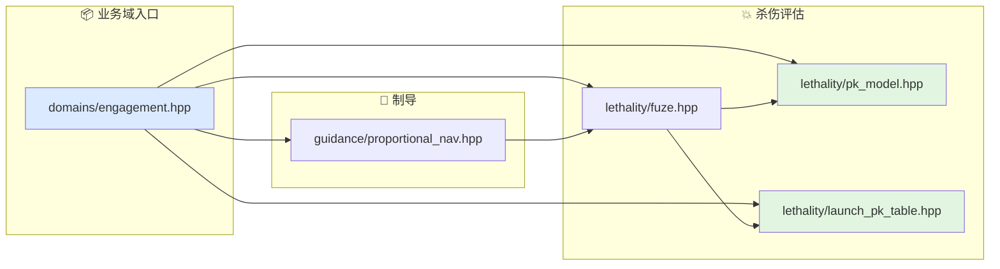

# 交战与杀伤文档索引

本目录对应算法层的交战与杀伤业务域。

## 代码入口

- `include/xsf_math/domains/engagement.hpp`
- `include/xsf_math/guidance/proportional_nav.hpp`
- `include/xsf_math/lethality/fuze.hpp`
- `include/xsf_math/lethality/pk_model.hpp`
- `include/xsf_math/lethality/launch_pk_table.hpp`

## 文档

- `基础知识整理.md`
- `比例导引.md`
- `引信与PCA.md`
- `杀伤效能与Pk.md`
