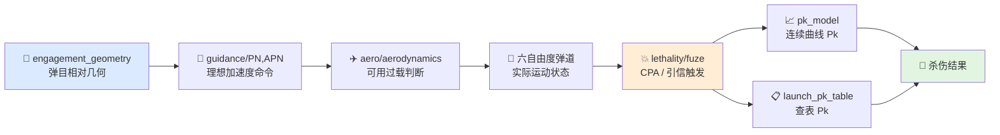

# 基础知识整理

本文件对应交战与杀伤业务域，目的是在阅读 `guidance/` 和 `lethality/` 代码之前，先建立一条从"拦截几何 → 导引律 → 制导误差 → 引信触发 → 杀伤概率"的完整心智模型。交战与杀伤不是单一的"比例导引"，而是一个从机动意图到毁伤结果的连续链路。

---

## 1. 这一层解决什么问题

交战与杀伤层要回答的核心问题是：**在弹目相对运动过程中，导弹应该如何机动以接近目标？接近后是否触发引信？起爆后形成杀伤的概率有多大？**

这个问题可以拆成三个子问题：

1. **该怎么机动？**
   - 由导引律根据弹目几何关系产生理想加速度命令。

2. **是否进入引信有效窗口？**
   - 由相对几何、脱靶量、相对速度、引信特性共同决定。

3. **杀伤概率有多大？**
   - 由交会条件、毁伤元散布、目标易损性共同决定。

---

## 2. 拦截几何基础

### 2.1 视线 (LOS) 与闭合速度

拦截问题的核心是弹目相对运动。定义：

| 符号 | 含义 |
|------|------|
| $\mathbf{r}$ | 导弹到目标的位置向量（LOS 向量） |
| $\mathbf{v}_m$ | 导弹速度 |
| $\mathbf{v}_t$ | 目标速度 |
| $\mathbf{v} = \mathbf{v}_t - \mathbf{v}_m$ | 相对速度（闭合速度向量） |
| $V_c = -\dot{R}$ | 闭合速度标量，$R = |\mathbf{r}|$ |

```mermaid
graph LR
    subgraph 导弹["🚀 导弹"]
        M1[速度 $\mathbf{v}_m$]
    end
    subgraph 目标["🎯 目标"]
        T1[速度 $\mathbf{v}_t$]
    end
    M1 -->|"LOS 向量 $\mathbf{r}$"| T1
    M1 -->|"相对速度 $\mathbf{v} = \mathbf{v}_t - \mathbf{v}_m$"| T1
```

**关键认知**：
- 如果 $\mathbf{v}$ 与 $\mathbf{r}$ 共线且指向导弹（即目标正在沿 LOS 向导弹飞来），则拦截即将发生。
- 如果 LOS 方向仍在快速旋转，说明当前轨迹还不是碰撞路径。

### 2.2 视线角速度 (LOS Rate)

LOS 角速度向量定义为：

$$
\boldsymbol{\omega}_{LOS} = \frac{\mathbf{r} \times \mathbf{v}}{R^2}
$$

**物理意义**：
- 描述了 LOS 线在空间中的旋转快慢和旋转轴。
- 三维空间中，$\omega\_{LOS}$ 是一个向量，其方向垂直于弹目相对运动平面。

**与平面问题的关系**：
在经典教材中，LOS 角速度常以标量 $\dot{\lambda}$ 出现。这实际上是三维角速度向量在某一平面的投影：

$$
\dot{\lambda} = |\boldsymbol{\omega}_{LOS}|
$$

### 2.3 导弹方位角与前置角

- **导弹方位角 (Aspect Angle)**：目标速度向量与 LOS 向量之间的夹角。描述的是"目标以什么姿态面对导弹"。
- **前置角 (Lead Angle / Anticipation Angle)**：导弹速度向量与 LOS 向量之间的夹角。描述的是"导弹需要提前指向哪里"。

**碰撞三角形**：
如果导弹和目标都保持匀速直线运动，存在一个"碰撞三角形"，使得导弹沿适当的前置角飞行就能与目标相遇。导引律的目的就是让导弹自动收敛到碰撞三角形上。

---

## 3. 导引律

### 3.1 导引律的分类

导引律解决的核心问题是：**已知当前弹目几何，导弹应该产生什么方向的加速度？**

常见导引律包括：
- **追踪法 (Pursuit Guidance)**：导弹速度始终指向目标当前位置。
- **平行接近法 (Constant Bearing, Decreasing Range)**：保持 LOS 方向不变，导弹沿碰撞三角形飞行。
- **比例导引 (PN, Proportional Navigation)**：加速度与 LOS 角速度成正比。
- **增强比例导引 (APN, Augmented PN)**：在 PN 基础上补偿目标加速度。
- **最优导引律 (Optimal Guidance)**：基于最优控制理论推导，考虑导弹动力学滞后、能量约束等。

### 3.2 比例导引 (PN)

**经典 PN 命令**：

$$
\mathbf{a}_c = N' V_c \, \boldsymbol{\omega}_{LOS}
$$

其中：
- $\mathbf{a}\_c$：导弹需要的法向加速度命令
- $N'$：有效导航比 (Effective Navigation Ratio)，通常取 3 ~ 5
- $V\_c$：闭合速度
- $\omega\_{LOS}$：LOS 角速度向量

**物理直觉**：
PN 的核心不是"朝目标追"，而是"抑制 LOS 的旋转"。
- 当 $\omega\_{LOS} = 0$ 时，LOS 不旋转，导弹和目标将沿直线相遇（碰撞三角形）。
- $N'$ 越大，对 LOS 角速度的抑制越强，弹道越直，但对制导系统带宽和导弹机动能力的要求也越高。

**三维 PN 与二维 PN**：
三维 PN 命令天然是向量形式，不需要先分解到俯仰/偏航平面再分别计算。只要 $\omega\_{LOS}$ 是三维向量，$\mathbf{a}\_c$ 就直接给出三维空间中的加速度需求。

### 3.3 增强比例导引 (APN)

当目标做机动时，PN 会产生一个与目标加速度相关的稳态误差。APN 通过在制导命令中加入目标加速度补偿项来改善：

$$
\mathbf{a}_c = N' V_c \, \boldsymbol{\omega}_{LOS} + \frac{N'}{2} \mathbf{a}_t^{\perp}
$$

其中 $\mathbf{a}_t^{\perp}$ 是目标加速度在垂直于 LOS 方向上的分量。

**工程意义**：
- APN 需要估计目标加速度。目标加速度估计误差会直接影响 APN 性能。
- 如果目标加速度未知或估计不准，有时宁愿使用 PN 也不愿引入 APN 的补偿误差。

### 3.4 追踪法 (Pursuit Guidance)

追踪法要求导弹速度向量始终指向目标当前位置：

$$
\mathbf{a}_c \propto \mathbf{v}_m \times \boldsymbol{\omega}_{LOS}
$$

**特点**：
- 实现简单，不需要估计 LOS 角速度。
- 末段弹道弯曲严重，尤其是目标做横向机动时。
- 脱靶量通常比 PN 大，现代导弹很少直接使用纯追踪法。

### 3.5 导航比的选择

- **$N' = 3$**：经典值，在理想条件下（无动力学滞后、无目标机动）保证零脱靶量。
- **$N' = 4 \sim 5$**：工程常用值，可以抵消部分制导系统滞后和目标机动的影响。
- **$N' \gt 5$**：弹道更直，但对末段机动能力要求极高，容易出现加速度饱和。

### 3.6 制导误差来源

即使导引律理论上完美，实际制导系统中仍存在多种误差源：

| 误差类型 | 来源 | 影响 |
|---------|------|------|
| 导引头噪声 | 热噪声、闪烁、角闪烁 | LOS 角速度测量误差 |
| 目标机动 | 目标加速度未知或时变 | 需要更大的导航比或 APN |
| 动力学滞后 | 导弹自动驾驶仪和弹体响应延迟 | 制导命令不能瞬时实现 |
| 加速度饱和 | 导弹最大可用过载有限 | 高机动需求被截断 |
| 初始条件误差 | 发射初始指向偏差 | 初期弹道修正量大 |

**关键认知**：
导引律给出的是"理想加速度"，实际导弹由于动力学滞后和饱和，只能近似实现。`guidance` 负责理想值，`aero` 和 `behavior` 负责可执行边界。

---

## 4. 引信与最近点

### 4.1 引信类型

引信负责在适当的时机触发战斗部。常见类型：
- **触发引信 (Contact Fuze)**：导弹直接撞击目标时触发。要求精确命中。
- **近炸引信 (Proximity Fuze)**：导弹接近目标到某一距离时触发。允许一定脱靶量。
- **时间引信 (Time Fuze)**：按预设时间触发。常用于防空炮弹、破片弹。

现代防空导弹和空空导弹大多采用**近炸引信**，因为：
- 导弹和目标相对速度极高（可达 1000-3000 m/s）。
- 精确直接命中技术要求极高，近炸可以大大提高杀伤概率。

### 4.2 最近点 (CPA, Closest Point of Approach)

CPA 是导弹轨迹与目标轨迹之间的最小距离点。

$$
CPA = \frac{|\mathbf{r} \times \mathbf{v}|}{|\mathbf{v}|}
$$

其中 $\mathbf{r}$ 是当前相对位置，$\mathbf{v}$ 是相对速度。

**物理意义**：
- 如果导弹和目标都保持当前速度不变，CPA 就是两者能接近到的最小距离。
- CPA 也称为"脱靶量" (Miss Distance) 的几何投影。

### 4.3 近炸窗口与 PCA 判定

近炸引信有一个有效作用范围（如 5-15 m）。当 CPA 落在这个范围内时，引信可能触发。但为了更准确，工程中通常做两阶段判定：

1. **几何判定**：CPA < 引信作用距离。
2. **时序判定**：导弹正在接近目标（$\dot{R} \lt 0$），且距离在持续减小。

**起爆时机**：
理想起爆时刻应使战斗部破片在目标通过破片云中心时与之相遇。因此起爆不是刚好在 CPA 处，而是需要提前一个"最佳起爆延时"。

---

## 5. 杀伤概率 (Pk)

### 5.1 Pk 的层次

杀伤概率可以分层理解：
- **制导命中概率 $P\_{hit}$**：导弹到达目标附近的概率，受制导精度影响。
- **引信触发概率 $P\_{fuze}$**：引信在正确时机正确触发的概率。
- **毁伤概率 $P\_{kill\vert hit}$**：在命中/起爆条件下，实际摧毁目标的概率。
- **总杀伤概率**

$$
P_k = P_{hit} \cdot P_{fuze} \cdot P_{kill|hit}
$$

### 5.2 杀伤概率模型

工程上有两种主要建模方式：

**连续曲线模型**：
Pk 是脱靶量、相对速度、交会角等的连续函数。例如：

$$
P_k = f(R_{miss}, V_{rel}, \theta_{aspect})
$$

这类模型通常来自经验拟合或半物理分析。

**查表模型 (Launch Pk Table)**：
Pk 按离散条件（距离、高度、速度、目标类型）查表得到。这是工程上最常用的简化方法，因为：
- 真实 Pk 受太多因素影响，很难用简单解析式覆盖。
- 军方通常通过大量试验和仿真生成标准 Pk 表。

### 5.3 破片杀伤模型

对于破片式战斗部，杀伤机理是：
1. 战斗部起爆后产生高速破片云。
2. 破片以一定速度向四周飞散。
3. 目标穿过破片云时，如果被一定数量的破片命中关键部位，则被摧毁。

**关键参数**：
- **破片初速 $V\_f$**：通常 1000-2500 m/s。
- **破片散布角**：战斗部类型决定（定向、全向、前向）。
- **破片密度**：单位面积上的破片数，随距离平方衰减。
- **目标易损性**：目标各部位被破片命中后的毁伤阈值。

**有效破片数**：
如果目标在破片云中扫过的面积为 $A$，破片密度为 $\rho_f$，则期望命中破片数为：

$$
N = \rho_f \cdot A
$$

### 5.4 目标易损性与杀伤标准

- **K 杀伤 (Kill)**：目标完全丧失作战能力。
- **F 杀伤 (Firepower Kill)**：目标丧失武器发射能力，但可能仍能飞行。
- **M 杀伤 (Mobility Kill)**：目标丧失机动能力，但可能仍能射击。

在导弹仿真中，通常以 K 杀伤作为 Pk 的评估标准。

---

## 6. 导引头与制导回路

### 6.1 导引头的作用

导引头是导弹的"眼睛"，负责：
1. 探测目标。
2. 测量 LOS 角速度或 LOS 误差角。
3. 将信息传递给制导计算机。

**导引头类型**：
- **雷达导引头 (RF Seeker)**：全天候、远距离，但可能受干扰。
- **红外导引头 (IR Seeker)**：被动探测、隐蔽性好，但受天气和诱饵影响。
- **光电/电视导引头**：高分辨率，但通常需要良好能见度。
- **复合导引头**：多模复合，提高抗干扰能力。

### 6.2 导引头跟踪回路

导引头通常安装在万向节上，可以相对于弹体转动。跟踪回路的目标是：**保持导引头光轴指向目标**。

导引头测得的角速度 $\dot{\lambda}\_{measured}$ 与真实 LOS 角速度 $\dot{\lambda}\_{true}$ 之间的关系受导引头动力学影响：
$$\dot{\lambda}_{measured} = \frac{1}{1 + \tau_s s} \dot{\lambda}_{true}$$

其中 $\tau\_s$ 是导引头时间常数。

**关键认知**：
- 导引头带宽有限，对快速旋转的 LOS 会有滞后。
- 大机动目标会导致导引头"甩头"，甚至丢失目标。

### 6.3 导引头视场与跟踪范围

- **瞬时视场 (IFOV)**：导引头在当前指向下能看到的角度范围。
- **跟踪范围**：导引头万向节能转动的最大角度。
- 如果目标跑出跟踪范围，导弹将丢失目标（go blind）。

---

## 7. 与代码的对应关系

| 头文件 | 职责 | 在交战杀伤链中的位置 |
|--------|------|-------------------|
| `include/xsf_math/guidance/proportional_nav.hpp` | PN、APN、追踪导引、LOS 几何量计算 | 机动命令生成 |
| `include/xsf_math/lethality/fuze.hpp` | CPA 计算、近炸判断、PCA 判定 | 引信触发决策 |
| `include/xsf_math/lethality/pk_model.hpp` | 连续曲线型杀伤概率 | 毁伤评估 |
| `include/xsf_math/lethality/launch_pk_table.hpp` | 发射杀伤概率查表 | 工程化毁伤评估 |

**完整交战杀伤链路**：



---

## 8. 常见误区

### 8.1 把 PN 理解成"朝目标追过去"

PN 的重点是抑制 LOS 角速度，不是直接追逐目标当前位置。如果导弹始终指向目标当前位置（追踪法），末段弹道会严重弯曲，脱靶量大。PN 通过提前转弯，使导弹尽快进入碰撞三角形。

### 8.2 把最近点距离当成命中概率

最近点距离只是几何量。是否触发引信、是否形成有效杀伤，还要看：
- 相对速度（影响破片与目标的相遇条件）
- 交会几何（影响破片命中部位）
- 引信作用距离和起爆时机

### 8.3 把 Pk 当成固定常数

Pk 在工程上强烈依赖：
- 脱靶量
- 相对速度
- 高度（影响导弹机动能力和引信性能）
- 交会几何（正面拦截 vs 尾追）
- 武器/目标组合

因此当前库同时保留了曲线模型和查表模型，以适应不同仿真精度需求。

### 8.4 忽视制导系统滞后

理想 PN 假设制导命令能瞬时实现。实际导弹有自动驾驶仪时间常数、弹体响应延迟、导引头滤波延迟。在末段（距目标几百米内），即使是很小的滞后也会导致显著的脱靶量。

### 8.5 混淆导引律输出与实际控制命令

`guidance` 输出的是加速度需求（惯性系或弹体系中的法向加速度），而实际舵机输出的是舵偏角。两者之间还有自动驾驶仪回路。在简化仿真中，常用"一阶惯性环节 + 饱和"来近似这种延迟。

---

## 9. 阅读顺序

1. `比例导引.md` → 理解 PN/APN 的推导和物理直觉
2. `引信与PCA.md` → 理解近炸引信和 CPA 判定
3. `杀伤效能与Pk.md` → 理解杀伤概率建模
4. `guidance/proportional_nav.hpp` → 理解导引律代码实现
5. `lethality/fuze.hpp` → 理解引信判定代码
6. `lethality/pk_model.hpp` / `launch_pk_table.hpp` → 理解 Pk 评估代码

---

## 10. 外部参考资料

- [Costello: Analysis of the Linear Homing Missile Guidance Loop](https://calhoun.nps.edu/bitstream/handle/10945/31532/95Mar_Costello.pdf?sequence=3)
- [Zarchan, Tactical and Strategic Missile Guidance, 7th Edition](https://arc.aiaa.org/doi/book/10.2514/4.106309)
- [NASA NTRS: Guidance and Navigation Considerations for Intercept Problems](https://ntrs.nasa.gov/citations/19630024609)
- [Fleeman, Tactical Missile Design, 2nd Edition](https://arc.aiaa.org/doi/book/10.2514/4.861955)
