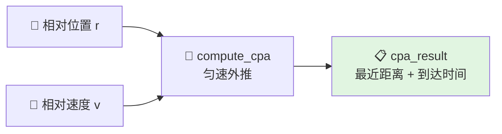
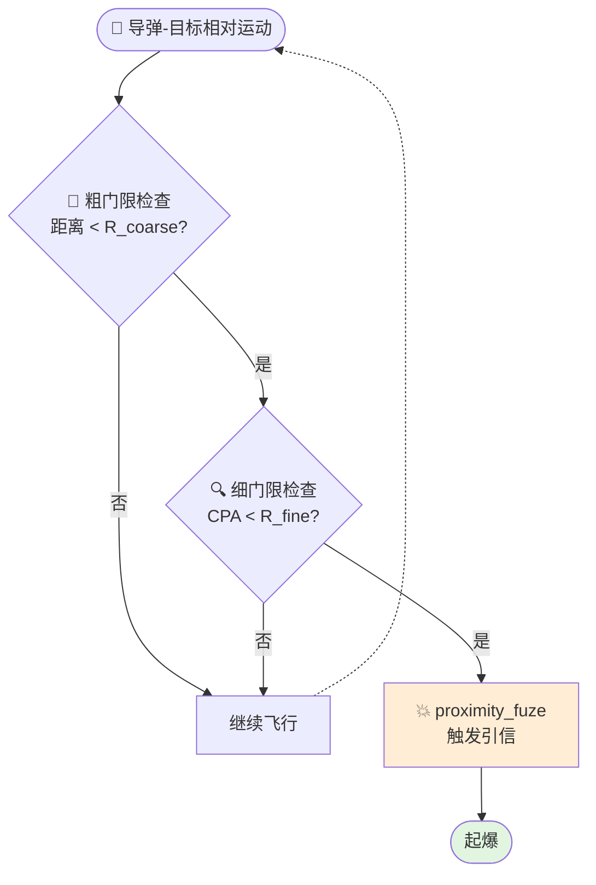

# 引信系统与 PCA

> 本文对应 `include/xsf_math/lethality/fuze.hpp`。

## 1. 当前实现能力

当前引信模块包括：

- `fuze_result`
- `cpa_result`
- `compute_cpa(...)`
- `proximity_fuze`
- `pca_two_stage`

## 2. CPA 的作用

CPA 即最近接近点，用于回答两个问题：

1. 武器与目标最近会靠到多近
2. 最近接近点将在多久之后出现

$$
CPA = \frac{|\mathbf{r} \times \mathbf{v}|}{|\mathbf{v}|}
$$

当前实现基于武器和目标的匀速线性外推，适合短时间窗口的工程判断。

## 3. 近炸引信

`proximity_fuze` 当前关注：

- 解保延迟
- 解保距离
- 触发半径
- 哑弹概率字段

触发逻辑综合考虑：

- 当前距离
- CPA 时间
- 是否已经错失目标

## 4. 两阶段 PCA 检查

`pca_two_stage` 代表一种更轻量的粗细两级检查思想：

- 粗门限：快速判断是否进入近距区域
- 细门限：在近距区域内做更严格判断

它适合后续扩展成更复杂的近炸搜索逻辑。

## 5. 与联合示例的关系

在当前仓库中，引信通常不单独使用，而是和：

- 制导
- 气动
- 杀伤概率

一起工作。

对应入口：

- `examples/missile_engagement_example.cpp`
- `tests/test_guidance.cpp`
