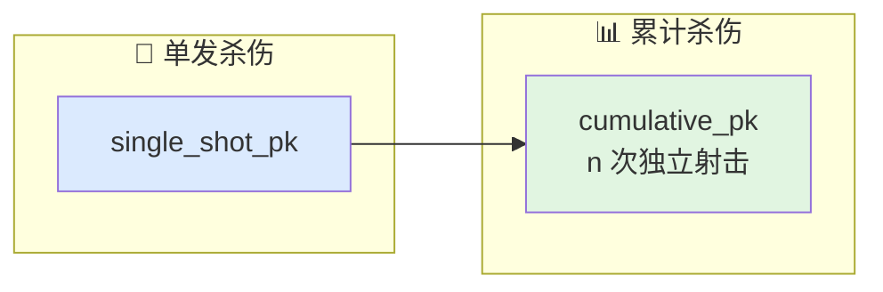

# 杀伤效能与 Pk

> 本文对应 `include/xsf_math/lethality/pk_model.hpp` 和 `include/xsf_math/lethality/launch_pk_table.hpp`。

## 新手入门

杀伤评估不是“命中了就一定摧毁、没命中就一定无效”这么简单。

实际中更常见的是：

- 脱靶量不是零，但仍可能近炸有效
- 同一脱靶量下，对不同目标类型效果不同
- 即使条件相同，最终也常用概率方式结算

所以杀伤链本质上是在做一件事：

把连续的交会几何结果，映射成离散而带概率的作战结果。

## 1. 当前实现能力

当前杀伤效能模块包括：

- `pk_curve`
- `kill_assessment`
- `single_shot_pk(...)`
- `cumulative_pk(...)`
- `monte_carlo_kill`
- `target_class`
- `typical_lethal_radius(...)`
- `ew_degraded_miss_distance(...)`
- `launch_pk_table`

## 2. 为什么 `Pk` 不是单个常数

真正的 `Pk` 至少取决于：

- 脱靶距离
- 战斗部类型
- 目标类型
- 起爆条件
- 对抗环境

因此更合理的表达方式是：

```text
Pk = f(几何, 战斗部, 目标类别, 干扰/对抗)
```

这也是为什么模块里既有曲线模型，也有查表模型。

## 3. Pk 曲线的作用

`pk_curve` 用于表达：

- 脱靶量越小，杀伤概率越高
- 随距离增加，Pk 平滑衰减

当前内置生成器包括：

- `blast_fragmentation(...)`
- `continuous_rod(...)`

它们适合回答“在没有复杂试验表时，能否先快速形成一条合理的效能曲线”。

所以曲线模型更偏：

- 快速工程估算
- 概念验证
- 缺少完整表格时的默认建模

## 4. 查表 `Pk` 的意义

`launch_pk_table` 则更接近工程或历史数据的使用方式。

它支持按以下条件查找：

- 发射平台类型
- 目标类型
- 高度
- 目标速度
- 下航程
- 侧偏距离

这说明它解决的问题不是抽象数学，而是：

“在给定发射条件下，这套武器体系的经验/标定杀伤概率是多少”

因此：

- `pk_curve` 更偏模型化
- `launch_pk_table` 更偏数据化

## 5. 单发与累计 `Pk`

当前库支持两种常见统计视角：

- 单发杀伤概率
- 多次独立射击下的累计杀伤概率

对于上层应用，这两种能力足以支撑：

- 单次拦截评估
- 齐射或多轮交战评估

逻辑上它们对应的是：

- 单发问题：这一发能不能成
- 多发问题：多次独立尝试之后总体把握有多大



## 6. 蒙特卡洛判定为什么必要

`monte_carlo_kill` 提供轻量随机试验能力，可用于：

- 基于 `Pk` 的离散化样本仿真
- 快速统计重复试验结果

这一步的意义是把“概率结果”转换成“单次试验的离散结果”。

否则上层只能得到一个期望值，无法在事件级仿真里表达：

- 这次真的击毁了
- 这次虽然 `Pk` 很高但仍然未成

## 7. 与引信和几何的关系

杀伤评估不是独立开始的，它通常位于：


这条链里最关键的是：

- `fuze`
  决定是否进入有效起爆窗口
- `PCA`
  决定最近交会关系
- `pk_model / launch_pk_table`
  把几何结果映射成概率结果

所以杀伤模块真正依赖的是“前面链路给出的几何质量”。

## 8. 与 EW 的关系

`ew_degraded_miss_distance(...)` 体现了一个直接工程假设：

- 干扰会恶化跟踪精度
- 跟踪误差增大会映射成更大的脱靶量
- 脱靶量增加再通过 `pk_curve` 映射成更低 `Pk`

这让电子战和杀伤评估之间形成了一个清晰接口：

$$
EW \xrightarrow{\text{误差放大}} R_{miss}\uparrow \xrightarrow{Pk\text{曲线}} Pk\downarrow
$$

这条链很重要，因为它说明电子战不一定非要直接改 `Pk`，也可以先改几何精度，再让 `Pk` 自然退化。

## 9. API 速查

**`lethality/pk_model.hpp`**

| 符号 | 角色 |
|------|------|
| `pk_curve` | 曲线参数化的单发 Pk，支持 `evaluate(miss_distance)` |
| `pk_curve::blast_fragmentation(lethal_r, max_r)` | 破片战斗部预设曲线 |
| `pk_curve::continuous_rod(rod_radius)` | 连续杆战斗部预设曲线 |
| `kill_assessment` | 单发杀伤评估结果 |
| `single_shot_pk(miss_distance, curve)` | 单发命中概率 |
| `cumulative_pk(individual_pks)` | $1 - \prod(1 - p_i)$ |
| `monte_carlo_kill` | 随机种子 RNG，`evaluate(miss, curve)` 返回布尔结果 |
| `target_class` | fighter/bomber/.../ship 枚举 |
| `typical_lethal_radius(tc)` | 按目标类别返回经验致命半径 |
| `ew_degraded_miss_distance(baseline_miss, ew_factor)` | EW 误差放大后的脱靶量 |

**`lethality/fuze.hpp`**

| 符号 | 角色 |
|------|------|
| `cpa_result` | `compute_cpa` 的输出，含最近距离和到达时间 |
| `compute_cpa(r, v)` | 匀速外推下的最近接近点 |
| `proximity_fuze` | 解保延迟、解保距离、触发半径、哑弹概率字段 |
| `pca_two_stage` | 粗门限 + 细门限两级近炸判决 |

**`lethality/launch_pk_table.hpp`**

| 符号 | 角色 |
|------|------|
| `launch_pk_table` | 单表（按下航程 × 侧偏距离查询） |
| `launch_pk_table_set` | 多条件（发射平台、目标类型、高度、速度）表集合 |
| `launch_pk_table_set::load_core_file` | 读取外部 Pk 数据文件，按表头字段解析 |

## 10. 相关源码

- `include/xsf_math/lethality/pk_model.hpp`
- `include/xsf_math/lethality/launch_pk_table.hpp`
- `include/xsf_math/lethality/fuze.hpp`
- `examples/missile_engagement_example.cpp`
- `tests/test_guidance.cpp`
