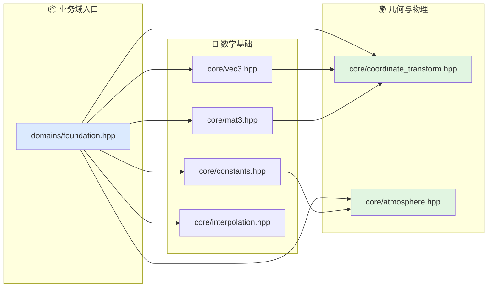

# 基础支撑文档索引

本目录对应算法层的基础支撑业务域。

## 代码入口

- `include/xsf_math/domains/foundation.hpp`
- `include/xsf_math/core/constants.hpp`
- `include/xsf_math/core/vec3.hpp`
- `include/xsf_math/core/mat3.hpp`
- `include/xsf_math/core/interpolation.hpp`
- `include/xsf_math/core/coordinate_transform.hpp`
- `include/xsf_math/core/atmosphere.hpp`

## 文档

- `基础知识整理.md`
- `坐标系统与变换.md`
