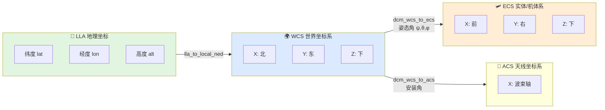

# 坐标系与坐标变换

> 本文面向 `xsf-math` 的 `core/coordinate_transform.hpp`，说明本库采用的坐标约定和常见几何变换。

## 1. 坐标系总览

当前库主要涉及四类表达：

| 缩写 | 含义 | 主要用途 |
|------|------|---------|
| WCS | 世界坐标系（North-East-Down） | 全局位置、速度、视线向量 |
| ECS | 实体/机体系（Forward-Right-Down） | 机体相关力和控制指令 |
| ACS | 天线坐标系 | 天线安装角和波束指向 |
| LLA | 经纬高 | 地理定位与距离近似 |

## 2. WCS 与 ECS

本库采用：

- WCS: `X=北, Y=东, Z=下`
- ECS: `X=前, Y=右, Z=下`

这是一套对飞行器和雷达建模都比较友好的 NED 约定。

对应 API：

- `dcm_wcs_to_ecs(...)`
- `dcm_ecs_to_wcs(...)`
- `wcs_to_ecs(...)`
- `ecs_to_wcs(...)`

## 3. 欧拉角约定

`euler_angles` 中的三个角定义为：

- `heading_rad`: 航向角，绕 Z 轴旋转
- `pitch_rad`: 俯仰角，绕 Y 轴旋转
- `roll_rad`: 横滚角，绕 X 轴旋转

这套约定直接服务于方向余弦矩阵计算，适合将全局向量变换到平台机体系。

## 4. 方位角与俯仰角

从 WCS 向量求方向时，本库使用：

$$
\begin{aligned}
Azimuth &= \arctan2(Y, X) \\
Elevation &= -\arcsin\left(\frac{Z}{|\mathbf{R}|}\right)
\end{aligned}
$$

其中俯仰角对 $Z$ 取负，是因为当前坐标系定义中 $Z$ 向下。

对应 API：

- `azimuth_from_vec(...)`
- `elevation_from_vec(...)`
- `vec_from_az_el(...)`

## 5. ACS 变换

天线坐标系变换通过：

- 平台姿态（欧拉角 $\psi, \theta, \phi$）
- 天线安装方位角 $az_{mount}$
- 天线安装俯仰角 $el_{mount}$

联合计算得到 $WCS \to ACS$ 的 DCM。

对应 API：

- `dcm_wcs_to_acs(...)`

这使得天线方向图评估可以和平台姿态自然耦合。

## 6. 地理距离与局部近似

当前库提供两类地理几何能力：

- `great_circle_distance(...)`
  适合两点球面距离估算
- `lla_to_local_ned(...)`
  适合局部区域内把经纬高差值映射为近似 NED 偏移

如果应用规模较大，`lla_to_local_ned(...)` 应被视为局部近似，不适合直接替代完整测地模型。

## 7. 典型使用场景

- 平台姿态下的目标方向投影
- 雷达/导引头视线角计算
- 天线安装误差与波束偏移计算
- 地理点之间的粗略距离估算

## 8. 相关源码

- `include/xsf_math/core/coordinate_transform.hpp`
- `tests/test_core.cpp`
