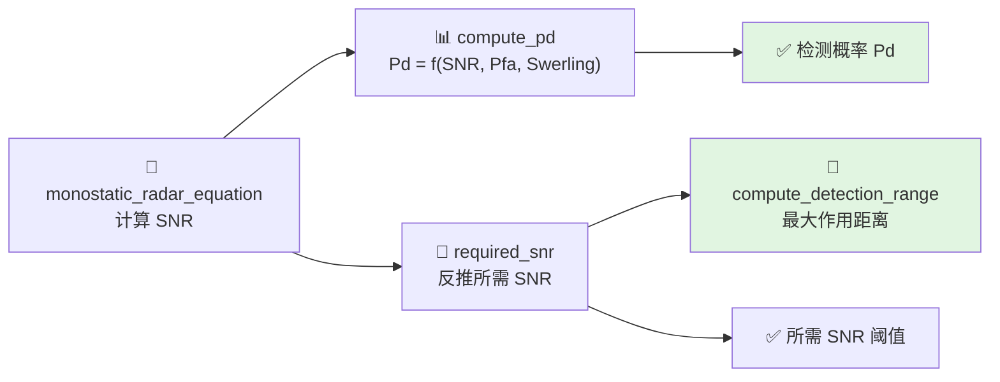

# Marcum-Swerling 检测理论

> 本文对应 `include/xsf_math/radar/marcum_swerling.hpp`。

## 1. 问题背景

给定：

- 目标回波的统计起伏特性
- 虚警概率 `Pfa`
- 脉冲积累数 `N`
- 当前信噪比 `SNR`

需要估计探测概率 `Pd`，或者反过来求达到目标 `Pd` 所需的 `SNR`。

## 2. 当前实现内容

`marcum_swerling` 提供：

- `compute_pd(...)`
- `required_snr(...)`
- `integration_gain(...)`

并支持：

- `swerling_case = 0..4`
- `detector_law = linear / square / log`

此外还提供：

- `albersheim_snr_db(...)`
- `albersheim_snr_db_n(...)`

用于快速估算单脉冲和多脉冲积累下的门限。

## 3. 工程意义

在当前库中，Marcum-Swerling 模块主要承担两件事：

1. 把雷达方程算出的 SNR 映射成 `Pd`
2. 把需求侧给出的 `Pd` 反推成所需 SNR 和作用距离

这使得 `radar_equation.hpp` 不再只是功率估算，而能进一步落到探测性能评估。

## 4. 相关调用路径

典型组合如下：

1. 用 `monostatic_radar_equation(...)` 求 `snr_linear`
2. 用 `marcum_swerling::compute_pd(...)` 求 `Pd`
3. 或用 `required_snr(...)` 反推 `compute_detection_range(...)`

## 5. 适用边界

当前实现是工程型近似模型，适合：

- 参数扫描
- 作用距离估算
- 示例与联调
- 相对性能比较

不适合直接替代完整的接收机级检测建模和高保真统计仿真。

## 6. 相关源码

- `include/xsf_math/radar/marcum_swerling.hpp`
- `include/xsf_math/radar/radar_equation.hpp`
- `tests/test_radar.cpp`
