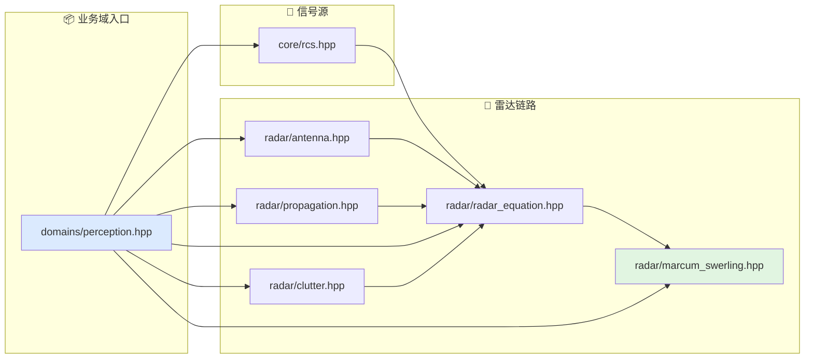

# 感知与探测文档索引

本目录对应算法层的感知与探测业务域。

## 代码入口

- `include/xsf_math/domains/perception.hpp`
- `include/xsf_math/core/rcs.hpp`
- `include/xsf_math/radar/antenna.hpp`
- `include/xsf_math/radar/propagation.hpp`
- `include/xsf_math/radar/radar_equation.hpp`
- `include/xsf_math/radar/clutter.hpp`
- `include/xsf_math/radar/marcum_swerling.hpp`

## 文档

- `基础知识整理.md`
- `雷达信号处理.md`
- `Marcum-Swerling探测.md`
- `雷达散射截面与电磁散射.md`
