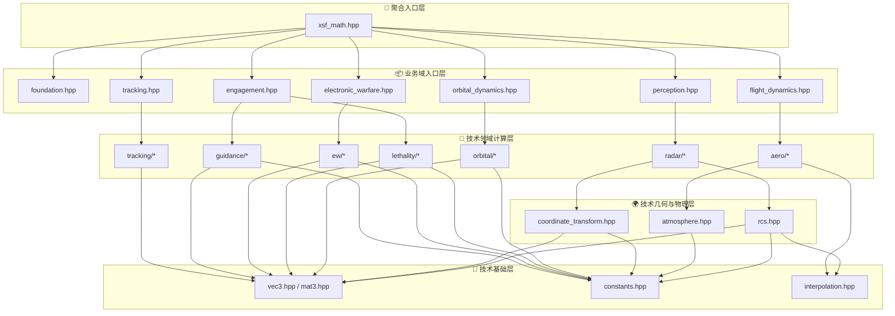
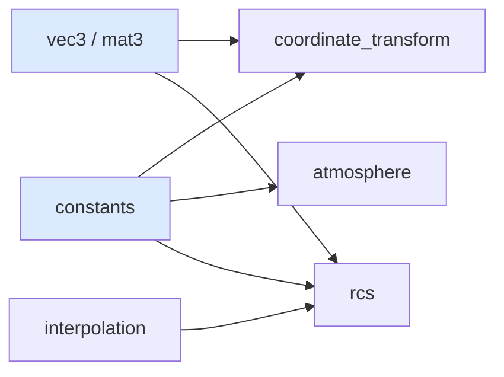
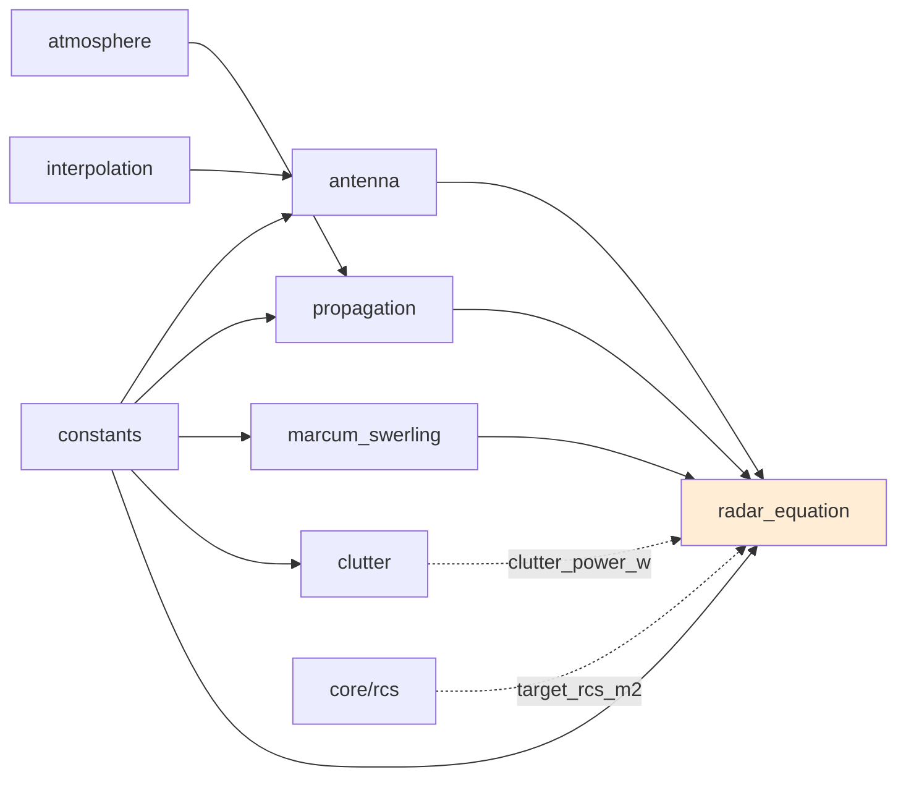
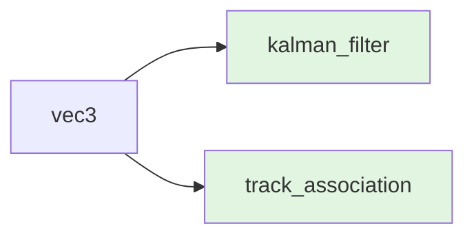
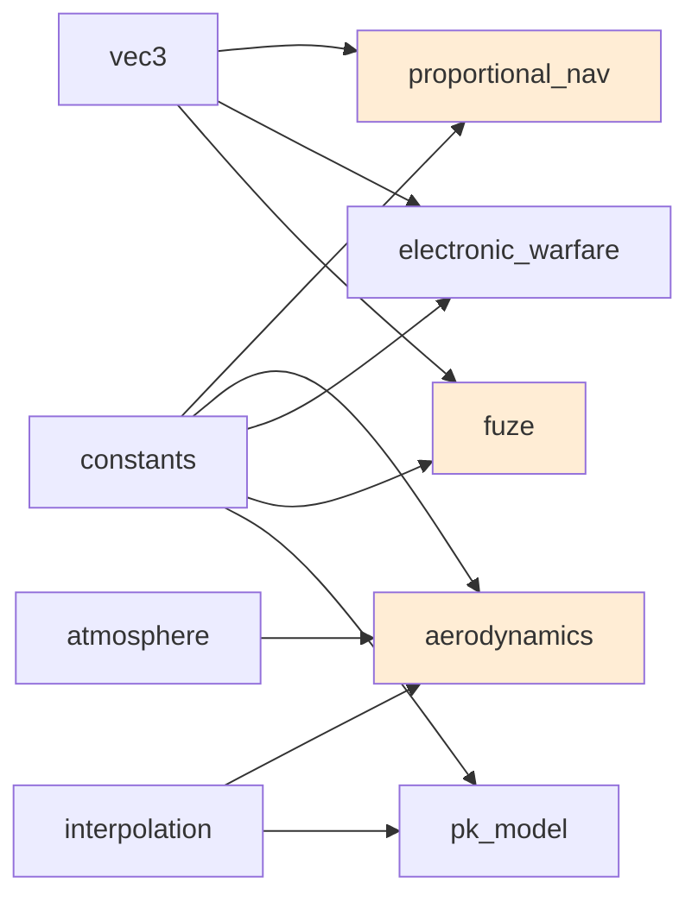
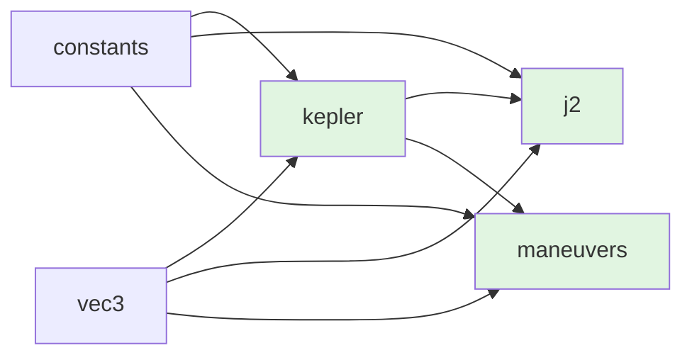
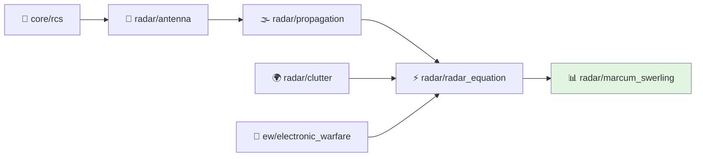
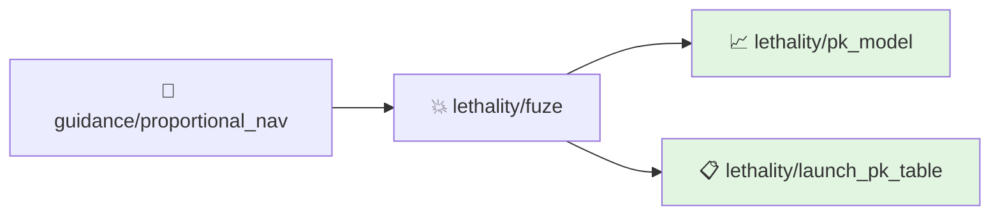

# xsf-math 模块依赖图谱

## 1. 分层视图

### 业务域入口层

- `domains/foundation.hpp`
- `domains/perception.hpp`
- `domains/tracking.hpp`
- `domains/engagement.hpp`
- `domains/flight_dynamics.hpp`
- `domains/electronic_warfare.hpp`
- `domains/orbital_dynamics.hpp`

### 技术基础层

- `core/constants.hpp`
- `core/vec3.hpp`
- `core/mat3.hpp`
- `core/interpolation.hpp`

### 技术几何与物理层

- `core/coordinate_transform.hpp`
- `core/atmosphere.hpp`
- `core/rcs.hpp`

### 技术领域计算层

- `radar/*`
- `tracking/*`
- `guidance/*`
- `aero/*`
- `ew/*`
- `lethality/*`
- `orbital/*`

### 聚合入口层

- `xsf_math.hpp`

## 2. 依赖图为什么重要

算法层同时保留两种组织方式：

- 业务域视图
  面向上层按问题链路接入。
- 技术模块视图
  面向底层公式、模型和实现维护。

技术模块划分不是为了“看起来整齐”，而是为了把不同问题拆开：

- `core`
  解决几何和物理量表达
- `radar`
  解决探测统计链
- `tracking`
  解决状态估计链
- `guidance`
  解决理想拦截机动链
- `aero`
  解决可执行能力边界
- `ew`
  解决对抗和退化效应
- `lethality`
  解决起爆与毁伤映射
- `orbital`
  解决长期传播和轨道机动

因此依赖图真正表达的是“问题怎么被分解”，而不仅仅是“谁 include 了谁”。

## 3. 主要依赖关系

### 基础链

- `coordinate_transform -> vec3 + mat3 + constants`
- `atmosphere -> constants`
- `rcs -> constants + interpolation + vec3`

### 雷达链

- `antenna -> constants + interpolation`
- `propagation -> constants + atmosphere`
- `marcum_swerling -> constants`
- `clutter -> constants`
- `radar_equation -> propagation + antenna + marcum_swerling + constants`
- `rcs` 通过 `radar_geometry.target_rcs_m2` 进入雷达方程；`clutter` 通过 `snr_with_interference.clutter_power_w` 进入 SNR 分母。这两个不是头文件 include 依赖，而是数据流入口。

### 跟踪链

- `kalman_filter -> vec3`
- `track_association -> vec3`

### 制导/效能链

- `proportional_nav -> vec3 + constants`
- `aerodynamics -> atmosphere + interpolation + constants`
- `electronic_warfare -> vec3 + constants`
- `fuze -> vec3 + constants`
- `pk_model -> interpolation + constants`

### 轨道链

- `kepler -> vec3 + constants`
- `j2 -> kepler + vec3 + constants`
- `maneuvers -> kepler + vec3 + constants`

## 4. 典型算法链路

### 探测链

这条链回答的是：

- 回波有多强
- 传播后还剩多少
- 分母里的噪声/杂波/干扰多大
- 最终 `Pd` 多高

### 跟踪与拦截链

这条链回答的是：

- 目标状态怎么稳健估计
- 制导律希望平台怎么机动
- 平台当前有没有能力执行该机动

### 杀伤链

这条链回答的是：

- 拦截几何如何
- 是否进入起爆窗口
- 最终命中/杀伤概率多大

### 轨道链

这条链回答的是：

- 当前轨道状态如何表达
- 长期摄动如何累积
- 从一个轨道到另一个轨道需要多大速度增量

## 5. 常用入口

如果下游只需要：

- 业务域整体入口：
  - 基础支撑：`domains/foundation.hpp`
  - 感知与探测：`domains/perception.hpp`
  - 跟踪估计：`domains/tracking.hpp`
  - 交战与杀伤：`domains/engagement.hpp`
  - 飞行与气动：`domains/flight_dynamics.hpp`
  - 电子战：`domains/electronic_warfare.hpp`
  - 轨道动力学：`domains/orbital_dynamics.hpp`
- 坐标和几何基础：从 `core/coordinate_transform.hpp` 开始
- 雷达探测与传播：从 `radar/radar_equation.hpp` 开始
- 统计检测理论：从 `radar/marcum_swerling.hpp` 开始
- 目标跟踪：从 `tracking/kalman_filter.hpp` 开始
- 制导律：从 `guidance/proportional_nav.hpp` 开始
- 气动能力估算：从 `aero/aerodynamics.hpp` 开始
- 干扰与干信比：从 `ew/electronic_warfare.hpp` 开始
- 近炸和杀伤：从 `lethality/fuze.hpp`、`lethality/pk_model.hpp` 开始
- 轨道传播：从 `orbital/kepler.hpp` 开始

## 6. 模块职责摘要

### core

负责常量、向量/矩阵、插值、坐标变换、标准大气和 RCS 数据表达，是所有上层模块的基础。

### radar

负责天线方向图、传播损耗、杂波、雷达方程以及 Pd/SNR 评估，构成完整探测链。

### tracking

负责基于位置量测的滤波和平面化的最近邻关联逻辑。

### guidance

负责比例导引、增强比例导引、追踪导引和加速度限幅等末制导相关计算。

### aero

负责二维气动模型、动压相关能力限制、比剩余功率与简单燃料/发动机模型。

### ew

负责自卫式干扰、站外干扰、SNR 降级、箔条与诱饵效应等电子战计算。

### lethality

负责 CPA、近炸引信、两阶段 PCA 检查以及 Pk 曲线和累计杀伤评估。

### orbital

负责开普勒轨道根数、状态转换、可见性判断与简化轨道阻力估算。

## 7. 维护注意点

- `core` 中的接口变化会放大到所有领域模块，应谨慎变更。
- `radar_equation.hpp` 是雷达链路的汇聚点，适合做联调与回归验证入口。
- `guidance`、`aero`、`ew`、`lethality` 在示例和测试中是联合使用的，不宜孤立理解。
- `xsf_math.hpp` 适合示例和快速验证，但不应替代模块边界认知。
