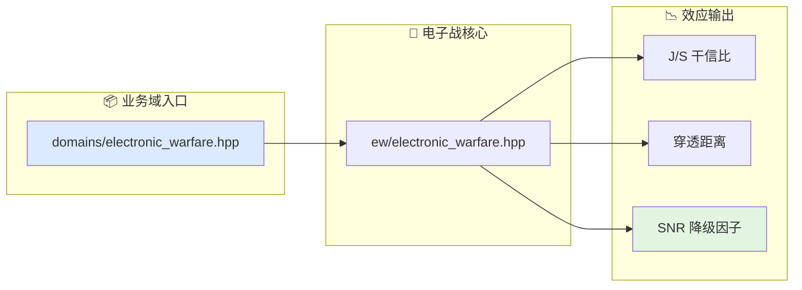

# 电子战文档索引

本目录对应算法层的电子战业务域。

## 代码入口

```mermaid
flowchart LR
    subgraph 入口["📦 业务域入口"]
        DOM["domains/electronic_warfare.hpp"]
    end
    subgraph 核心["🔧 电子战核心"]
        EW["ew/electronic_warfare.hpp"]
    end
    subgraph 效应["📉 效应输出"]
        JS["J/S 干信比"]
        BT["穿透距离"]
        DEG["SNR 降级因子"]
    end
    DOM --> EW
    EW --> JS & BT & DEG

    style DOM fill:#dbeafe
    style DEG fill:#e1f5e1
```

- `include/xsf_math/domains/electronic_warfare.hpp`
- `include/xsf_math/ew/electronic_warfare.hpp`

## 文档

- `基础知识整理.md`
- `电子战.md`
