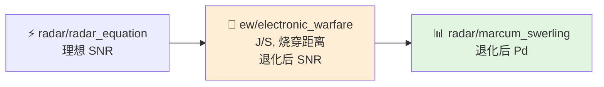
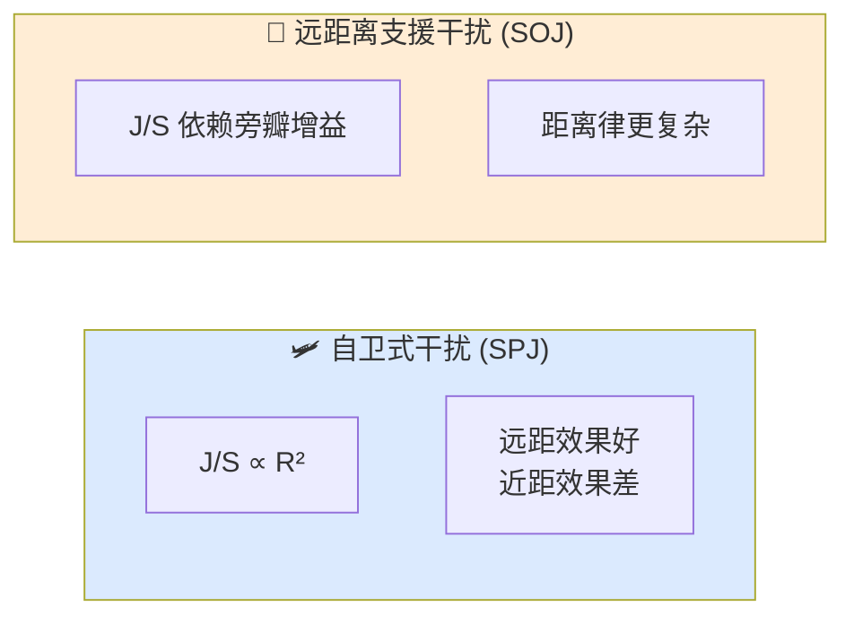

# 基础知识整理

本文件对应电子战业务域，目的是在阅读 `ew/` 代码之前，先建立一套关于"电磁频谱中的对抗与反制"的完整心智模型。电子战不是"单纯把噪声加到雷达里"，而是一个涉及侦察、干扰、欺骗、隐身和抗干扰的复杂博弈过程。理解这个博弈的层次结构，才能正确使用 `electronic_warfare.hpp`。

---

## 1. 这一层解决什么问题

电子战层要回答的核心问题是：**在电磁对抗环境中，雷达或通信系统的性能如何退化？干扰和诱饵如何改变感知链的判决结果？**

这个问题可以拆成四个子问题：

1. **干扰如何降低有效 SNR？**
   - 由干信比 (J/S) 和干扰功率谱密度决定。

2. **雷达在什么距离上会被压制，什么距离上能烧穿干扰？**
   - 由自卫式/远距离支援干扰的距离律决定。

3. **箔条、诱饵和假目标如何改变雷达对场景的解释？**
   - 由对抗手段的物理特性和雷达处理算法决定。

4. **雷达如何通过抗干扰技术恢复部分性能？**
   - 由 ECCM（电子反侦察/抗干扰）技术决定。

---

## 2. 电子战的分类

### 2.1 电子战三要素：ESM / ECM / ECCM

**ESM (Electronic Support Measures，电子支援措施)**：
- 被动接收敌方电磁信号，用于截获、识别、定位。
- 本身不发射信号，具有隐蔽性。
- 典型装备：雷达告警接收机 (RWR)、电子情报系统 (ELINT)。

**ECM (Electronic Countermeasures，电子对抗措施)**：
- 主动采取措施降低敌方雷达/通信/导航系统的效能。
- 分为噪声干扰和欺骗干扰两大类。
- 典型装备：自卫式干扰机、箔条弹、拖曳式诱饵。

**ECCM (Electronic Counter-Countermeasures，电子反干扰)**：
- 采取措施保护己方雷达/通信系统免受敌方 ECM 影响。
- 典型技术：频率捷变、旁瓣对消、脉冲压缩、恒虚警处理。

### 2.2 噪声干扰 vs 欺骗干扰

**噪声干扰 (Noise Jamming)**：
- 在敌方雷达接收带宽内注入噪声，抬高接收机噪声底。
- 效果是降低 SNR，从而降低 $P\_d$ 或缩短烧穿距离。
- 包括：阻塞噪声 (Barrage)、瞄准噪声 (Spot)、扫频噪声 (Sweep)。

**欺骗干扰 (Deception Jamming)**：
- 产生与真实目标回波相似的假信号，误导雷达的跟踪或测量。
- 效果是在雷达屏幕上产生虚假目标、距离/速度/角度欺骗。
- 包括：距离拖引、速度拖引、角度欺骗、合成假目标。

---

## 3. 噪声干扰与干信比 (J/S)

### 3.1 干信比的定义

干信比 (Jamming-to-Signal Ratio) 是干扰功率与目标回波功率的比值：

$$\frac{J}{S} = \frac{P_j G_j G_r \lambda^2}{(4\pi)^2 R_j^2 L_j} \cdot \frac{(4\pi)^3 R_t^4 L}{P_t G_t^2 \lambda^2 \sigma}$$

简化后（自卫式干扰，$R\_j = R\_t$）：
$$\frac{J}{S} = \frac{P_j G_j}{P_t G_t} \cdot \frac{4\pi R_t^2}{\sigma} \cdot \frac{G_r}{G_t(\theta)} \cdot \frac{L}{L_j}$$

其中：
- $P\_j$：干扰机发射功率
- $G\_j$：干扰机天线增益（指向雷达）
- $R\_j$：干扰机到雷达的距离
- $R\_t$：目标到雷达的距离
- $\sigma$：目标 RCS

### 3.2 自卫式干扰 (Self-Protection Jamming, SPJ)

自卫式干扰机装载在目标平台上（如战斗机挂载的干扰吊舱）。

**特点**：
- $R\_j = R\_t$，干扰机与目标共位。
- J/S 随距离的变化：目标回波 $\propto R^{-4}$，干扰功率 $\propto R^{-2}$。
- 因此 $J/S \propto R^2$：**距离越远，自卫式干扰效果越强；距离越近，效果越弱**。

### 3.3 远距离支援干扰 (Stand-Off Jamming, SOJ)

干扰机与目标分离，在目标后方或侧方提供掩护。

**特点**：
- $R\_j \neq R\_t$，干扰机距离雷达较远且位置固定。
- J/S 的距离律更复杂，取决于雷达天线在干扰方向上的增益（通常是旁瓣增益）。
- 由于雷达主瓣指向目标、旁瓣指向干扰机，$G\_r$ 在干扰方向上显著降低，因此 SOJ 需要更大的干扰功率才能奏效。

### 3.4 烧穿距离 (Burn-Through Range)

烧穿距离是指：雷达能够"烧穿"干扰，重新检测到目标的最小距离。

当 $J/S$ 下降到某一临界值 $(J/S)\_{req}$ 时，雷达可以检测到目标。对于自卫式干扰：

$$R_{burn} = \sqrt{\frac{P_t G_t \sigma (J/S)_{req}}{4\pi P_j G_j}}$$

**物理意义**：
- 烧穿距离以内，目标回波足够强，雷达可以工作。
- 烧穿距离以外，干扰压制了目标回波，雷达无法稳定跟踪。
- 提高雷达发射功率、增大天线增益、减小目标 RCS（对隐身目标不利）都可以改变烧穿距离。

---

## 4. 欺骗干扰

### 4.1 距离欺骗 (Range Gate Pull Off, RGPO)

干扰机复制雷达发射信号，但逐渐改变时延，使雷达的距离跟踪门跟随假目标移动，最终把真实目标甩在门限外。

**防御**：雷达采用前沿跟踪（Leading Edge Tracking），只跟踪回波的前沿部分，因为干扰机复制信号总有微小延迟。

### 4.2 速度欺骗 (Velocity Gate Pull Off, VGPO)

干扰机改变复制信号的多普勒频移，使雷达的速度跟踪门跟随假目标移动。

### 4.3 角度欺骗

通过产生多个相干干扰源（如交叉眼干扰 Cross-Eye），使雷达的单脉冲角度测量产生偏差。

### 4.4 合成假目标

现代数字射频存储 (DRFM) 干扰机可以精确复制雷达波形，产生大量逼真假目标，淹没雷达的数据处理系统。

---

## 5. 箔条与诱饵

### 5.1 箔条 (Chaff)

箔条是由大量细金属丝或金属涂层纤维组成的云团，被抛撒到空中后：
- 对雷达波产生强烈散射，形成大的 RCS。
- 随风飘散，与真实目标分离。

**箔条的 RCS**：
一根长度为半波长的偶极子箔条，其最大 RCS 约为 $0.17 \lambda^2$。大量箔条的总 RCS 可叠加到数十甚至数百平方米。

**雷达对抗箔条的方法**：
- 速度滤波：箔条随风飘动，速度远低于飞机，可用多普勒滤波区分。
- 极化鉴别：箔条的极化响应与复杂目标不同。
- 高分辨率雷达：距离/多普勒分辨单元小，可以把箔条和飞机分开。

### 5.2 拖曳式诱饵 (Towed Decoy)

拖曳式诱饵由飞机拖曳在后方，主动或被动产生强雷达回波。
- **被动诱饵**：本身是大 RCS 反射体，吸引雷达制导导弹。
- **主动诱饵**：内部有转发器，放大并转发雷达信号。

**优势**：诱饵与载机距离很近（几十到几百米），在雷达分辨率不足时，诱饵和载机看起来像一个"更大的目标"，导弹可能被诱导向诱饵。

### 5.3 投掷式诱饵

从飞机上发射的小型主动诱饵，能够机动飞行，模拟载机的雷达特征和运动轨迹。

---

## 6. 隐身与低可观测性

### 6.1 隐身技术的目标

隐身不是"看不见"，而是"让雷达在更短的距离上才能看见我"。

### 6.2 降低 RCS 的方法

**外形隐身**：
- 将机身表面设计成倾斜平面，把雷达波反射到非威胁方向。
- 减少直角反射、腔体散射、边缘绕射。
- 典型设计：菱形机身、内埋武器舱、倾斜垂尾。

**吸波材料 (RAM, Radar Absorbing Material)**：
- 将电磁能转化为热能吸收。
- 包括谐振型吸波材料和渐变阻抗型吸波材料。

**其他低可观测技术**：
- 红外隐身：降低发动机尾焰温度和排气红外特征。
- 射频管理：减少主动辐射，降低被 ESM 截获的概率。

### 6.3 隐身与探测的距离律

雷达探测距离与 RCS 的四次方根成正比：
$$R_{max} \propto \sigma^{1/4}$$

因此，如果 RCS 从 $5 \text{ m}^2$ 降低到 $0.001 \text{ m}^2$（降低 5000 倍），探测距离下降到原来的 $(1/5000)^{1/4} \approx 1/8.4$。

---

## 7. 雷达抗干扰技术 (ECCM)

### 7.1 频率捷变 (Frequency Agility)

雷达在脉冲间或脉组间快速改变发射频率：
- 干扰机难以精确复制当前频率。
- 不同频率下目标 RCS 和杂波特性不同，可以"闪烁"掉部分干扰能量。

### 7.2 旁瓣对消 (Side Lobe Cancellation, SLC)

使用辅助天线接收干扰信号，然后在主通道中减去干扰分量，抑制通过旁瓣进入的干扰。

### 7.3 旁瓣匿影 (Side Lobe Blanking, SLB)

当辅助天线检测到的信号强于主天线时（说明信号通过旁瓣进入），关闭该方向的接收，防止旁瓣干扰和目标欺骗。

### 7.4 脉冲压缩与低旁瓣波形

- **脉冲压缩**：将宽脉冲的能量压缩成窄脉冲，提高距离分辨率，使箔条和假目标更容易与真实目标分离。
- **低旁瓣波形**：降低脉冲压缩后的距离旁瓣，减少强杂波/干扰的泄漏。

### 7.5 恒虚警处理 (CFAR)

在干扰或杂波背景变化时，动态调整检测门限，使虚警概率保持恒定。CFAR 可以在一定程度上抵抗噪声干扰导致的底噪抬高。

---

## 8. 与代码的对应关系

| 头文件 | 职责 | 在电子战链路中的位置 |
|--------|------|-------------------|
| `include/xsf_math/ew/electronic_warfare.hpp` | 干信比、烧穿距离、SNR 退化、箔条和诱饵相关计算 | 干扰效应评估核心 |

**电子战在探测链中的耦合位置**：

---

## 9. 常见误区

### 9.1 把电子战理解为"单纯增大噪声"

很多电子战手段更接近"改变雷达所看到的场景"，而不只是把噪声底抬高。欺骗干扰、箔条、诱饵都是在"制造虚假现实"，雷达的信号处理和数据处理环节都会受到影响。

### 9.2 只用单一距离律估计 J/S

目标回波和干扰回波在不同拓扑下的距离律不同：
- 自卫式干扰：$J/S \propto R^2$
- 远距离支援干扰：$J/S$ 依赖旁瓣增益，距离律更复杂。
- 不能混用同一套近似。

### 9.3 忽视与探测链的耦合

电子战层通常不会单独使用，而是需要与 `radar_equation`、`clutter` 和 `marcum_swerling` 一起串联。单独计算一个 J/S 值没有工程意义，必须把它放到 SNR → Pd 的完整链路中。

### 9.4 混淆噪声干扰和欺骗干扰的效果

- 噪声干扰：降低 $P\_d$，但不会直接产生假航迹。
- 欺骗干扰：可能产生假航迹，但如果雷达有抗欺骗措施（如跟踪一致性检验），假航迹可能被剔除。

### 9.5 把隐身当成"完全不可探测"

隐身是降低 RCS，从而缩短被探测的距离，不是完全消除回波。在近距离（如火控雷达已经锁定后），隐身目标的回波仍然足够强。此外，隐身主要针对特定频段和方向，在其他频段（如 VHF）或特定角度下，RCS 可能显著增大。

---

## 10. 阅读顺序

1. `电子战.md` → 理解电子战各手段的工程建模
2. `ew/electronic_warfare.hpp` → 理解 J/S 和烧穿距离的代码实现
3. `radar/radar_equation.hpp` → 理解 SNR 计算，明确电子战的插入点
4. `radar/marcum_swerling.hpp` → 理解干扰后 Pd 的计算

---

## 11. 外部参考资料

- [NAVAIR: Integrated Defensive Electronic Countermeasures (IDECM)](https://www.navair.navy.mil/product/Integrated-Defensive-Electronic-Countermeasures-IDECM)
- [MIT Lincoln Laboratory: Radar Introduction to Radar Systems](https://www.ll.mit.edu/outreach/online-course-radar-introduction-to-radar-systems)
- [Schleher, Electronic Warfare in the Information Age](https://www.scitechpub.com/electronic-warfare-in-the-information-age.html)
- [Knott, Radar Cross Section Measurements](https://www.scitechpub.com/radar-cross-section-measurements.html)
- [MIT Lincoln Laboratory: Extended Polarimetric Observations of Chaff Using the WSR-88D Weather Radar Network](https://www.ll.mit.edu/r-d/publications/extended-polarimetric-observations-chaff-using-wsr-88d-weather-radar-network)
