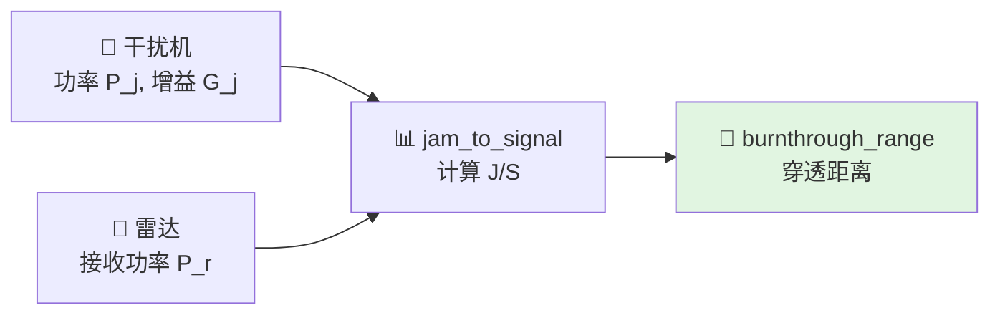

# 电子战基础

> 本文对应 `include/xsf_math/ew/electronic_warfare.hpp`。

## 1. 当前实现能力

当前电子战模块覆盖：

- 干扰机功率密度
- 自卫式干扰 `self_screening_jam`
- 站外干扰 `stand_off_jam`
- SNR 降级因子 `ew_degradation`
- 箔条 RCS 估算
- 诱饵有效性估算

## 2. 自卫式干扰

自卫式干扰对应“目标携带自己的干扰机”这一场景。

当前实现重点提供：

- 干信比 $J/S$
- 穿透距离 $R_{burnthrough}$

$$
\frac{J}{S} = \frac{P_j G_j G_r \lambda^2}{(4\pi) R^2 \cdot P_r}
$$

这是和雷达链最常联动的电子战能力。

## 3. 站外干扰

站外干扰与目标分离，常用于：

- 编队支援
- 远距支援平台
- 与目标不同方向的干扰注入

当前实现中，站外干扰显式区分：

- 目标到雷达的几何
- 干扰机到雷达的几何
- 雷达在干扰方向上的接收增益

## 4. SNR 降级

`ew_degradation` 提供一种轻量的架构接口，把电子战影响映射为：

- 干扰功率乘子
- 噪底乘子
- blanking 因子

这让应用层可以在不重写探测链的前提下叠加 EW 效应。

## 5. 箔条与诱饵

当前模块还提供：

- `chaff_rcs_m2(...)`
- `decoy_effectiveness(...)`

它们偏向快速工程估算，而不是完整对抗仿真。

## 6. API 速查

`ew/electronic_warfare.hpp` 全部符号（`namespace xsf_math`）：

| 符号 | 角色 |
|------|------|
| `self_screening_jam` | 自卫式干扰，提供 `jam_to_signal(...)` 和 `burnthrough_range_m(...)` |
| `stand_off_jam` | 站外干扰，显式区分目标-雷达几何和干扰机-雷达几何 |
| `ew_degradation` | 对探测链的轻量降级：`jamming_power_multiplier`、`noise_floor_multiplier`、`blanking_factor` |
| `chaff_rcs_m2(num_dipoles, frequency)` | 偶极子箔条等效 RCS |
| `decoy_effectiveness(decoy_rcs, target_rcs, ...)` | 诱饵能量比 |
| `false_target_equivalent_rcs(actual_snr_linear, ...)` | 干扰机产生的假目标等效 RCS |
| `false_target_range_offset(...)` | 假目标距离偏置 |

## 7. 相关源码

- `include/xsf_math/ew/electronic_warfare.hpp`
- `examples/radar_detection_example.cpp`
- `tests/test_guidance.cpp`
