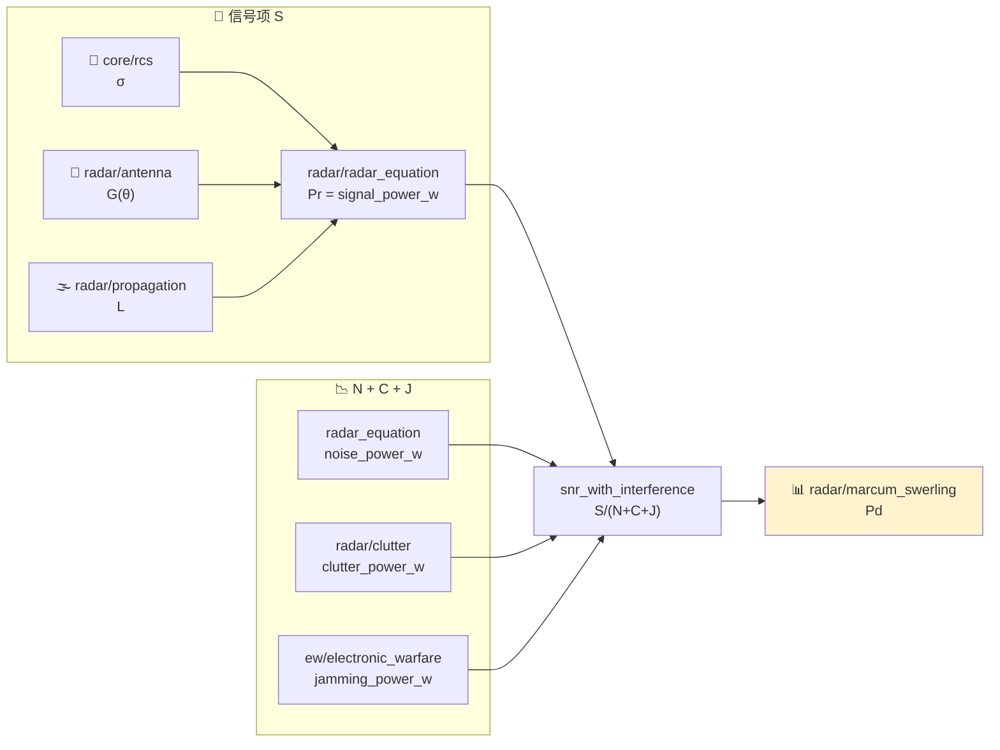
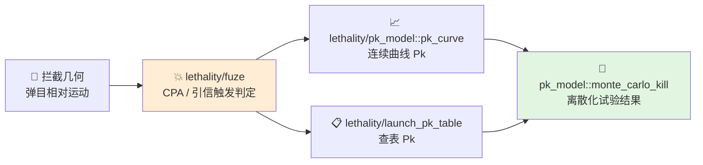

# 算法链路与逻辑详解

本文档不按单个头文件解释，而是按“算法在上层系统里解决什么问题、前后怎么衔接”来解释算法层。

## 1. 为什么算法层需要按链路理解

在实际仿真里，很少有哪个算法是孤立工作的。

例如：

- 雷达方程本身不能决定是否探测到目标，还需要传播、杂波、噪声、干扰和检测模型一起参与。
- 比例导引本身能给出机动加速度，但是否能执行还取决于当前动压、过载能力和气动限制。
- 引信判断不能单独存在，它依赖前面的几何关系、相对速度和最近点信息。

所以算法层更适合按“链路”来理解，而不是按“某个公式名词”来理解。

## 2. 基础链：从坐标到物理量

几乎所有上层算法都要先解决两个问题：

1. 几何关系怎么表达
2. 当前环境量怎么得到

这部分由 `core` 提供。

### 2.1 几何表达

`vec3`、`mat3` 和 `coordinate_transform` 负责把：

- 世界系位置
- 平台姿态
- LOS 方向
- 目标相对运动

统一到可计算的向量形式。

没有这层，后面的雷达、制导、引信都会各自实现一套几何逻辑，最终造成不一致。

### 2.2 环境量表达

`atmosphere` 负责把高度映射成：

- 密度
- 温度
- 音速
- 动压

这些量继续影响：

- 雷达传播损耗
- 平台马赫数
- 气动升阻
- 最大可用过载

所以 `atmosphere` 是“探测”和“飞行能力”之间的共用桥梁。

## 3. 探测链：目标能不能被看见

探测链的核心问题不是“有雷达公式就够了”，而是：

1. 目标回波有多强
2. 回波在传播中损失多少
3. 分母里的噪声、杂波、干扰各有多大
4. 最终在给定虚警概率下能否被判为目标

### 3.1 回波功率来源

`radar_equation` 决定信号项 `S` 的量级。

它依赖：

- 发射功率
- 天线增益
- 波长
- 距离
- 目标 RCS

这一步只回答“理论上能收到多大的回波”，还没有进入真实环境。

### 3.2 传播与方向图

`propagation` 和 `antenna` 把“理想接收功率”修正成“工程场景中的接收功率”。

关键逻辑是：

- 同样的目标回波，不同传播路径损耗不同
- 同样的目标，不在主瓣内时有效增益不同
- 大气、雨衰、多径都会改变最终可用信号

### 3.3 分母项的构成

分母不是一个简单的“噪声常数”，而是：

- 热噪声 `N`
- 杂波 `C`
- 干扰 `J`

`clutter` 和 `ew` 就是往这个分母里加工程环境项。

因此探测链的真实表达更像：

$$
SNR = \frac{S}{N + C + J}
$$

其中：
- $S$：目标回波信号功率
- $N$：接收机热噪声功率
- $C$：环境杂波功率
- $J$：电子战干扰功率

### 3.4 检测判决

`marcum_swerling` 决定给定 `Pfa` 和目标起伏模型时，某个 `SNR` 最终能对应到多大的 `Pd`。

这一步把“物理信号强度”转成“统计判决结果”。

所以完整探测链分成"分子"和"分母"两路，最终由 `marcum_swerling` 把 SNR 映射到 Pd：

数据通路（与代码一致）：

- `radar_equation.hpp` 的 `radar_equation_result` 给出 `signal_power_w` 和 `noise_power_w`
- `snr_with_interference` 把热噪声、杂波、干扰三项**并联**放入分母，而不是串行叠加
- `compute_detection_probability` 是一个便捷入口：直接串起 `monostatic_radar_equation` 和 `marcum_swerling::compute_pd`

## 4. 跟踪链：量测如何变成稳定状态

探测出来的量测往往是噪声很大的。

`tracking` 的任务不是“重复输出量测”，而是：

- 用动力学模型预测目标下一步状态
- 用新量测修正预测
- 在多个候选量测中选择最合理的那个

### 4.1 卡尔曼滤波

`kalman_filter` 的核心是两步：

1. 预测
2. 更新

它的价值在于：

- 让状态估计连续
- 把量测噪声平滑掉
- 给制导系统提供更稳定的相对运动信息

### 4.2 关联

`track_association` 解决的是“这个量测到底属于哪条航迹”。

如果没有这一层：

- 滤波器会被错误量测污染
- 航迹会跳变
- 后面的制导几何会失真

所以跟踪链的输出不是“单点位置”，而是“经过筛选和滤波的目标状态”。

## 5. 制导与飞行能力链：该怎么拦、能不能拦

这一链路至少要同时回答两个问题：

1. 从拦截几何上看，应该给什么加速度
2. 从平台能力上看，这个加速度能不能做到

### 5.1 制导律给出理想命令

`guidance/proportional_nav`、`augmented_proportional_nav`、`pursuit_guidance` 解决的是“理想机动需求”。

它们输入的是：

- 相对位置
- 相对速度
- LOS 角速度
- 目标加速度估计

它们输出的是：

- 横向或法向加速度需求

### 5.2 气动层负责把理想命令落到可执行空间

`aero` 不负责“该不该转”，而负责“最多能转多狠”。

典型逻辑是：

- 当前动压太低，舵效不足
- 当前马赫数或迎角受限
- 当前质量、面积和 `CLmax` 决定最大过载

所以：

- `guidance` 给理想值
- `aero` 给可执行边界

这两层不该混在一起，因为它们解决的是两个不同的问题。

## 6. 杀伤链：接近之后是否有效

拦到目标附近不等于形成杀伤。

`lethality` 关心的是：

1. 最近点几何关系如何
2. 是否满足引信触发条件
3. 命中后是否有足够概率形成杀伤

### 6.1 最近点与引信

`fuze` 和 `PCA` 逻辑的作用是：

- 判断是否进入有效近炸窗口
- 判断相对几何是否满足起爆条件

它实际上是把连续的拦截过程变成一次离散的“起爆/不起爆”判决。

### 6.2 杀伤概率

`pk_model` 和 `launch_pk_table` 进一步把：

- 距离
- 高度
- 目标速度
- 交会条件

映射为：

- 理论命中概率
- 查表得到的工程化杀伤概率

所以杀伤链不是单纯“距离够近就命中”，而是把几何结果映射到概率结果。

注：`monte_carlo_kill` 与 `pk_curve`、`cumulative_pk` 在同一头文件 `lethality/pk_model.hpp` 中，不是独立模块。

## 7. 轨道链：长期传播和轨道机动

轨道问题和飞行器末制导问题不同，它更强调：

- 长时间传播误差
- 摄动累积
- 轨道根数和状态量之间的转换

### 7.1 开普勒主项

`kepler` 负责二体问题主项：

- 根数到状态
- 状态到根数
- 基本轨道传播

### 7.2 J2 摄动

现实轨道长期传播中，地球扁率造成的 `J2` 摄动会导致：

- 升交点赤经漂移
- 近地点幅角漂移

这也是 `j2` 模块存在的原因。

### 7.3 轨道机动

`maneuvers` 把轨道设计问题转换成：

- 转移轨道
- 速度增量
- 时间代价

它本质上解决的是“从一个轨道状态到另一个轨道状态的工程操作量”。

## 8. 阅读方法

从使用角度阅读算法层时，可按问题链路而不是文件名顺序展开：

### 想看探测问题

1. `感知与探测/雷达信号处理.md`
2. `感知与探测/Marcum-Swerling探测.md`
3. `感知与探测/雷达散射截面与电磁散射.md`
4. `电子战/电子战.md`

### 想看拦截问题

1. `交战与杀伤/比例导引.md`
2. `飞行与气动/气动与飞行.md`
3. `交战与杀伤/引信与PCA.md`
4. `交战与杀伤/杀伤效能与Pk.md`

### 想看轨道问题

1. `轨道动力学/轨道力学.md`

### 想看基础几何问题

1. `基础支撑/坐标系统与变换.md`
2. `跟踪估计/跟踪与滤波.md`
