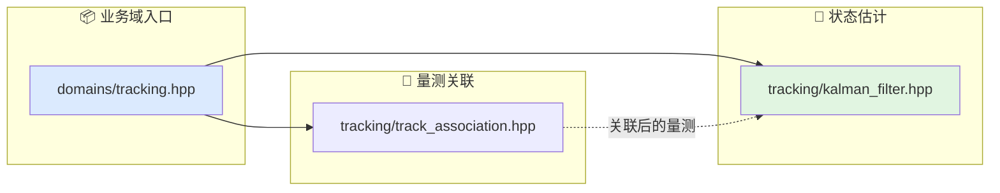

# 跟踪估计文档索引

本目录对应算法层的跟踪估计业务域。

## 代码入口

- `include/xsf_math/domains/tracking.hpp`
- `include/xsf_math/tracking/kalman_filter.hpp`
- `include/xsf_math/tracking/track_association.hpp`

## 文档

- `基础知识整理.md`
- `跟踪与滤波.md`
