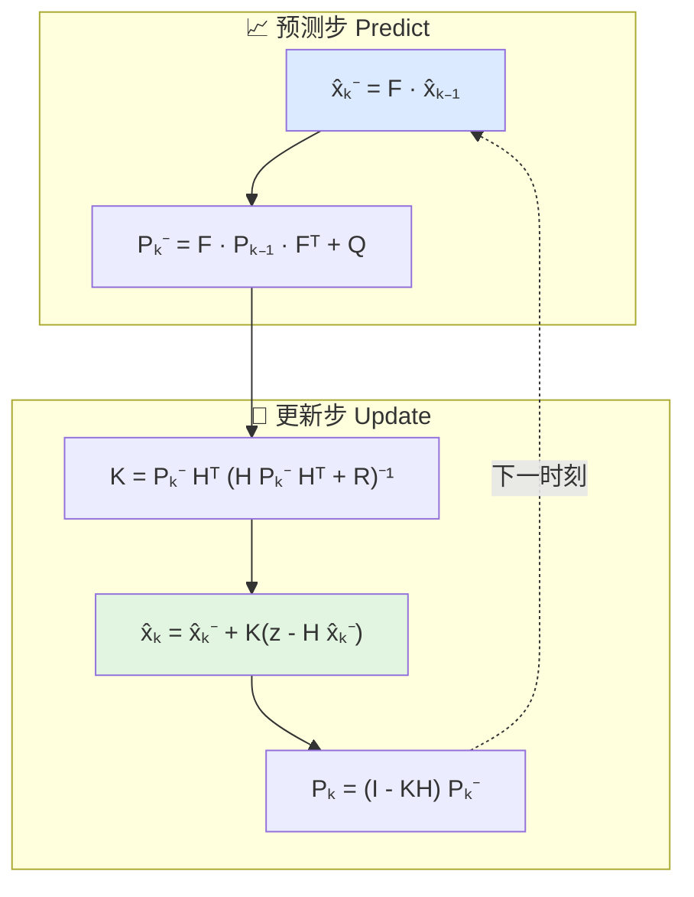

# 跟踪与滤波

> 本文对应 `include/xsf_math/tracking/kalman_filter.hpp` 和 `include/xsf_math/tracking/track_association.hpp`。

## 1. 当前实现能力

跟踪模块目前提供两类核心能力：

- 状态估计
  - `kalman_filter_6state`
  - `alpha_beta_filter`
- 量测关联
  - `nearest_neighbor_associator`
  - `m_of_n_logic`

## 2. 卡尔曼滤波

`kalman_filter_6state` 使用 6 状态模型：

$$
\mathbf{x} = [x, y, z, v_x, v_y, v_z]^T
$$

量测只包含位置：

$$
\mathbf{z} = [x, y, z]^T
$$

当前预测模型是恒速模型，适合：

- 雷达点迹平滑
- 目标速度估算
- 与简单量测源联调

## 3. Alpha-Beta 滤波

`alpha_beta_filter` 是更轻量的平滑器，适合：

- 低成本估计
- 不需要完整协方差传播的场景
- 简单可视化或快速原型

## 4. 最近邻关联

`nearest_neighbor_associator` 当前提供：

- 基于马氏距离的门限判断
- 贪心最近邻关联
- 未关联量测输出

这适合作为最小关联基线，但不应被理解为复杂多目标跟踪器。

## 5. M-of-N 逻辑

`m_of_n_logic` 用于表达：

- 在滑动窗口内命中次数达到阈值后确认航迹

这是工程上常见的航迹确认逻辑，适合和量测关联一起构成轻量跟踪链。

## 6. 适用边界

当前跟踪模块偏向基础型工具，不包含：

- JPDA / MHT
- IMM
- 非线性 EKF / UKF
- 复杂机动模型

它更适合作为当前数学库中的“最小跟踪能力集合”。

## 7. API 速查

**`tracking/kalman_filter.hpp`**

| 符号 | 角色 |
|------|------|
| `kalman_filter_6state` | 6 状态（位置+速度）线性卡尔曼，显式维护 `state`、`covariance`；提供 `predict(dt)`、`update(z)`、`track_score(meas_pos)` |
| `alpha_beta_filter` | 轻量 α-β 平滑器，仅维护位置和速度估计 |
| `track_state` | 关联/滤波共享的航迹状态结构 |

**`tracking/track_association.hpp`**

| 符号 | 角色 |
|------|------|
| `nearest_neighbor_associator` | 贪心最近邻，内置 `mahalanobis_distance(trk, det)` 和门限判断 |
| `m_of_n_logic` | 滑窗 M/N 确认逻辑，用于航迹起始 |

## 8. 相关源码

- `include/xsf_math/tracking/kalman_filter.hpp`
- `include/xsf_math/tracking/track_association.hpp`
- `tests/test_core.cpp`
