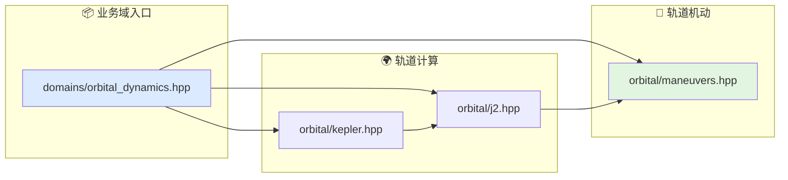

# 轨道动力学文档索引

本目录对应算法层的轨道动力学业务域。

## 代码入口

- `include/xsf_math/domains/orbital_dynamics.hpp`
- `include/xsf_math/orbital/kepler.hpp`
- `include/xsf_math/orbital/j2.hpp`
- `include/xsf_math/orbital/maneuvers.hpp`

## 文档

- `基础知识整理.md`
- `轨道力学.md`
