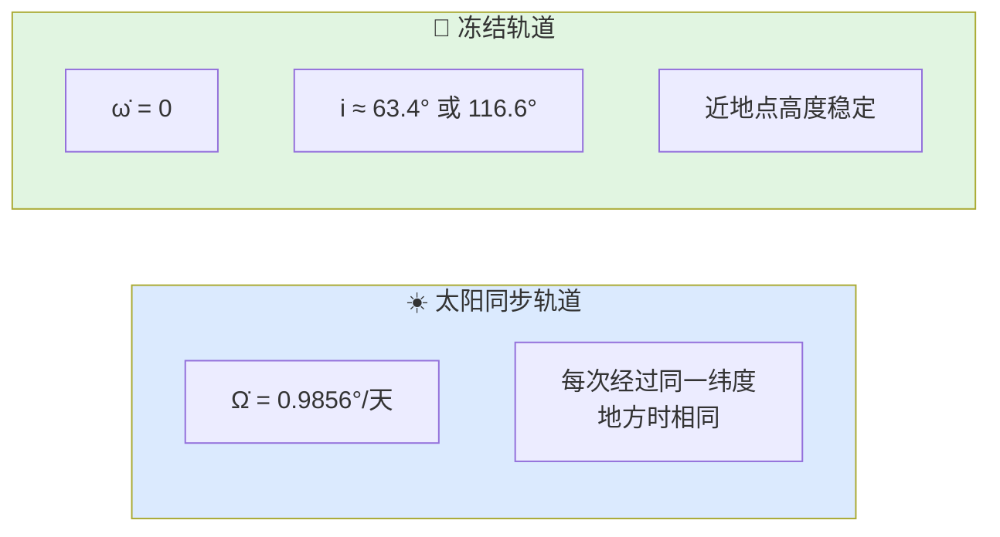

# 基础知识整理

本文件对应轨道动力学业务域，目的是在阅读 `orbital/` 代码之前，先建立一套关于"航天器在引力场中如何运动、如何长期传播、如何做机动"的完整心智模型。轨道动力学与近地飞行控制有着本质区别：它更强调长期几何稳定性、能量守恒和摄动累积效应。

---

## 1. 这一层解决什么问题

轨道动力学层要回答的核心问题是：**已知一个空间目标的当前状态，它在未来某个时刻会出现在哪里？如果需要改变它的轨道，需要多大的速度增量？**

这个问题可以拆成三个子问题：

1. **如何用轨道根数表达状态？**
   - 位置-速度是直观状态，但轨道根数更能反映轨道的几何本质。

2. **如何在理想二体模型和真实摄动模型下进行传播？**
   - 二体问题给出主项，摄动理论修正长期和周期偏差。

3. **如何从一个轨道转移到另一个轨道？**
   - 由脉冲机动、速度增量和转移时间决定。

---

## 2. 二体问题与开普勒定律

### 2.1 二体假设

在轨道力学的基础模型中，只考虑地球和一个航天器之间的相互引力，忽略其他所有因素（大气、太阳引力、地球形状等）。

**牛顿万有引力定律**：
$$\mathbf{F} = -\frac{GMm}{r^2} \hat{\mathbf{r}}$$

其中：
- $G$：万有引力常数
- $M$：地球质量
- $m$：航天器质量（在二体问题中可被约去）
- $r$：地心到航天器的距离

**引力参数**：
工程上常用地球的引力参数 $\mu = GM \approx 3.986004418 \times 10^{14} \text{ m}^3/\text{s}^2$。

### 2.2 开普勒三定律

1. **轨道定律**：行星绕太阳的轨道是椭圆，太阳在椭圆的一个焦点上。
2. **面积定律**：行星与太阳的连线在相等时间内扫过相等的面积（角动量守恒）。
3. **周期定律**：轨道周期的平方与半长轴的立方成正比，$T^2 \propto a^3$。

这些定律不仅适用于行星绕太阳，也适用于航天器绕地球。

### 2.3 活力公式 (Vis-Viva Equation)

活力公式给出了轨道上任意一点的速度与半径、半长轴的关系：

$$v^2 = \mu \left(\frac{2}{r} - \frac{1}{a}\right)$$

**特殊情形**：
- **圆轨道** ($r = a$)：$v\_{circular} = \sqrt{\mu / r}$
- **抛物线轨道** ($a \to \infty$)：$v\_{escape} = \sqrt{2\mu / r}$（逃逸速度）

**LEO 圆轨道速度**：
在 200 km 高度 ($r \approx 6578$ km)：
$$v \approx \sqrt{\frac{3.986 \times 10^{14}}{6.578 \times 10^6}} \approx 7.78 \text{ km/s}$$

---

## 3. 轨道六根数

### 3.1 为什么用轨道根数

虽然位置和速度 $(\mathbf{r}, \mathbf{v})$ 能唯一确定轨道状态，但它们随时间快速变化，难以直观理解轨道的几何特征。

轨道六根数 $(a, e, i, \Omega, \omega, \nu)$ 把轨道的"形状"、"空间指向"和"瞬时位置"分开描述，更适合长期分析和轨道设计。

### 3.2 六根数的物理意义

| 根数 | 符号 | 意义 | 说明 |
|------|------|------|------|
| 半长轴 | $a$ | 轨道大小 | $a \gt 0$：椭圆；$a = \infty$：抛物线；$a \lt 0$：双曲线 |
| 偏心率 | $e$ | 轨道形状 | $e = 0$：圆；$0 \lt e \lt 1$：椭圆；$e = 1$：抛物线；$e \gt 1$：双曲线 |
| 轨道倾角 | $i$ | 轨道平面与赤道面的夹角 | $0° \leq i \leq 180°$ |
| 升交点赤经 | $\Omega$ | 升交点方向在赤道面上的经度 | $0° \leq \Omega \lt 360°$ |
| 近地点幅角 | $\omega$ | 从升交点到近地点的角度 | $0° \leq \omega \lt 360°$ |
| 真近点角 | $\nu$ | 从近地点到当前位置的角度 | $0° \leq \nu \lt 360°$ |

**几何直觉**：
- $(a, e)$ 定义了椭圆的形状和大小。
- $(i, \Omega)$ 定义了轨道平面在空间中的指向。
- $\omega$ 定义了椭圆长轴在轨道平面内的方向。
- $\nu$ 定义了卫星在椭圆上的瞬时位置。

### 3.3 真近点角、平近点角与偏近点角

**真近点角 $\nu$**：几何上最直接的角度，卫星-地心-近地点的夹角。

**偏近点角 $E$**：辅助圆上的投影角度，用于开普勒方程。

**平近点角 $M$**：假设卫星做匀速圆周运动时对应的角度。

**开普勒方程**：
$$M = E - e \sin E$$

这是一个超越方程，通常用牛顿迭代法求解 $E$，再由 $E$ 转换到 $\nu$。

---

## 4. 轨道类型

### 4.1 圆轨道与椭圆轨道

- **圆轨道** ($e = 0$)：速度恒定，高度恒定。LEO、MEO、GEO 大多近似圆轨道。
- **椭圆轨道** ($0 \lt e \lt 1$)：近地点速度最大、高度最低；远地点速度最小、高度最高。
  - 近地点距离：$r\_p = a(1 - e)$
  - 远地点距离：$r\_a = a(1 + e)$

### 4.2 抛物线与双曲线轨道

- **抛物线** ($e = 1$)：刚好能逃逸地球的轨道，$v = v\_{escape}$。
- **双曲线** ($e \gt 1$)：超速逃逸轨道，如月球探测器离开地球影响球时的轨道。

### 4.3 典型地球轨道

| 轨道类型 | 高度范围 | 周期 | 典型应用 |
|---------|---------|------|---------|
| LEO (低地球轨道) | 200 - 2000 km | 90 - 120 min | 遥感、ISS、侦察 |
| MEO (中地球轨道) | 2000 - 35786 km | 2 - 12 hr | GPS、Galileo |
| GEO (地球静止轨道) | 35786 km | 24 hr | 通信、气象 |
| GTO (地球同步转移轨道) | 近地点 ~200 km，远地点 35786 km | ~10.5 hr | 卫星发射过渡轨道 |
| HEO (高椭圆轨道) | 近地点 ~500 km，远地点 ~40000 km | ~12 hr | 通信（高纬度覆盖） |

---

## 5. 轨道摄动

### 5.1 为什么需要摄动理论

真实地球不是完美球体，空间中还有其他引力源和阻力源。这些因素使真实轨道偏离理想二体轨道。

主要摄动源：
- 地球扁率 ($J\_2, J\_3, J\_4, ...$)
- 大气阻力
- 太阳辐射压
- 日月引力（第三体摄动）
- 地球潮汐形变

### 5.2 J2 摄动：最显著的长期摄动

地球是一个扁球体（赤道隆起），其引力势可以用球谐函数展开：

$$U = \frac{\mu}{r} \left[1 - \sum_{n=2}^{\infty} \left(\frac{R_E}{r}\right)^n J_n P_n(\sin\phi) + \cdots\right]$$

其中 $J\_2 \approx 1.0826 \times 10^{-3}$ 是最主要项（比 $J\_3$ 大三个量级）。

**J2 引起的长期漂移**：

升交点赤经的长期变化率：
$$\dot{\Omega} = -\frac{3}{2} J_2 \left(\frac{R_E}{a}\right)^2 \frac{\sqrt{\mu/a^3}}{(1-e^2)^2} \cos i$$

近地点幅角的长期变化率：
$$\dot{\omega} = \frac{3}{2} J_2 \left(\frac{R_E}{a}\right)^2 \frac{\sqrt{\mu/a^3}}{(1-e^2)^2} \left(2 - \frac{5}{2}\sin^2 i\right)$$

**工程意义**：
- **太阳同步轨道**：选择 $i$ 使得 $\dot{\Omega} = 360°/\text{year}$（约 $0.9856°/\text{day}$），卫星每次经过同一纬度时地方时相同。这对遥感卫星非常重要。
- **冻结轨道**：选择 $i$ 使得 $\dot{\omega} = 0$（$i \approx 63.4°$ 或 $116.6°$），保持近地点高度稳定，避免轨道偏心率的长期变化。

### 5.3 大气阻力

大气阻力对低轨道卫星（尤其是 LEO）影响显著：
$$\mathbf{a}_d = -\frac{1}{2} \frac{C_D A}{m} \rho v^2 \hat{\mathbf{v}}$$

其中 $C\_D A/m$ 称为弹道系数 (Ballistic Coefficient)。

**效果**：
- 阻力使轨道能量缓慢衰减，半长轴减小，轨道逐渐螺旋下降。
- 近地点通常比远地点大气密度大，因此近地点高度下降更快，轨道趋于圆化（$e$ 减小）。
- 最终卫星再入大气层烧毁。

### 5.4 太阳辐射压

太阳光子撞击卫星表面产生微小但持续的力：
$$F_{SRP} = \frac{I_{sun}}{c} A_{eff} (1 + \nu)$$

其中 $I\_{sun} \approx 1361 \text{ W/m}^2$ 是太阳常数，$\nu$ 是表面反射系数。

对于大面质比卫星（如太阳能帆板），太阳辐射压是显著的长期摄动源。

---

## 6. 轨道机动

### 6.1 脉冲假设

轨道机动分析中最常用的简化是**脉冲假设**：假设推力在极短时间内完成，速度发生瞬时跳变，而位置不变。

在这个假设下，轨道机动完全由**速度增量 $\Delta v$** 描述。

### 6.2 霍曼转移 (Hohmann Transfer)

霍曼转移是共面两圆轨道之间最省能量的双脉冲转移：
1. 在近地点（或某一点）加速，进入椭圆转移轨道。
2. 在远地点（或目标轨道交点）再次加速，圆化到目标轨道。

**速度增量**：
$$\Delta v_1 = v_{tx,p} - v_1 = \sqrt{\frac{2\mu}{r_1} - \frac{\mu}{a_t}} - \sqrt{\frac{\mu}{r_1}}$$

$$\Delta v_2 = v_2 - v_{tx,a} = \sqrt{\frac{\mu}{r_2}} - \sqrt{\frac{2\mu}{r_2} - \frac{\mu}{a_t}}$$

其中 $a\_t = (r\_1 + r\_2)/2$ 是转移轨道半长轴。

**转移时间**：
$$T_{transfer} = \pi \sqrt{\frac{a_t^3}{\mu}}$$

**例子**：从 LEO ($r\_1 = 6578$ km) 到 GEO ($r\_2 = 42164$ km)：
- $\Delta v\_{total} \approx 3.93$ km/s
- $T\_{transfer} \approx 5.26$ hr

### 6.3 双椭圆转移

当轨道半径比 $r\_2/r\_1 \gt 11.94$ 时，三脉冲的双椭圆转移比霍曼转移更省能量（虽然时间更长）。

### 6.4 平面改变机动

改变轨道倾角需要在与交点线垂直的方向施加速度增量：
$$\Delta v = 2v \sin\left(\frac{\Delta i}{2}\right)$$

**关键认知**：
平面改变非常昂贵。在 LEO ($v \approx 7.8$ km/s) 改变 $30°$ 倾角需要 $\Delta v \approx 4.0$ km/s，几乎等于从 LEO 到 GEO 的霍曼转移能量。

工程上常把平面改变和升轨/降轨结合起来（如在远地点速度低时做倾角改变），以节省能量。

### 6.5 兰伯特问题 (Lambert's Problem)

已知两个位置向量 $\mathbf{r}\_1$、$\mathbf{r}\_2$ 和飞行时间 $\Delta t$，求连接这两点的轨道和所需速度增量。这是轨道交会、拦截和转移设计的核心问题。

兰伯特问题的解不唯一（存在短弧和长弧解），通常用迭代算法（如 Battin 方法、Izzo 方法）求解。

---

## 7. 轨道可见性与覆盖

### 7.1 地面覆盖角

卫星对地面的覆盖范围由地心角 $\theta$ 决定：
$$\cos(\theta + \alpha) = \frac{R_E}{R_E + h} \cos\alpha$$

其中 $h$ 是卫星高度，$\alpha$ 是最小仰角（通常 $5°-10°$）。

**覆盖半径**：
$$d = R_E \cdot \theta$$

- LEO (500 km)：覆盖半径约 2000-2500 km
- GEO (35786 km)：覆盖半径约 8000 km（可覆盖约 1/3 地球表面）

### 7.2 回归轨道

如果卫星的轨道周期与地面自转周期成简单整数比，卫星会在固定时间后重复经过相同的地面轨迹。这类轨道称为回归轨道或重访轨道，对遥感卫星非常重要。

---

## 8. 与代码的对应关系

| 头文件 | 职责 | 在轨道链路中的位置 |
|--------|------|-------------------|
| `include/xsf_math/orbital/kepler.hpp` | 二体轨道根数、状态转换、基础传播 | 轨道计算核心 |
| `include/xsf_math/orbital/j2.hpp` | J2 摄动、长期漂移率计算 | 摄动修正 |
| `include/xsf_math/orbital/maneuvers.hpp` | 常见轨道转移、速度增量估算 | 轨道机动设计 |

**典型轨道链路**：

---

## 9. 常见误区

### 9.1 把短期传播和长期传播混为一谈

短期传播（几分钟到几小时）里二体模型可能足够精确，但长期传播（几天到几周）时 J2、大气阻力和更高阶摄动会累积出明显偏差。对于 LEO 卫星，J2 导致的位置偏差在一天内可达数十公里。

### 9.2 只看位置，不看轨道几何

轨道问题很多时候更适合在根数空间分析，而不是一直停留在位置速度坐标。例如：
- 判断轨道是否太阳同步，只需要看 $\dot{\Omega}$。
- 判断轨道是否冻结，只需要看 $\dot{\omega}$。
- 这些在 $(x, y, z, \dot{x}, \dot{y}, \dot{z})$ 空间中很难直观判断。

### 9.3 把霍曼转移当成所有机动的默认最优解

霍曼转移是经典低推力外的两脉冲最优解之一，但并不覆盖：
- 大倾角改变的机动
- 有时间约束的机动
- 有限推力（非脉冲）机动
- 多约束复杂场景

### 9.4 混淆地心惯性系和地心地固系

轨道传播通常在 ECI 系中进行（因为引力场在惯性系中更简单），而地面站观测和覆盖分析通常在 ECEF 中进行（因为地面固定）。如果不做坐标转换，计算出的地面轨迹会包含地球自转的虚假分量。

### 9.5 忽略大气阻力对低轨道的长期影响

对于 400 km 以下 LEO，大气阻力是轨道衰减的主导因素。如果不考虑阻力，预测的轨道寿命可能偏差几个数量级。对于微小卫星（CubeSat），面质比大，阻力衰减更快。

---

## 10. 阅读顺序

1. `轨道力学.md` → 理解轨道力学的完整框架
2. `orbital/kepler.hpp` → 理解二体问题和根数转换的代码实现
3. `orbital/j2.hpp` → 理解 J2 摄动的代码实现
4. `orbital/maneuvers.hpp` → 理解轨道机动和 Δv 估算的代码实现

---

## 11. 外部参考资料

- [NASA Science: Orbits and Kepler's Laws](https://science.nasa.gov/solar-system/orbits-and-keplers-laws/)
- [NASA Science: Hohmann Transfer Orbit](https://science.nasa.gov/resource/hohmann-transfer-orbit/)
- [Vallado, Fundamentals of Astrodynamics and Applications, 4th Edition](https://www.celestrak.com/software/vallado-sw.asp)
- [NASA TFAWS Orbital Mechanics Presentation](https://tfaws.nasa.gov/wp-content/uploads/Rickman-Presentation.pdf)
- [NASA NTRS: GEOprop Orbital Propagator with J2/J3/J4 and Other Perturbations](https://ntrs.nasa.gov/api/citations/20160011228/downloads/20160011228.pdf?attachment=true)
- [Bate, Mueller, White: Fundamentals of Astrodynamics](https://www.doverpublications.com/fundamentals-of-astrodynamics.html)
