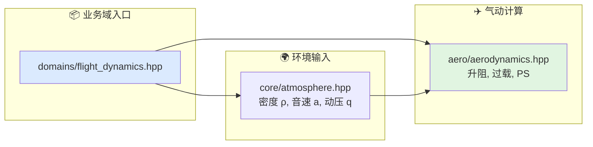

# 飞行与气动文档索引

本目录对应算法层的飞行与气动业务域。

## 代码入口

- `include/xsf_math/domains/flight_dynamics.hpp`
- `include/xsf_math/core/atmosphere.hpp`
- `include/xsf_math/aero/aerodynamics.hpp`

## 文档

- `基础知识整理.md`
- `气动与飞行.md`
