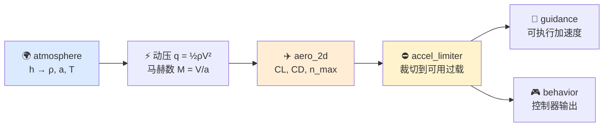
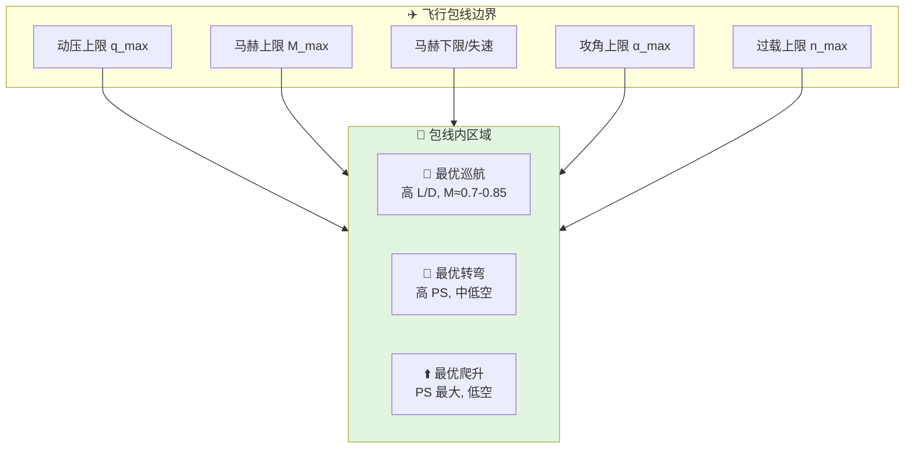

# 气动力学与飞行动力学

> 本文对应 `include/xsf_math/aero/aerodynamics.hpp` 和 `include/xsf_math/core/atmosphere.hpp`。

## 新手入门

气动模块解决的问题不是”把升力阻力公式写出来”，而是给上层回答一个更实际的问题：

当前这枚导弹、这架飞机，在这个高度、这个速度、这个质量下，到底还能不能完成所需机动。

所以它在算法链中的角色更像”能力边界判定器”，而不是完整飞控系统。

## 1. 当前实现能力

当前气动相关能力包括：

- 标准大气状态计算
- 二维升阻模型
- 最大可用过载估算
- 比剩余功率估算
- 简化燃油消耗模型
- 简化火箭发动机模型
- 失速检查与包线检查

## 2. 为什么大气模型和气动模型要放在一起看

大多数气动计算都围绕以下量展开：

$$
q = \frac{1}{2} \rho V^2, \quad M = \frac{V}{a}
$$

| 符号 | 含义 | 公式 |
|------|------|------|
| $\rho$ | 空气密度 | ISA 大气模型输出 |
| $q$ | 动压 | $q = \frac{1}{2} \rho V^2$ |
| $M$ | 马赫数 | $M = V / a$ |
| $C_L$ | 升力系数 | 查表或经验模型 |
| $C_D$ | 阻力系数 | $C_D = C_{D0} + K C_L^2$ |

其中标准大气能力由 `atmosphere` 提供。

这意味着：

- 高度改变，会先改变密度和音速
- 密度和音速改变，又会影响动压和马赫数
- 动压和马赫数再影响升阻、最大过载和推力效果

所以 `atmosphere` 实际上是整个气动估算链的入口。

## 3. 二维气动模型解决的问题

`aero_2d` 使用典型的抛物线阻力极线：

$$
C_D = C_{D0} + \frac{C_L^2}{\pi \cdot AR \cdot e}
$$

其中 $K = \frac{1}{\pi \cdot AR \cdot e}$ 为诱导阻力因子。

这类模型不是为了替代完整六自由度气动数据库，而是为了给上层提供三个关键信息：

- 产生某个升力要付出多少阻力代价
- 当前动压下大概还能提供多大机动能力
- 在不同速度/高度下，平台性能如何变化

适合：

- 飞机/导弹的快速性能估算
- 过载能力评估
- 制导指令与气动约束耦合

## 4. 最大过载为什么是核心输出

当前实现支持根据：

- 动压
- 参考面积
- `CLmax`
- 质量

估算最大可用过载。

这一步的意义非常大，因为它把：

- 制导想要的机动
- 平台实际上能做的机动

分开了。

典型逻辑是：

1. `guidance` 给出理想法向加速度
2. `aero` 根据当前动压和质量算出上限
3. `accel_limiter` 把指令裁到可执行范围内

所以 `aero` 是制导链里最关键的”现实约束层”。

## 5. 比剩余功率为什么重要

光知道当前能不能拉出某个过载还不够，还要知道这种飞法是不是可持续。

比剩余功率回答的是：

- 当前推力减阻力之后，剩余能量是在增加还是在减少
- 当前状态是更适合加速、爬升，还是已经处于性能边缘

这对：

- 飞机性能分析
- 导弹末段能量保持
- 外部框架做动作切换

都很有价值。

## 6. 推进与燃料为什么只做轻量模型

当前不是完整推进系统模型，但提供了两个轻量能力：

- `fuel_model`
- `rocket_motor`

它们的定位不是还原复杂发动机内循环，而是给上层提供：

- 推力大致量级
- 质量/燃料随时间的变化
- 动力来源对飞行性能的影响

这已经足够支撑工程估算和交战示例。

## 7. 典型算法链位置

气动模块最常处在下面这条链中：



### 飞行包线示意



在算法层里，它负责把环境量转成能力边界；在行为层里，这些边界又会继续约束拉升、转弯、下降、进近等动作。

## 8. 适用边界

当前气动模型偏向工程估算，不包含：

- 六自由度完整气动力/力矩建模
- 高超声速热效应
- 复杂翼身耦合
- 真正的控制面气动导数体系

如果后续要承载高保真飞行动力学，应在现有结构之上继续扩展，而不是误把当前实现当作完整飞控模型。

## 9. 气动逻辑核心知识点

以下是理解当前气动模型和行为层飞行逻辑所需的关键知识点。

### 9.1 抛物线阻力极线

核心公式：

$$
C_D = C_{D0} + K \cdot C_L^2, \quad K = \frac{1}{\pi \cdot AR \cdot e}
$$

- `Cd0`：零升阻力系数，与平台外形和表面状态有关
- `K`：诱导阻力因子
- `AR`：展弦比（翼展^2 / 翼面积），AR 越大诱导阻力越小
- `e`：Oswald 效率因子（通常 0.7-0.95），反映翼型的升力分布偏离椭圆的程度

这意味着升力越大，阻力以平方关系增加。在制导和机动计算中，这直接决定了”拉 N 个 g 要付出多大速度衰减”。

当前 `aero_2d` 采用单一 Cd0 的不可压模式。如果上层需要跨音速阻力上升行为，可以：

- 在上层用 `interpolation::linear_lookup` 做 `Mach → Cd0` 插值，再把结果填进 `aero_2d.cd0`
- 需要高保真时引入独立的跨音速阻力修正表，由上层维护

### 9.2 动压与升力方程

$$
q = \frac{1}{2} \rho V^2, \quad L = q \cdot S \cdot C_L, \quad D = q \cdot S \cdot C_D
$$

- `q`：动压，单位 Pa。动压为零时无气动控制能力
- `S`：参考面积
- `CL`/`Cd`：升力/阻力系数

最大可用法向力为 $q \cdot S \cdot C_{L_{max}}$，因此最大可用过载为：

$$
n_{max} = \frac{q \cdot S \cdot C_{L_{max}}}{m \cdot g}
$$

这就是 `accel_limiter::max_available_g` 和 `aero_2d::max_g_available` 的物理来源。

### 9.3 标准大气模型（ISA 1976）

ISA 将对流层（0-11 km）建模为温度线性递减：

$$
\begin{aligned}
T(h) &= T_0 - L \cdot h \quad (L = 6.5 \text{ K/km}) \\
P(h) &= P_0 \cdot \left(\frac{T}{T_0}\right)^{\frac{g}{R \cdot L}} \\
\rho(h) &= \frac{P}{R \cdot T} \\
a(h) &= \sqrt{\gamma R T}
\end{aligned}
$$

平流层（11-20 km）温度恒定约 216.65 K。

在整个链路中，高度变化首先影响密度和音速，进而影响动压和马赫数，最终影响所有气动相关输出。

### 9.4 动压门限与低能量保护

行为层的所有控制器都检查 `flight_controls_available`：

$$
\text{if } V < V_{min} \text{ or } q < q_{min}: \quad \text{拒绝输出有效控制命令}
$$

这防止了在低速/低动压状态下发出不可执行的气动控制指令。

### 9.5 高度制导中的圆弧假设

高度制导将航迹角变化建模为匀速圆弧运动：

$$
\begin{aligned}
S &= V \cdot \Delta t \quad \text{（弧长）} \\
R &= \frac{S}{|\Delta \gamma|} \quad \text{（弧半径）} \\
a_n &= \frac{V^2}{R} \quad \text{（法向加速度）}
\end{aligned}
$$

然后叠加重力偏置 `cos(fpa) * g` 以抵消重力的纵向分量。这是 `altitude_guidance_command` 在 `include/xsf_behavior/flight/basic_controllers.hpp` 中的核心公式。

这种方法的含义是：
- 需要改变的航迹角越大，所需法向加速度越大
- 速度越快，需要的法向加速度也越大（因为弧半径受限于时间步内的弧长）
- 重力偏置是必要的，否则平飞保持时会持续下沉

### 9.6 飞行路径角制导中的重力补偿

飞行路径角制导的核心是：

$$
\begin{aligned}
\omega &= \frac{\Delta \theta}{\Delta t} \\
a_{cmd,z} &= \omega \cdot V
\end{aligned}
$$

然后必须减去当前姿态下重力在 ECS 中的分量：

```text
gravity_ecs = WCS_to_ECS({0, 0, g}, attitude)
compensated_z = commanded_z - gravity_ecs.z
```

如果不做重力补偿，压头时会过度，抬头时会不足。`flight_path_angle_guidance_command` 在计算完名义法向加速度后会显式减去这个重力 ECS 分量。

### 9.7 协调转弯的侧向加速度

协调转弯（无侧滑转弯）的原理是通过滚转分量产生侧向力来改变航向：

$$
\begin{aligned}
a_{lat} &= \frac{\Delta \psi}{\Delta t} \cdot V_{ground} \\
\phi &= \arctan\left(\frac{a_{lat}}{g}\right)
\end{aligned}
$$

滚转角是侧向加速度与重力加速度之比的反正切。在 1g 侧向加速度时滚转约 45 度。xsf_behavior 的 `heading_change_command` 实现与经典协调转弯理论一致。

### 9.8 所需垂向速度的 sqrt(g*Δh) 公式

高度制导中使用的所需垂向速度公式：

$$
V_v = \sqrt{g \cdot |\Delta h|}
$$

这来源于等减速假设：如果以恒定 1g 减速从当前高度差收敛到零高度差，初始所需的垂向速度恰好是 `sqrt(2 * g/2 * Δh) = sqrt(g * Δh)`。这提供了一个自然的”远了快飞、近了慢飞”的平滑收敛行为。

### 9.9 跨音速阻力上升

当前 `aero_2d` 使用单一 Cd0，不内建跨音速阻力上升模型。如果需要覆盖这段非线性，建议在上层：

- 用 `interpolation::linear_lookup` 对 `Mach → Cd0` 做显式插值
- 典型关键参数：跨音速阻力开始上升的马赫数 0.7-0.8、达到超音速水平的马赫数 1.1-1.3
- 跨音速区间内 Cd0 呈 S 形快速增长，对导弹末段能量预测和飞行器性能包线影响极大

## 10. API 速查

所有符号位于 `namespace xsf_math`。

**`core/atmosphere.hpp`**

| 符号 | 角色 |
|------|------|
| `atmosphere::temperature / pressure / density / sonic_velocity` | ISA 1976 基本大气量 |
| `atmosphere::dynamic_pressure(alt, V)` | 动压 $q = \frac{1}{2} \rho V^2$ |
| `atmosphere::mach_number(alt, V)` / `speed_from_mach(alt, M)` | 马赫/真空速互转 |
| `atmosphere::density_altitude(alt, ΔT)` | 非标大气密度高度反解 |
| `atmosphere::dynamic_viscosity / kinematic_viscosity` | Sutherland 律黏度 |
| `atmosphere::non_standard` | 带温度偏差的非标准大气子模型 |

**`aero/aerodynamics.hpp`**

| 符号 | 角色 |
|------|------|
| `aero_coefficients` | `cl / cd / cy` 三分量系数包 |
| `aero_state` / `aero_state::from_alt_speed(alt, V)` | 高度+速度 → 密度/动压/马赫 的状态缓存 |
| `aero_forces` | 机体系（ECS）中的 `drag / side / normal / lift` 分量 |
| `aero_2d` | 抛物线极线 2D 气动模型（含 `cd0_mach_table` 查表） |
| `aero_2d::compute(state, requested_g_normal, requested_g_lateral)` | 按请求过载反算气动力 |
| `aero_2d::max_g_available(state, mass)` | $n_{max} = qS C_{L_{max}}/(mg)$ |
| `aero_2d::specific_excess_power(state, T, m, C_L)` | 比剩余功率 $P_s$ |
| `fuel_model` | 按推力消耗的简化燃油模型，含 `sfc` 比油耗 |
| `rocket_motor` | 标称推力/燃烧时间/比冲的轻量火箭模型 |
| `is_stalled(aoa, critical_aoa)` | 失速检查 |
| `flight_envelope::within_envelope(...)` | 马赫/高度/过载/最小速度包线检查 |

## 11. 相关源码

- `include/xsf_math/core/atmosphere.hpp`
- `include/xsf_math/aero/aerodynamics.hpp`
- `include/xsf_behavior/flight/flight_state.hpp`
- `include/xsf_behavior/flight/basic_controllers.hpp`
- `examples/missile_engagement_example.cpp`
- `tests/test_guidance.cpp`
- `tests/test_flight.cpp`
