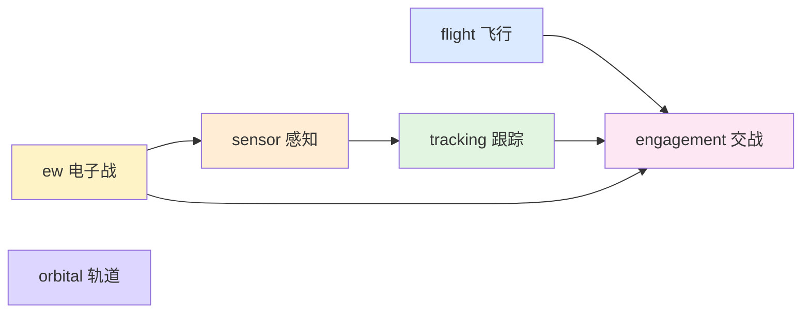

# 行为层文档索引

行为层对应 `include/xsf_behavior/`，把算法层各业务域的公式组合成“这一帧应当产出哪些意图”的控制器。行为层不推进仿真状态，只输出命令/判定/计划。

## 已落地子域

- `飞行/` → `include/xsf_behavior/flight/`
  飞行状态、原子控制器、原生制导程序层。
- `感知/` → `include/xsf_behavior/sensor/`
  雷达调度 + 探测决策。参考 `xsf-core XsfDefaultSensorScheduler`。
- `跟踪/` → `include/xsf_behavior/tracking/`
  航迹起始、关联、M/N 确认、丢弃。参考 `xsf-core XsfDefaultSensorTracker::State`。
- `交战/` → `include/xsf_behavior/engagement/`
  发射计算、PN/APN 制导、引信与 Pk。参考 `xsf-core XsfLaunchComputer`。
- `电子战/` → `include/xsf_behavior/ew/`
  SSJ / SOJ 选择 + 技术库选通。参考 `xsf-core XsfEW_EA`。
- `轨道/` → `include/xsf_behavior/orbital/`
  Hohmann、平面机动、圆化机动的序列规划。参考 `xsf-core XsfOrbitalManeuversHohmannTransfer`。

## 设计目标

- 不引入完整仿真内核
- 不负责状态推进和任务调度
- 不维护实体生命周期
- 只输出控制/判定/计划意图

## 通用模式

行为层的每个模块都遵循相同的四件套：

1. **输入结构**：当前态势 + 约束/参数；
2. **控制器结构**：内部状态 + 一个 `compute` / `select` / `evaluate` / `update` 方法；
3. **输出结构**：意图命令（带有效位 / 违反项 / 估计值）；
4. **日志**：用 `XSF_LOG_*` 记录决策轨迹，不触发任何仿真动作。

## 阅读路径

1. `飞行/README.md`
2. `感知/README.md`
3. `跟踪/README.md`
4. `交战/README.md`
5. `电子战/README.md`
6. `轨道/README.md`

## 与算法层的边界

行为层依赖算法层的：

- 大气与速度/动压估算
- 常量和基础数学
- 坐标与几何量表达
- 雷达方程与统计检测
- 卡尔曼滤波与关联门限
- 制导公式、引信、Pk 模型
- EW 公式、轨道机动 Δv

行为层新增的是：

- 目标 / 状态 / 限制 / 命令的结构化表达
- 阶段状态机（交战、制导程序）
- 调度优先级（搜索 vs 跟踪）
- 技术库选通 / 机动序列规划

算法层的详细解释见：

- `../算法层/README.md`
- `../算法层/算法链路与逻辑详解.md`
- `../算法层/基础支撑/`
- `../算法层/感知与探测/`
- `../算法层/跟踪估计/`
- `../算法层/交战与杀伤/`
- `../算法层/飞行与气动/`
- `../算法层/电子战/`
- `../算法层/轨道动力学/`
