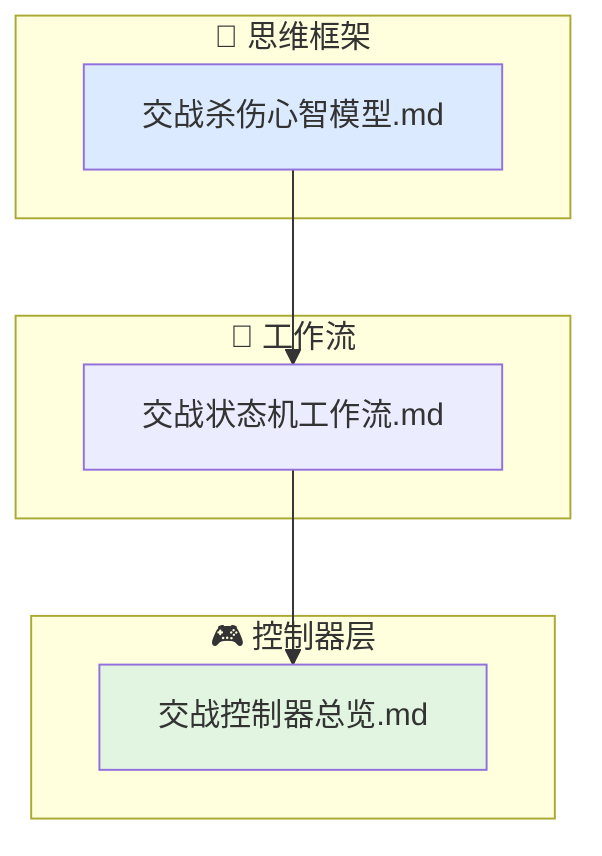

# 交战行为文档索引

当前行为层的交战子域覆盖"从发现目标到发射武器、再到末制导、引信起爆和杀伤评估"的完整闭环。

## 文档结构

- `交战杀伤心智模型.md`
  发射窗口的本质、制导律与气动能力的博弈、引信判决的离散化逻辑、Pk 的物理含义。
- `交战状态机工作流.md`
  从 pre_engage 到 burst/post_engage 的六阶段状态流转与触发条件。
- `交战控制器总览.md`
  `launch_computer`、`fuze_controller`、`engagement_controller` 的职责、输入、输出与限制条件。

## 代码对应关系

- `include/xsf_behavior/engagement/launch_computer.hpp`
- `include/xsf_behavior/engagement/fuze_controller.hpp`
- `include/xsf_behavior/engagement/engagement_controller.hpp`
