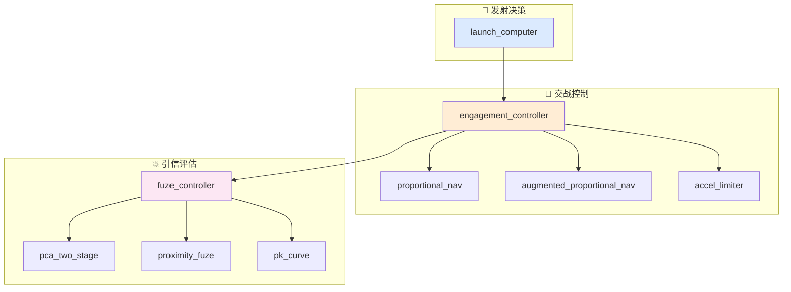
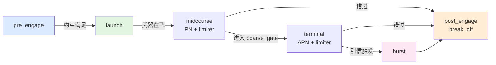

# 交战控制器总览

本文档描述当前 `xsf-behavior` 交战子域中各控制器的职责边界、典型输入和输出意图。

## 总体架构



## 控制器列表

### `launch_computer`

用途：
对候选目标估算拦截时间、预测拦截点，并检查发射约束。

典型场景：
- `pre_engage` 阶段决定是否允许发射
- 武器分配阶段评估多个候选目标的可行性

关键参数：
- `weapon_kinematics`：武器运动学参数（推力加速度、燃尽速度、燃烧时间、滑行减速、最小末速）
- `launch_constraint_limits`：发射约束门限（斜距、高度差、离轴角、闭合速度、飞行时间）

典型输出：

| 字段 | 含义 |
|------|------|
| `all_constraints_met` | 所有约束是否满足 |
| `validity_flags` | 哪些字段计算有效（位掩码） |
| `time_of_flight_s` | 估算飞行时间 |
| `intercept_point_wcs` | 预测拦截点（WCS） |
| `launcher_bearing_rad` | 发射方位角 |
| `launcher_elevation_rad` | 发射俯仰角 |
| `violated_*` | 各约束的违反标志 |

### `fuze_controller`

用途：
组合 PCA、近炸引信和 Pk 模型，给出"本次是否应当起爆 + 预估杀伤概率"的意图输出。

典型场景：
- 每帧检查弹目几何是否满足起爆条件
- 估算当前交会条件下的杀伤概率

关键参数：
- `pca.coarse_gate_m` / `pca.fine_gate_m`：两阶段 PCA 门限
- `fuze.trigger_radius_m`：近炸触发半径
- `fuze.arm_delay_s`：解除保险延迟
- `pk`：杀伤概率曲线

典型输出：

| 字段 | 含义 |
|------|------|
| `status` | 引信状态（no_trigger/proximity_burst/contact/miss/dud） |
| `burst` | 是否起爆（快速读取位） |
| `in_coarse_gate` | 是否在粗门限内 |
| `in_fine_gate` | 是否在细门限内 |
| `miss_distance_m` | 当前弹目距离 |
| `time_to_cpa_s` | 距 CPA 的时间 |
| `effective_miss_m` | 叠加 EW 后的等效脱靶量 |
| `estimated_pk` | 预估杀伤概率 |

### `engagement_controller`

用途：
组合发射计算、制导律和引信评估，按六阶段状态机输出当前帧的交战意图。

典型场景：
- 每帧根据当前态势更新交战状态
- 决定当前阶段应输出的制导指令或发射/起爆意图

关键组件：
- `lc`：`launch_computer`
- `pn`：`proportional_nav`
- `apn`：`augmented_proportional_nav`
- `fuze`：`fuze_controller`
- `limiter`：`accel_limiter`

典型输出：

| 字段 | 含义 |
|------|------|
| `phase` | 当前交战阶段 |
| `issue_launch` | 是否发出发射指令 |
| `guidance_accel_cmd` | 制导加速度指令（三维向量） |
| `fuze_decision` | 引信评估结果 |
| `request_break_off` | 是否请求脱离 |

## 状态流转



## 关键实现细节

### 发射约束的位掩码

```cpp
namespace launch_computer_validity {
    constexpr unsigned int launch_time        = 0x0001u;
    constexpr unsigned int launcher_bearing   = 0x0002u;
    constexpr unsigned int launcher_elevation = 0x0004u;
    constexpr unsigned int time_of_flight     = 0x0008u;
    constexpr unsigned int intercept_time     = 0x0010u;
    constexpr unsigned int intercept_point    = 0x0020u;
}
```

外部框架可以检查 `validity_flags` 了解哪些字段可信。

### 武器运动学简化

```cpp
double nominal_flight_speed_mps() const {
    double avg = 0.5 * (weapon.burnout_speed_mps + weapon.min_terminal_speed_mps);
    return std::max(avg, 1.0);
}
```

使用推力段末速和最小末速的算术平均作为名义速度，用于二次方程求解。

### 制导律切换逻辑

```cpp
if (cmd.fuze_decision.in_coarse_gate) {
    cmd.phase = engagement_phase::terminal;
    raw = apn.compute_accel(ctx.geom);
} else {
    cmd.phase = engagement_phase::midcourse;
    raw = pn.compute_accel(ctx.geom);
}
cmd.guidance_accel_cmd = limiter.limit(raw);
```

粗门限内切换 APN，粗门限外使用 PN。所有制导指令都经过 `accel_limiter` 限幅。

### 脱靶量的 EW 降级

```cpp
d.effective_miss_m = ew_degraded_miss_distance(cpa.miss_distance_m,
                                                in.track_error_increase_m);
d.estimated_pk = pk.evaluate(d.effective_miss_m);
```

跟踪误差增大 → 等效脱靶量增大 → Pk 下降。

## 当前适用方式

交战控制器适合被外部仿真框架按时间步调用：

1. 外部框架维护武器和目标状态
2. 每帧组装 `engagement_context`
3. 调用 `engagement_controller.update(ctx)`
4. 按 `phase` 处理结果：
   - `pre_engage`：检查 `issue_launch`
   - `launch`：创建武器实体
   - `midcourse` / `terminal`：消费 `guidance_accel_cmd`
   - `burst`：触发战斗部
   - `post_engage`：决定是否重攻或放弃
5. 外部框架推进动力学状态

当前仓库不直接提供武器实体管理或战斗部物理仿真。

## 相关源码

- `include/xsf_behavior/engagement/launch_computer.hpp`
- `include/xsf_behavior/engagement/fuze_controller.hpp`
- `include/xsf_behavior/engagement/engagement_controller.hpp`
- `include/xsf_math/guidance/proportional_nav.hpp`
- `include/xsf_math/lethality/fuze.hpp`
- `include/xsf_math/lethality/pk_model.hpp`
- `include/xsf_math/aero/aerodynamics.hpp`
