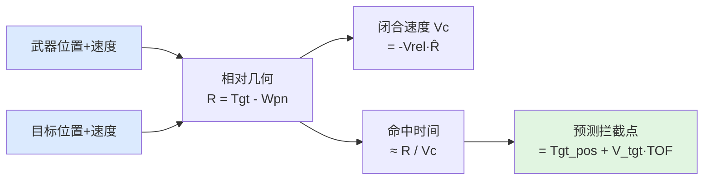
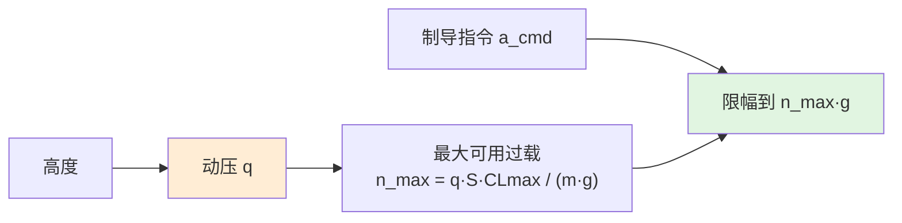
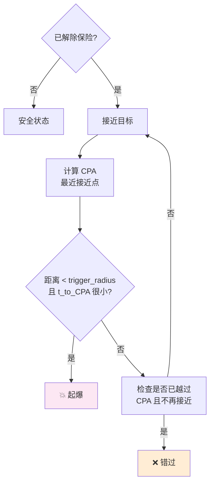
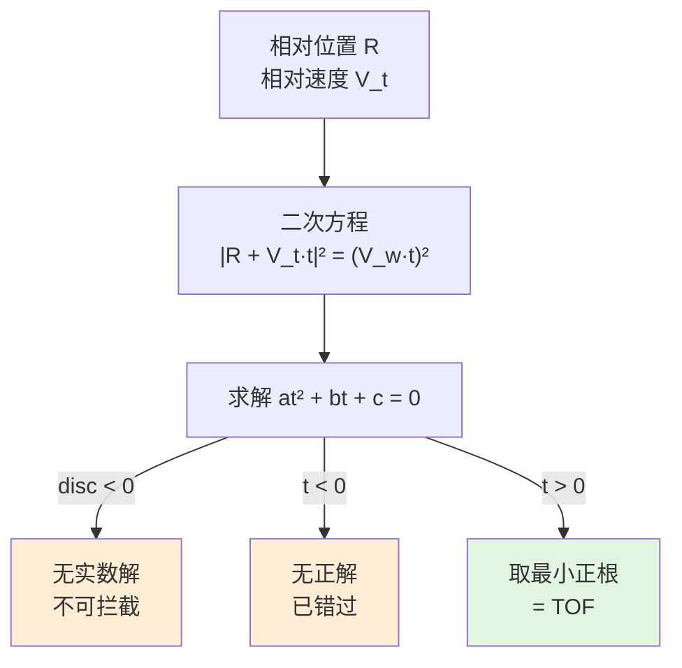
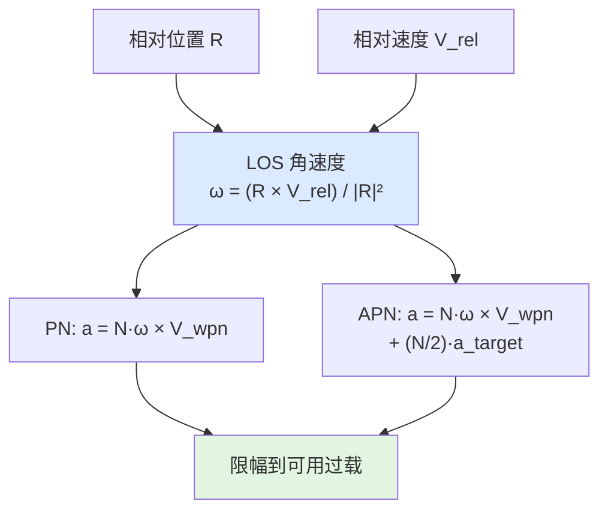
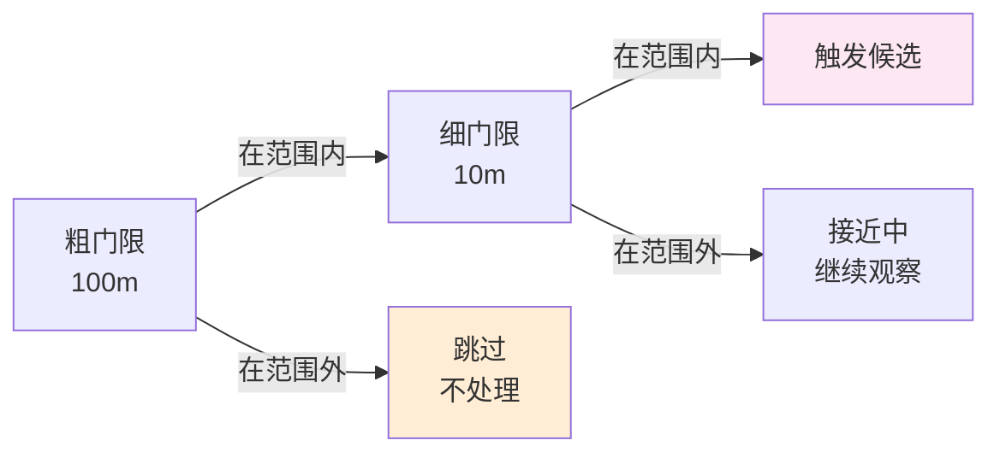
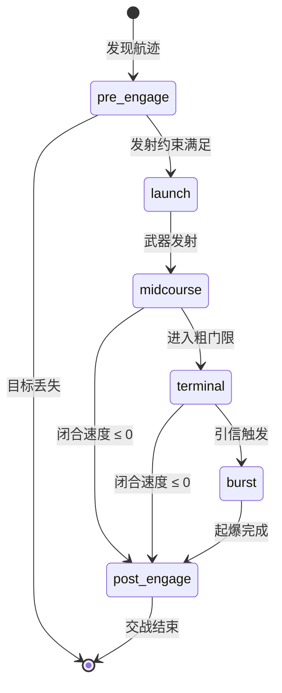
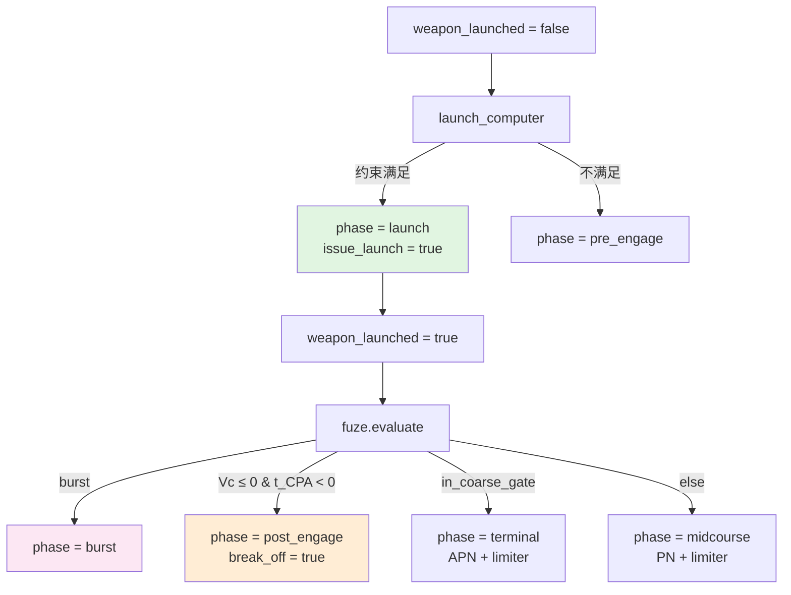

# 交战杀伤心智模型

> 本文为行为层建立思维框架。不解释单个控制器的接口，而是回答"当你要让一个武器系统在仿真中正确地决定何时发射、如何制导、何时起爆、杀伤概率多大时，到底需要考虑哪些事情"。

## 0. 为什么需要这份心智模型

交战链是仿真中最复杂的闭环之一。它串联了发射决策、制导律、气动约束、引信判定和杀伤评估五个环节。缺少正确的心智模型，会遇到：

- 发射窗口计算错误，导弹飞出后根本追不上目标
- 制导律输出理想加速度，但平台做不到，导致失控
- 引信在错误时机起爆，错过最佳杀伤位置
- Pk 评估过于乐观或悲观，无法支撑战术决策

这份文档从"拦截的物理本质"出发，建立完整的思维地图。

## 1. 交战的四个核心约束

### 1.1 几何约束——导弹能不能飞到拦截点

发射前必须回答：在当前位置、速度、目标运动状态下，导弹能否在燃料/能量耗尽前到达目标附近？

关键量：

- **拦截时间（TOF）**：导弹从发射到接近目标的时间
- **预测拦截点（PIP）**：假设目标匀速，导弹与目标轨迹的交会点
- **闭合速度**：导弹与目标接近的相对速度



### 1.2 能量约束——导弹飞过去后还有没有能量机动

导弹的能量是"一次性"的：

- 助推段：发动机工作，速度快速增加
- 巡航/滑行段：发动机关机，靠惯性飞行，气动阻力持续消耗能量
- 末段：剩余能量决定能做多大的末端机动

关键洞察：**不是"能不能到达"，而是"到达后还有没有能量做末段修正"**。


行为层的 `launch_computer` 使用简化模型：
- 推力段：平均加速度 × 时间 = 速度增量
- 滑行段：恒定减速（气动阻力近似）
- 整体：用平均速度估算 TOF

### 1.3 气动约束——制导指令能不能被执行

制导律（PN/APN）输出的是"理想加速度方向"，但导弹实际能产生的加速度受限于：

- 动压（高度和速度决定）
- 最大升力系数 CLmax
- 参考面积和质量



### 1.4 引信约束——接近后能不能在正确时机起爆

引信不是"靠近就炸"，而是一组精确的逻辑：

- **解除保险**：发射后一定时间/距离内不激活（防止自伤）
- **近炸窗口**：目标进入触发半径内
- **CPA 判定**：最近接近点是否在有效范围内
- **起爆时机**：在 CPA 附近起爆，使破片/冲击波覆盖目标



## 2. 发射窗口的思维链

### 2.1 发射不是"想打就打"

发射窗口由多个约束共同决定：

| 约束 | 含义 | 典型限制 |
|------|------|---------|
| 斜距 | 目标不能太远也不能太近 | min/max slant range |
| 高度差 | 导弹的爬升/下降能力 | min/max delta altitude |
| 离轴角 | 目标必须在发射器指向范围内 | max boresight angle |
| 闭合速度 | 目标不能飞离太快 | max opening speed |
| 飞行时间 | 导弹燃料/能量限制 | max time of flight |

行为层的 `launch_computer` 同时检查这些约束，只有全部满足才给出 `all_constraints_met = true`。

### 2.2 拦截时间的估算



二次方程来源于：导弹以平均速度 `V_w` 直线追击，目标以速度 `V_t` 匀速运动，求两者距离为零的时间。

注意：这是一个**简化模型**，假设：
- 导弹以恒定平均速度飞行（忽略加速/减速过程）
- 目标匀速直线运动（忽略机动）
- 不考虑制导律的弯曲弹道

### 2.3 为什么用二次方程而不是精确积分

- 精确积分需要知道完整的弹道和制导律，计算量大
- 二次方程给出解析解，足够快速
- 在发射决策阶段，需要的是"能不能打"而非"精确打到哪"
- 末制导阶段由 PN/APN 负责精确修正

## 3. 制导的思维链

### 3.1 制导律的目标——让视线角速度归零

比例导引（PN）的核心思想：

$$
\mathbf{a}_{cmd} = N \cdot \boldsymbol{\omega}_{LOS} \times \mathbf{V}_{missile}
$$

其中 $\boldsymbol{\omega}_{LOS}$ 是视线（LOS）角速度。如果 LOS 角速度为零，导弹和目标在同一方向上运动，最终会相撞。



### 3.2 为什么末段用 APN 而非 PN

- **PN**：假设目标不机动。如果目标机动，LOS 角速度不能归零，会产生"脱靶"
- **APN**：加入目标加速度估计的修正项，提前补偿目标机动

行为层的 `engagement_controller` 在 coarse gate 内切换 APN，在 coarse gate 外使用 PN。

### 3.3 纵横耦合问题

三维加速度向量需要分解到俯仰/偏航通道：
- 纵向：控制高低方向的加速度
- 横向：控制左右方向的加速度

当前行为层输出三维加速度向量，没有显式分解。外部框架需要自行映射到舵面或推力矢量。

## 4. 引信与杀伤的思维链

### 4.1 最近接近点（CPA）

假设导弹和目标速度恒定，CPA 是两者轨迹在空间中最接近的点。

$$
t_{CPA} = -\frac{\Delta\mathbf{R} \cdot \Delta\mathbf{V}}{|\Delta\mathbf{V}|^2}
$$

- $t_{CPA} > 0$：还在接近
- $t_{CPA} = 0$：当前就是最近点
- $t_{CPA} < 0$：已经越过

### 4.2 两阶段 PCA

为了减少计算量，引信检查分两个阶段：

1. **粗门限**（大半径，如 100m）：快速筛选，排除明显不可能的目标
2. **细门限**（小半径，如 10m）：精确判定，决定是否起爆



### 4.3 脱靶量到 Pk 的映射

脱靶量（miss distance）是 CPA 时的弹目距离。Pk（杀伤概率）随脱靶量变化：

- 脱靶量 = 0：直接命中，Pk ≈ 1
- 脱靶量 < 杀伤半径：破片/冲击波覆盖，Pk 高
- 脱靶量 > 杀伤半径：Pk 快速下降

行为层使用 `pk_curve` 查表或曲线来映射。

### 4.4 EW 对杀伤的降级

干扰不仅降低探测概率，还通过增大跟踪误差来增大脱靶量：

$$
miss_{eff} = \sqrt{miss_{baseline}^2 + track\_error_{increase}^2}
$$

跟踪误差增大 → 脱靶量增大 → Pk 下降。

## 5. 交战状态机的思维链

行为层把交战过程组织为六个阶段：



### 5.1 各阶段的核心问题

| 阶段 | 核心问题 | 行为层输出 |
|------|---------|-----------|
| pre_engage | 能不能打？ | `launch_computer` 约束检查结果 |
| launch | 发射指令 | `issue_launch = true` |
| midcourse | 怎么飞向目标？ | PN 制导加速度 |
| terminal | 末段精确修正 | APN 制导加速度 |
| burst | 起爆判定 | 引信触发 + Pk 估计 |
| post_engage | 脱离/重攻 | `request_break_off = true` |

### 5.2 阶段切换的触发条件



## 6. 一张图：交战工作时的完整考虑清单

```text
┌────────────────────────────────────────────────────────┐
│                    外部框架 / 跟踪层                        │
│           提供确认航迹（位置、速度、目标类型）               │
└────────────────────┬───────────────────────────────────┘
                     │ 目标状态
                     ▼
┌────────────────────────────────────────────────────────┐
│                  行为层 / launch_computer                    │
│                                                        │
│  输入：当前位置、目标位置、目标速度、武器运动学参数           │
│  处理：二次方程估算 TOF → 预测拦截点 → 约束检查             │
│  输出：all_constraints_met / violated_* / PIP             │
└────────────────────┬───────────────────────────────────┘
                     │ 发射决策
                     ▼
┌────────────────────────────────────────────────────────┐
│                  外部框架 / 武器发射                        │
│           创建武器实体、赋予初始速度、启动推进               │
└────────────────────┬───────────────────────────────────┘
                     │ 武器状态
                     ▼
┌────────────────────────────────────────────────────────┐
│                  行为层 / engagement_controller              │
│                                                        │
│  pre_engage → launch → midcourse → terminal → burst      │
│                                                        │
│  每帧：                                                 │
│    ├─ 检查引信（fuze_controller）                        │
│    ├─ 若未触发 → 根据距离选 PN / APN                     │
│    ├─ 加速度限幅（accel_limiter）                        │
│    └─ 输出 guidance_accel_cmd                            │
└────────────────────┬───────────────────────────────────┘
                     │ 制导指令
                     ▼
┌────────────────────────────────────────────────────────┐
│                  外部框架 / 动力学 / 飞控                    │
│           把加速度指令映射到舵面/推力，推进状态              │
└────────────────────┬───────────────────────────────────┘
                     │ 更新后的弹目几何
                     ▼
┌────────────────────────────────────────────────────────┐
│                  行为层 / fuze_controller                    │
│                                                        │
│  输入：弹目位置、速度、飞行时间                             │
│  处理：PCA → 引信检查 → CPA 计算 → 脱靶量 → Pk           │
│  输出：burst / miss / no_trigger + estimated Pk           │
└────────────────────────────────────────────────────────┐
```

## 7. 常见误解

### "只要距离够近就能命中"

不是。脱靶量取决于相对几何和制导精度。即使距离只有 10m，如果相对速度垂直于视线，导弹可能"擦肩而过"。

### "PN 制导一定能命中"

不是。PN 在目标机动、导弹能量不足、气动饱和时都会失效。APN 能部分补偿目标机动，但受限于加速度上限。

### "引信半径越大越好"

不是。引信半径大意味着更早起爆，但如果目标还在破片飞散锥的边缘，实际杀伤效果可能不如在更近位置起爆。

### "Pk = 1 意味着一定杀伤"

不是。Pk 是概率。Pk = 0.99 意味着平均 100 次中有 1 次不杀伤。蒙特卡洛仿真中必须体现这个随机性。

### "发射约束全部满足就能打中"

不是。发射约束只回答"能不能发射"，不回答"能不能命中"。命中还取决于制导精度、目标机动、气动能力、引信时机。

### "交战状态机必须严格按顺序走"

不是。状态可以回退或提前终止：
- pre_engage 中目标丢失 → 直接结束
- midcourse 中目标机动逃逸 → 可能永远无法进入 terminal
- terminal 中闭合速度变负 → 进入 post_engage（miss）

## 8. 相关源码

- `include/xsf_behavior/engagement/launch_computer.hpp` — 发射计算机
- `include/xsf_behavior/engagement/fuze_controller.hpp` — 引信控制器
- `include/xsf_behavior/engagement/engagement_controller.hpp` — 交战状态机
- `include/xsf_math/guidance/proportional_nav.hpp` — PN/APN 制导律
- `include/xsf_math/lethality/fuze.hpp` — 引信模型
- `include/xsf_math/lethality/pk_model.hpp` — Pk 模型
- `include/xsf_math/aero/aerodynamics.hpp` — 气动约束
- `tests/test_guidance.cpp` — 制导与交战验证
