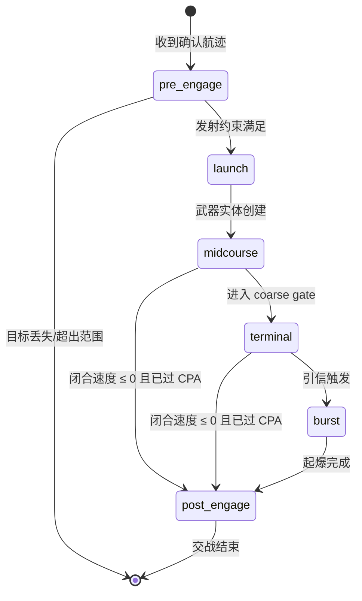
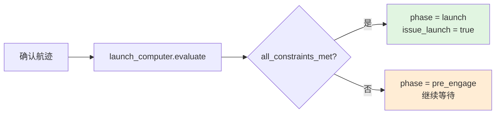
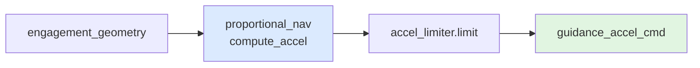
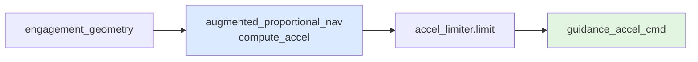
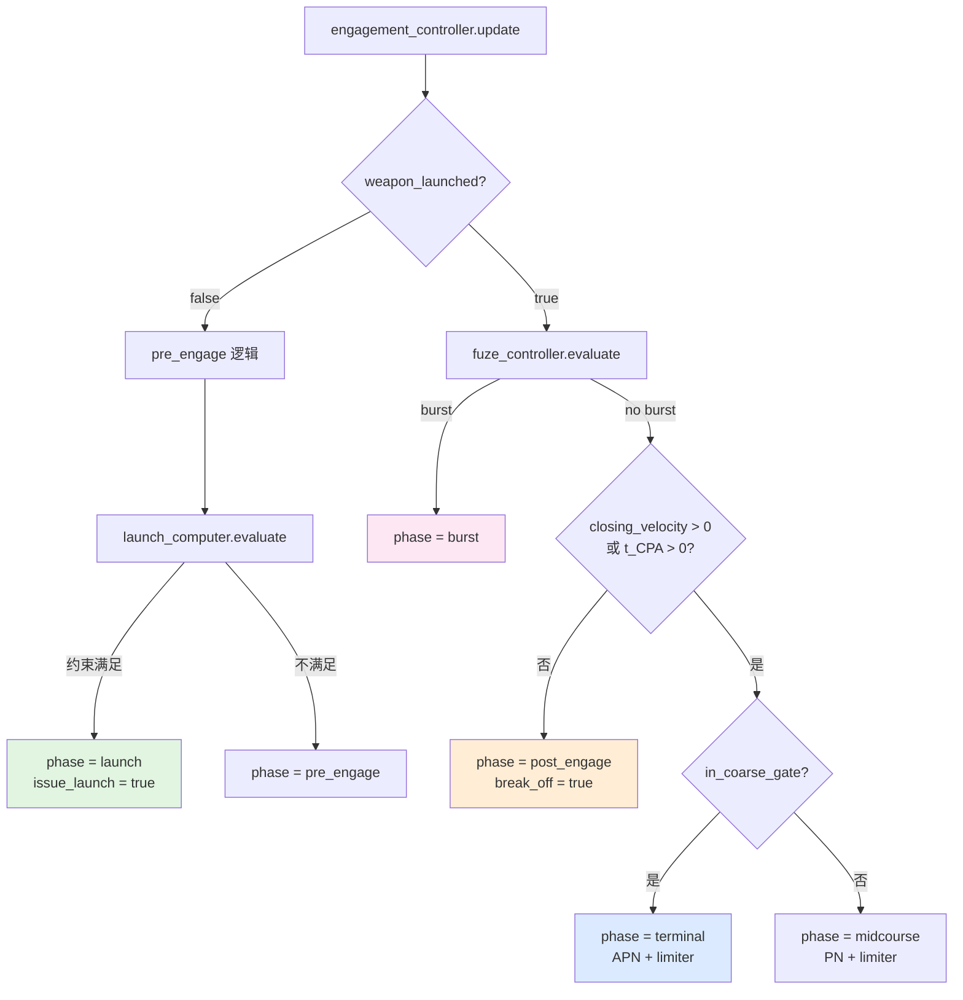

# 交战状态机工作流

本文档描述从发现目标到交战结束的六阶段状态流转与触发条件。

## 0. 总体状态机

## 1. 各阶段详解

### 1.1 pre_engage —— 预交战

触发条件：
- 收到跟踪层传来的确认航迹
- 武器尚未发射

退出条件：
- `launch_computer` 所有约束满足 → 进入 `launch`
- 目标航迹丢失/丢弃 → 结束

输出：
- `issue_launch`：是否允许发射
- `lc_result`：包含约束违反详情

### 1.2 launch —— 发射

触发条件：
- `pre_engage` 阶段约束满足
- 本周期输出 `issue_launch = true`

外部框架职责：
- 创建武器实体
- 赋予初始速度和姿态
- 启动发动机/助推器
- 设置 `weapon_launched = true`

注意：行为层本身**不创建实体**，只输出发射意图。

### 1.3 midcourse —— 中段制导

触发条件：
- 武器已发射
- 未进入 coarse gate
- 引信未触发
- 仍在接近（闭合速度 > 0 或 t_CPA > 0）

制导律：PN（纯比例导引）

### 1.4 terminal —— 末段制导

触发条件：
- 武器已发射
- 进入 `coarse_gate`（距离 < coarse_gate_m）
- 引信未触发
- 仍在接近

制导律：APN（增广比例导引）

为什么切换 APN：
- 末段距离近，目标机动的影响被放大
- APN 加入目标加速度补偿，减少脱靶量

### 1.5 burst —— 起爆

触发条件：
- `fuze_controller` 判定 `burst = true`
- 即：`proximity_fuze.check` 返回 `proximity_burst` 或 `contact`

输出：
- `phase = burst`
- `fuze_decision` 包含 estimated Pk

外部框架职责：
- 触发战斗部爆炸
- 计算实际杀伤结果（可基于 `estimated_pk` 做蒙特卡洛抽样）

### 1.6 post_engage —— 交战后

触发条件：
- 闭合速度 ≤ 0 且已越过 CPA（t_CPA < 0）
- 或起爆完成后

输出：
- `phase = post_engage`
- `request_break_off = true`

含义：
- 如果未起爆就进入 post_engage，表示 miss
- 外部框架可选择重攻（重新进入 pre_engage）或放弃

## 2. 状态转换决策树

## 3. 关键参数

### launch_computer 约束

| 参数 | 默认值 | 含义 |
|------|--------|------|
| `max_slant_range_m` | 1e9 | 最大斜距 |
| `min_slant_range_m` | 0 | 最小斜距 |
| `max_delta_altitude_m` | 1e6 | 最大高度差 |
| `max_boresight_rad` | π | 最大离轴角 |
| `max_opening_speed_mps` | 1e6 | 最大远离速度 |
| `max_time_of_flight_s` | 1e6 | 最大飞行时间 |

### fuze_controller 参数

| 参数 | 默认值 | 含义 |
|------|--------|------|
| `coarse_gate_m` | 100 | 粗门限半径 |
| `fine_gate_m` | 10 | 细门限半径 |
| `trigger_radius_m` | 10 | 近炸触发距离 |
| `arm_delay_s` | 1 | 解除保险延迟 |

### engagement_controller 制导参数

| 参数 | 默认值 | 含义 |
|------|--------|------|
| `pn.nav_ratio` | 3.0 | PN 导引比 |
| `apn.nav_ratio` | 3.0 | APN 导引比 |
| `limiter.max_g` | 30.0 | 最大可用过载 |

## 4. 当前边界

当前交战状态机尚未覆盖：

- **多目标交战**：同时攻击多个目标的优先级裁决
- **多弹协同**：多枚导弹对同一目标的时序配合
- **发射后不管（LOAL）**：发射后目标丢失的重捕获
- **中途目标切换**：发射后更换目标
- **能量管理**：基于剩余能量的制导策略调整
- **地形避让**：低空飞行时的地形跟随/回避

## 5. 相关源码

- `include/xsf_behavior/engagement/engagement_controller.hpp`
- `include/xsf_behavior/engagement/launch_computer.hpp`
- `include/xsf_behavior/engagement/fuze_controller.hpp`
- `include/xsf_math/guidance/proportional_nav.hpp`
- `include/xsf_math/lethality/fuze.hpp`
