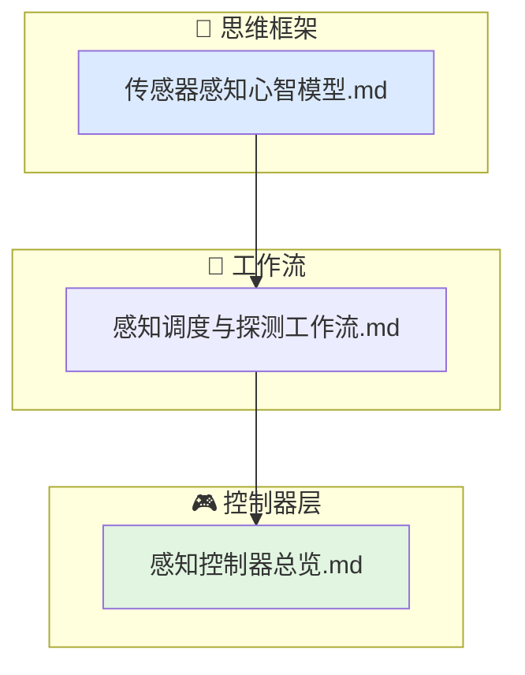

# 感知行为文档索引

当前行为层的感知子域覆盖"传感器如何决定下一帧该照射谁、以及照射后如何判定是否发现目标"。

## 文档结构

- `传感器感知心智模型.md`
  搜索与跟踪的调度思维、探测判决的统计本质、驻留资源分配的物理约束。
- `感知调度与探测工作流.md`
  从调度器选择目标到探测控制器产出判决的完整数据流。
- `感知控制器总览.md`
  `sensor_scheduler` 和 `detection_controller` 的职责、输入、输出与限制条件。

## 代码对应关系

- `include/xsf_behavior/sensor/sensor_schedule.hpp`
- `include/xsf_behavior/sensor/detection_controller.hpp`
