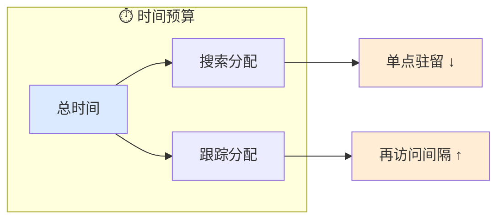
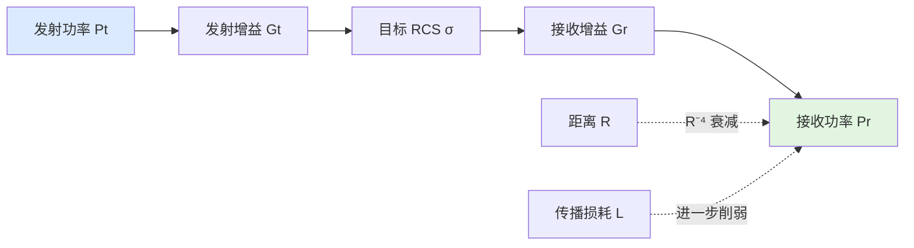
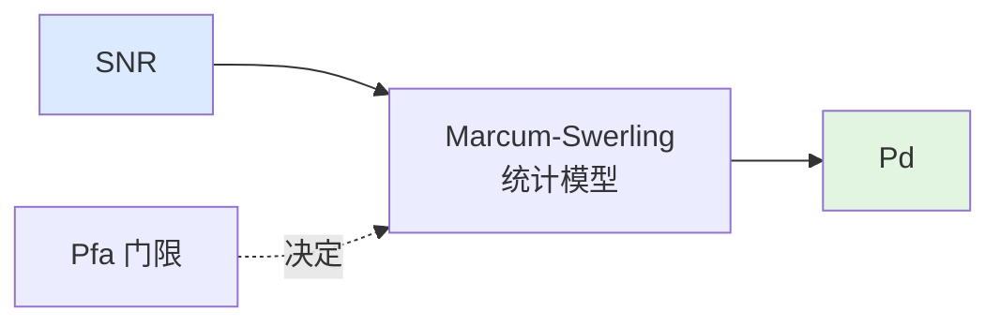
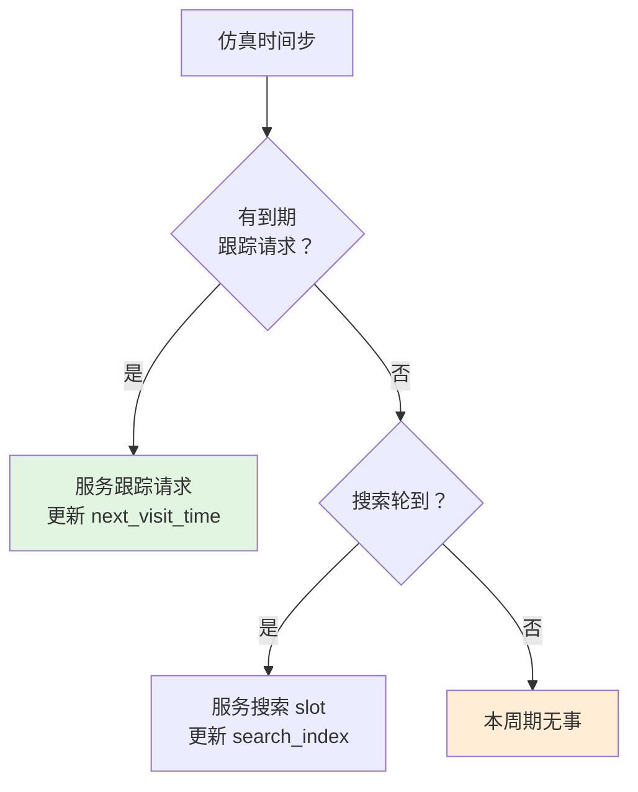
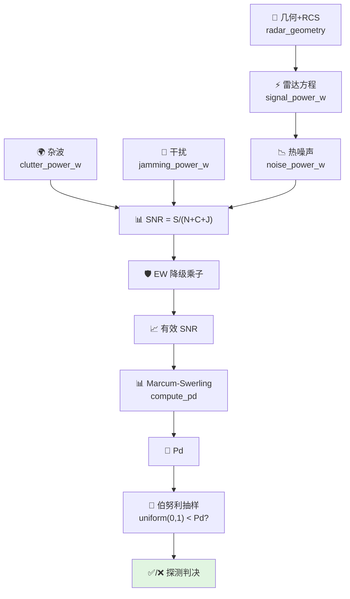

# 传感器感知心智模型

> 本文为行为层建立思维框架。不解释单个控制器的接口，而是回答"当你要让一个传感器在仿真中正确地搜索、跟踪、判定目标时，到底需要考虑哪些事情"。

## 0. 为什么需要这份心智模型

感知层的代码看起来只是"选个目标、算个 SNR、抽个随机数"，但它背后隐含了大量工程判断：

- 为什么跟踪请求要优先于搜索？
- 为什么探测结果是随机的，而不是"SNR 够高就一定发现"？
- 为什么同一组参数，不同距离上的探测效果差异巨大？
- 为什么干扰不改变雷达方程本身，却能大幅降低发现概率？

这份文档从"传感器在物理和统计层面面对哪些现实"出发，帮你建立完整的思维地图。

## 1. 传感器面临的三个核心约束

任何传感器在任何时刻都受到三类约束：

### 1.1 时间约束——雷达不能同时看所有方向

雷达天线的主瓣只有一个。要覆盖空间，必须通过机械转动或电子扫描让波束在不同方向间切换。这个切换需要时间。

关键量：

- **帧时间**：搜索完整个责任区所需的时间
- **驻留时间**：波束停留在单个方向的时长
- **再访问间隔**：对同一目标的两次照射之间的时间

这意味着：
- 搜索帧时间越短，对单方向的驻留时间就越短，能量积累越少，探测距离越近
- 跟踪目标越多，搜索帧时间被压缩得越厉害
- 存在一个硬性上限：跟踪请求数超过 `max_track_requests` 后，新航迹无法被维持



### 1.2 能量约束——信号在传播中会衰减

雷达发射的能量在空间中扩散，回波再扩散一次。这是雷达方程的物理基础。

关键链条：



这意味着：
- 距离增加一倍，回波功率变为 1/16（四次方反比）
- 即使所有硬件参数不变，远处目标的 SNR 也会急剧下降
- 增大天线增益或发射功率可以部分补偿，但存在工程上限

### 1.3 统计约束——探测是概率事件，不是确定性事件

即使回波功率完全确定，探测结果仍然是随机的。原因：

- 噪声是随机的（热噪声服从瑞利分布）
- 目标回波可能起伏（Swerling 模型）
- 门限 crossing 是统计判决

关键量：

- **虚警概率 Pfa**：没有目标时错误报有的概率
- **探测概率 Pd**：有目标时正确报有的概率
- **检测门限**：由 Pfa 决定的 SNR 门限



这意味着：
- SNR = 10 dB 时 Pd 可能只有 0.3；SNR = 15 dB 时 Pd 可能跃升到 0.9
- 同一目标、同一参数，每次试验的结果可能不同
- 行为层的 `detection_controller` 用伯努利抽样来体现这个随机性

## 2. 搜索 vs 跟踪：资源竞争的本质

传感器的核心矛盾是：**搜索需要覆盖广度，跟踪需要维持精度，两者争夺同一个时间预算。**

### 2.1 搜索模式

- 不知道目标在哪里，需要在责任区内扫描
- 每点的驻留时间短，但覆盖范围广
- 发现概率与帧时间、驻留时间、搜索范围有关

### 2.2 跟踪模式

- 已知目标大致位置，需要在预测位置附近照射
- 驻留时间可以更长，能量积累更多
- 但需要定期回访，否则航迹会发散

### 2.3 为什么跟踪优先

`sensor_scheduler` 的默认策略是"跟踪优先于搜索"：

1. 已确认航迹代表高价值目标，丢失它的代价高于未发现新目标
2. 跟踪的预测位置不确定性小，可以用更窄的波束/更短的搜索框
3. 搜索可以容忍更长的帧时间（未发现新目标是常态）



## 3. 探测判决的思维链

单次照射后，探测控制器必须回答"这次是否判为有目标"。这不是简单的"SNR > 门限"，而是一个统计链路。

### 3.1 思维链



### 3.2 为什么 SNR 要并联 N+C+J

分母不是简单的噪声常数，而是三个独立来源的功率叠加：

$$
SNR = \frac{S}{N + C + J}
$$

- **N（热噪声）**：接收机内部电子热运动产生，始终存在
- **C（杂波）**：地面/海面/气象反射的回波，与雷达照射区域有关
- **J（干扰）**：敌方有意发射的电磁能量

三者是**并联**关系，不是串联。这意味着：
- 即使信号很强，如果干扰功率是信号的 100 倍，有效 SNR 仍然很低
- 降低杂波（用 MTI/PD 处理）和降低干扰（用旁瓣对消）是两条独立的技术路线

### 3.3 为什么是伯努利抽样而不是确定性门限

在真实雷达中，即使 Pd = 0.99，也不意味着"每次都能发现"。噪声的随机性导致：

- 有时噪声刚好和目标同相叠加，信号显得更强（漏检概率低）
- 有时噪声反相抵消，信号显得极弱（漏检概率高）

行为层的 `detection_controller` 提供两种模式：

- **随机模式**（`stochastic = true`）：`uniform(0,1) < Pd`，体现统计本质
- **确定性模式**（`stochastic = false`）：`Pd >= threshold`，方便测试和复现

仿真应优先使用随机模式，但在回归测试和参数扫描时可切到确定性模式。

## 4. 干信比 J/S 的物理含义

电子战对探测链的影响通过干信比 J/S 体现。

### 4.1 自卫式干扰（SSJ）

目标携带干扰机，雷达从目标方向同时看到回波和干扰。

$$
\frac{J}{S} \propto R^2
$$

关键洞察：**距离越远，干扰优势越大**。因为信号按 R⁻⁴ 衰减，而干扰只按 R⁻² 衰减（干扰机到雷达是单程）。

这意味着：
- 近距离雷达可以"烧穿"干扰（信号强于干扰）
- 远距离干扰占优，雷达可能完全丢失目标
- 存在"烧穿距离"：J/S = 1 时的临界距离

### 4.2 站外干扰（SOJ）

干扰机位于与目标不同的位置。

$$
\frac{J}{S} \propto \frac{R_t^4}{R_j^2}
$$

关键洞察：目标距离雷达越远（Rt 越大），干扰优势越大；但干扰机自身距离（Rj）也影响效果。

## 5. 一张图：传感器工作时的完整考虑清单

```text
┌────────────────────────────────────────────────────────┐
│                    外部框架 / 任务调度                      │
│           决定"现在使用什么模式"、"责任区边界"               │
└────────────────────┬───────────────────────────────────┘
                     │ 模式指令 + 目标列表
                     ▼
┌────────────────────────────────────────────────────────┐
│                  行为层 / sensor_scheduler                 │
│                                                        │
│  输入：                                                 │
│    ├─ 搜索目标列表（slot）                                │
│    ├─ 跟踪请求列表（request_id + next_visit_time）        │
│    └─ 当前仿真时间                                       │
│                                                        │
│  处理：                                                 │
│    ├─ 检查到期跟踪请求 → 优先服务                         │
│    ├─ 无到期跟踪 → 按轮询服务搜索                         │
│    └─ 更新下次访问时间                                   │
│                                                        │
│  输出：                                                 │
│    ├─ target_index（照射哪个目标）                        │
│    ├─ mode（search / track）                            │
│    └─ dwell_time（驻留时长）                             │
└────────────────────┬───────────────────────────────────┘
                     │ 照射指令
                     ▼
┌────────────────────────────────────────────────────────┐
│                  算法层 / 雷达方程 + 传播                    │
│           计算基线信号功率、噪声功率、传播损耗               │
└────────────────────┬───────────────────────────────────┘
                     │ 基线 SNR
                     ▼
┌────────────────────────────────────────────────────────┐
│                行为层 / detection_controller               │
│                                                        │
│  输入：                                                 │
│    ├─ 基线 SNR                                          │
│    ├─ 杂波功率 + 干扰功率                                │
│    ├─ EW 降级乘子                                        │
│    └─ 检测器参数（Swerling case、Pfa、N脉冲）             │
│                                                        │
│  处理：                                                 │
│    ├─ 并联 N+C+J 计算有效 SNR                            │
│    ├─ 叠加 EW 降级                                       │
│    ├─ Marcum-Swerling 映射到 Pd                          │
│    └─ 伯努利抽样产出判决                                 │
│                                                        │
│  输出：                                                 │
│    ├─ detected（true/false）                            │
│    ├─ Pd / SNR / 随机抽样值                              │
│    └─ 日志记录                                           │
└────────────────────┬───────────────────────────────────┘
                     │ 探测结果
                     ▼
┌────────────────────────────────────────────────────────┐
│                  外部框架 / 航迹管理                        │
│           把探测结果落到航迹上、更新滤波器                 │
└────────────────────────────────────────────────────────┘
```

## 6. 常见误解

### "SNR 够高就一定探测到"

不是。Pd = 0.99 意味着平均 100 次中有 1 次漏检。在仿真中必须体现这个随机性，否则会得到过于乐观的结果。

### "搜索和跟踪可以并行"

不能。天线主瓣只有一个。电子扫描可以在微秒级切换波束指向，但在仿真帧级别（通常毫秒到秒级），搜索和跟踪仍然需要分时。

### "干扰只是让 SNR 变小"

不只是变小，是**改变了统计分布**。强干扰可能让检测门限被迫抬高，导致 Pfa 和 Pd 同时变化。行为层目前用降级乘子近似，更精细的模型需要考虑检测器在非平稳噪声中的性能退化。

### "烧穿距离是固定值"

不是。它依赖于目标 RCS、干扰机 ERP、雷达参数。同一套雷达对不同目标的烧穿距离不同。

### "跟踪再访问间隔越短越好"

不是。再访问间隔短意味着时间预算被跟踪大量占用，搜索帧时间被压缩，可能导致漏发现新目标。这是一个优化问题，不是简单的"越短越好"。

## 7. 相关源码

- `include/xsf_behavior/sensor/sensor_schedule.hpp` — 传感器调度器
- `include/xsf_behavior/sensor/detection_controller.hpp` — 探测决策控制器
- `include/xsf_math/radar/radar_equation.hpp` — 雷达方程
- `include/xsf_math/radar/marcum_swerling.hpp` — 统计检测模型
- `include/xsf_math/ew/electronic_warfare.hpp` — 干扰模型
- `include/xsf_math/radar/clutter.hpp` — 杂波模型
- `tests/test_radar.cpp` — 雷达链路验证
