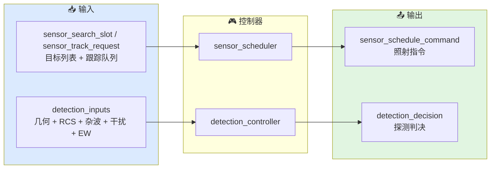
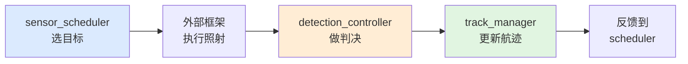

# 感知控制器总览

本文档描述当前 `xsf-behavior` 感知子域中各控制器的职责边界、典型输入和输出意图。

## 总体架构



## 控制器列表

### `sensor_scheduler`

用途：
维护搜索列表与跟踪请求列表，按时间步决定下一帧应当照射哪个目标。

典型场景：
- 初始化阶段填充搜索列表
- 发现目标后添加跟踪请求
- 每帧调用 `select` 获取照射指令
- 航迹丢失后丢弃跟踪请求

关键状态：
- `search_list`：待搜索的目标索引列表
- `track_list`：活跃跟踪请求队列
- `search_index`：当前搜索轮询位置
- `next_search_visit_s`：下次搜索服务时间

典型输出：

| 字段 | 搜索模式 | 跟踪模式 |
|------|---------|---------|
| `valid` | true | true |
| `mode` | `search` | `track` |
| `target_index` | 轮询到的目标 | 关联的目标 |
| `request_id` | -1 | 航迹 ID |
| `scheduled_time_s` | 当前时间 | 当前时间 |
| `dwell_time_s` | 分配驻留 | 分配驻留 |

### `detection_controller`

用途：
把雷达方程、统计检测和 EW 降级组合成一次"本次驻留是否判为有目标"的意图输出。

典型场景：
- 外部框架完成照射后，用实际几何和态势调用 `evaluate`
- 需要确定性结果时设置 `stochastic = false`
- 需要统计随机性时设置 `stochastic = true`

关键参数：
- `tx` / `rx`：发射机/接收机参数
- `detector`：Marcum-Swerling 检测器配置
- `stochastic`：是否启用随机抽样
- `pd_threshold`：确定性模式下的门限

典型输出：

| 字段 | 含义 |
|------|------|
| `detected` | 本次是否判为有目标 |
| `snr_linear` | 有效 SNR（线性值，已含 N+C+J+EW） |
| `snr_db` | 有效 SNR（dB） |
| `pd` | 本次的探测概率 |
| `false_alarm` | 虚警概率 |
| `sample_draw` | 随机值（随机模式）或门限（确定性模式） |

## 公共数据流



## 关键实现细节

### 跟踪优先策略

`select` 方法内部总是先检查跟踪请求，再考虑搜索。这是因为：
- 跟踪请求有明确的 `next_visit_time_s` 到期机制
- 丢失已确认航迹的代价高于未发现新目标
- 搜索可以在跟踪间隙"插空"执行

### 搜索机会间隔

```cpp
double search_chance_interval_s() const {
    return params.search_frame_time_s / search_list.size();
}
```

搜索列表越长，每个 slot 的访问间隔越长。如果跟踪请求占用了大量时间预算，实际搜索帧时间会超过设定值。

### 伯努利抽样的实现

```cpp
std::uniform_real_distribution<double> u(0.0, 1.0);
d.detected = u(rng) < pd;
```

这是体现探测统计本质的核心代码。`rng` 用固定种子初始化（默认 42），可通过外部赋值更换种子。

### EW 降级的叠加顺序

```cpp
// 1) 基线 SNR（雷达方程）
// 2) 并联 N+C+J
// 3) EW 降级乘子
double snr_lin = mix.snr_linear();
snr_lin = in.ew_effect.degrade_snr(snr_lin, in.js_ratio_linear);
```

顺序不能颠倒：必须先算物理 SNR，再乘统计降级因子。

## 当前适用方式

这些控制器适合被外部仿真框架按时间步调用：

1. 外部框架维护目标列表和态势
2. 初始化时填充 `sensor_scheduler.search_list`
3. 每帧调用 `sensor_scheduler.select(sim_time)` 获取照射指令
4. 外部框架执行照射（更新天线指向、计算实际几何）
5. 调用 `detection_controller.evaluate(inputs)` 获取探测判决
6. 把探测结果交给 `track_manager` 更新航迹
7. 根据航迹状态增删 `sensor_scheduler` 中的跟踪请求

当前仓库不直接提供电磁传播仿真或天线机械驱动模型。

## 相关源码

- `include/xsf_behavior/sensor/sensor_schedule.hpp`
- `include/xsf_behavior/sensor/detection_controller.hpp`
- `include/xsf_math/radar/radar_equation.hpp`
- `include/xsf_math/radar/marcum_swerling.hpp`
- `include/xsf_math/ew/electronic_warfare.hpp`
