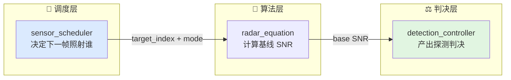
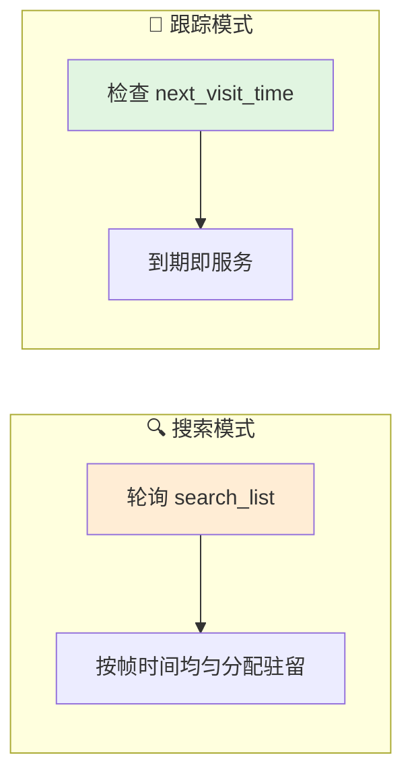
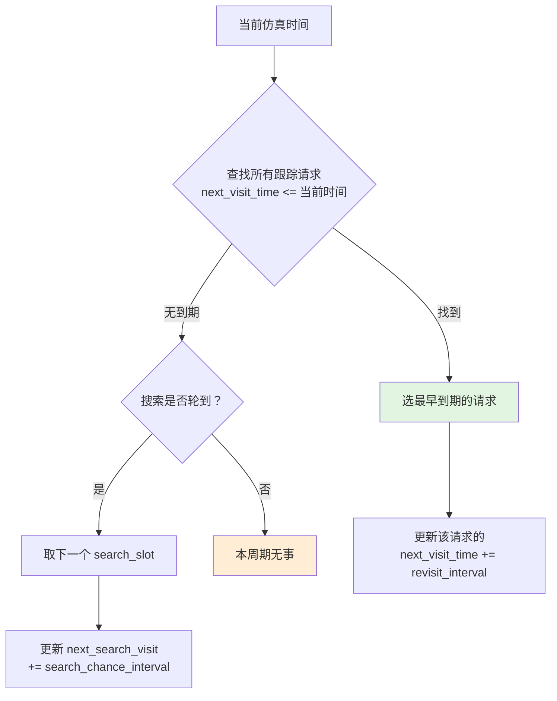
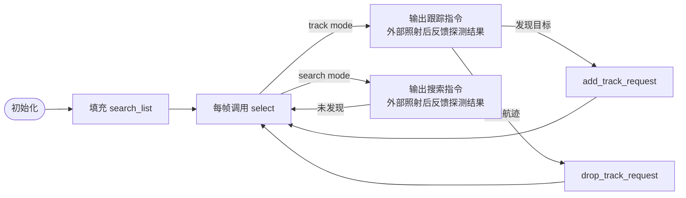
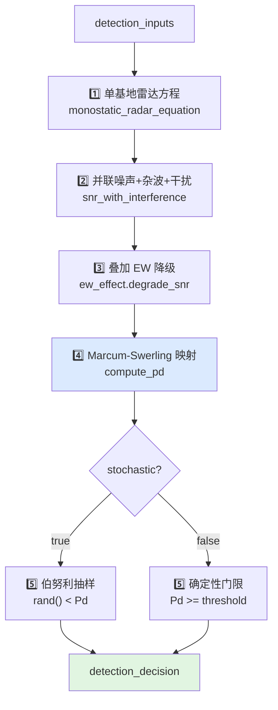
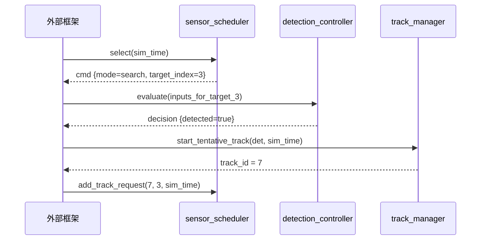
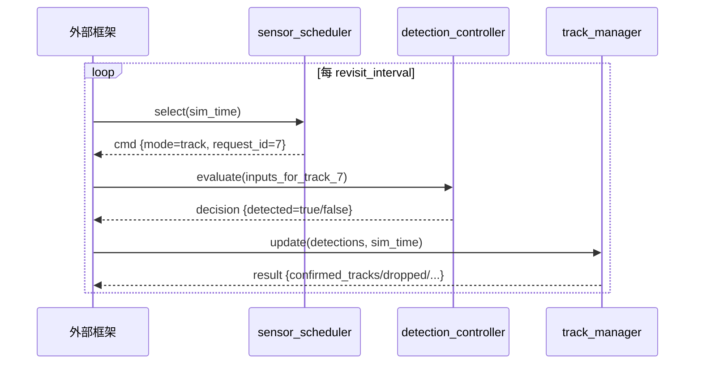

# 感知调度与探测工作流

本文档描述从传感器调度到探测判决的完整数据流。

## 0. 总体链路



## 1. 调度器工作流

### 1.1 两种模式



### 1.2 跟踪优先策略



### 1.3 关键参数

| 参数 | 默认值 | 含义 |
|------|--------|------|
| `search_frame_time_s` | 2.0 s | 搜索一圈的总时间 |
| `track_revisit_time_s` | 0.5 s | 跟踪默认再访问间隔 |
| `dwell_time_s` | 0.010 s | 单次驻留时间 |
| `max_track_requests` | 16 | 最大并发跟踪请求数 |

### 1.4 典型工作流



## 2. 探测控制器工作流

### 2.1 输入准备

外部框架在调用 `detection_controller::evaluate` 前，需要组装：

```cpp
detection_inputs in;
in.geometry.range_m = ...;           // 到目标的斜距
in.geometry.target_rcs_m2 = ...;     // 目标 RCS
in.geometry.tx_antenna_gain_db = ...;// 指向目标的发射增益
in.geometry.rx_antenna_gain_db = ...;// 指向目标的接收增益
in.geometry.elevation_rad = ...;     // 指向目标的俯仰角
in.clutter_power_w = ...;            // 杂波功率（可选）
in.jamming_power_w = ...;            // 干扰功率（可选）
in.ew_effect = ...;                  // EW 降级乘子（可选）
in.js_ratio_linear = ...;            // 干信比（可选）
```

### 2.2 判决流程



### 2.3 输出解读

```cpp
struct detection_decision {
    bool   detected;        // 本次驻留是否判为有目标
    double snr_linear;      // 有效 SNR（线性值）
    double snr_db;          // 有效 SNR（dB）
    double pd;              // 本次的探测概率
    double false_alarm;     // 虚警概率（来自检测器参数）
    double sample_draw;     // 抽样的随机值（随机模式）或门限（确定性模式）
};
```

## 3. 搜索与跟踪的协同

### 3.1 搜索发现新目标



### 3.2 跟踪维持与回退



## 4. 当前边界

当前工作流尚未覆盖：

- **多传感器协同调度**：多部雷达的时序协调
- **自适应 revisit 间隔**：根据航迹质量动态调整跟踪频率
- **确认前跟踪（TWS）**：边搜索边跟踪的混合模式
- **多普勒处理**：速度门、MTI 改善因子的实时计算
- **红外/光电探测**：只有雷达链路

## 5. 相关源码

- `include/xsf_behavior/sensor/sensor_schedule.hpp`
- `include/xsf_behavior/sensor/detection_controller.hpp`
- `include/xsf_behavior/tracking/track_manager.hpp`
- `include/xsf_math/radar/radar_equation.hpp`
- `include/xsf_math/radar/marcum_swerling.hpp`
