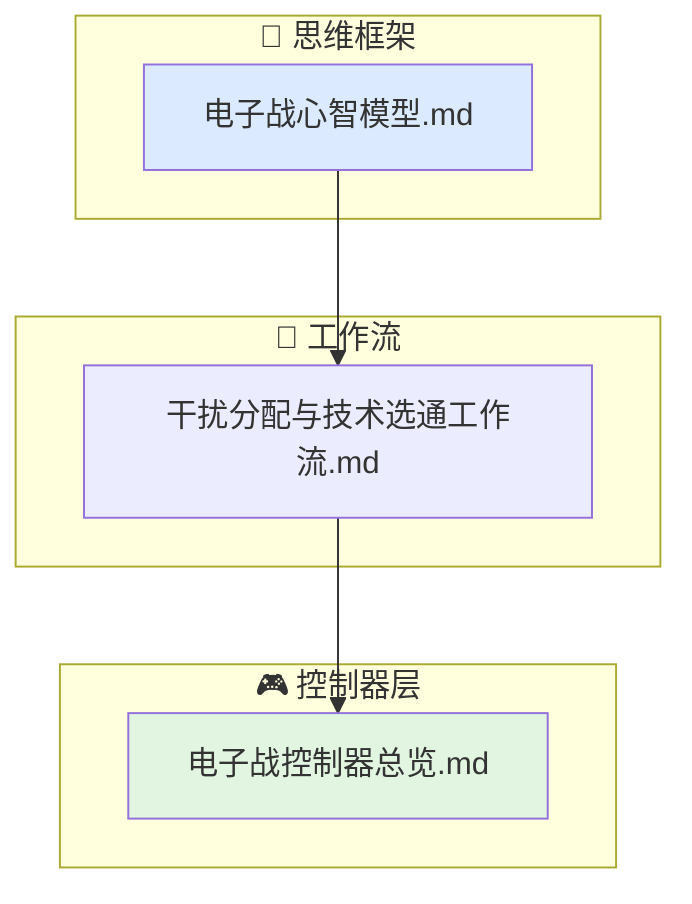

# 电子战行为文档索引

当前行为层的电子战子域覆盖"给定干扰资源，如何分配给目标、以及选用哪些技术来最大化对抗效果"。

## 文档结构

- `电子战心智模型.md`
  噪声干扰 vs 欺骗干扰的思维差异、J/S 的物理本质、技术库的模块化思想。
- `干扰分配与技术选通工作流.md`
  从态势感知到干扰模式选择再到技术选通与效果合成的完整链路。
- `电子战控制器总览.md`
  `jam_assignment_controller` 和 `ew_technique_controller` 的职责、输入、输出与限制条件。

## 代码对应关系

- `include/xsf_behavior/ew/jam_assignment.hpp`
- `include/xsf_behavior/ew/ew_technique_controller.hpp`
