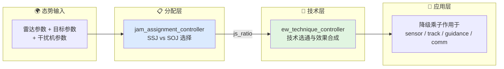
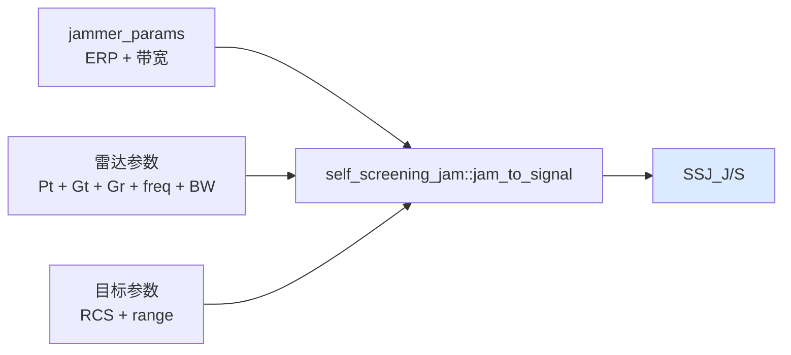
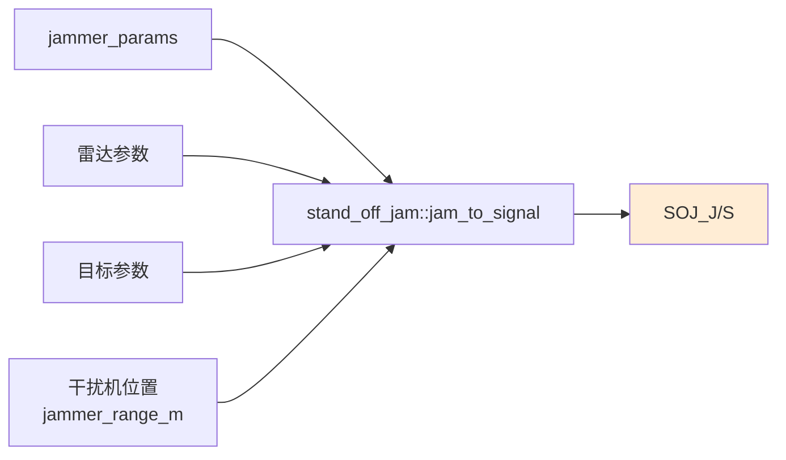
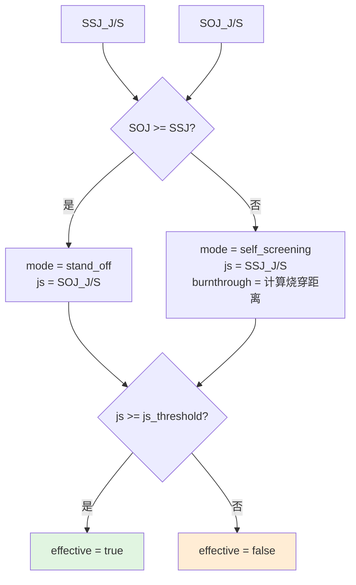
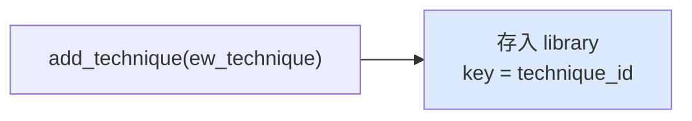
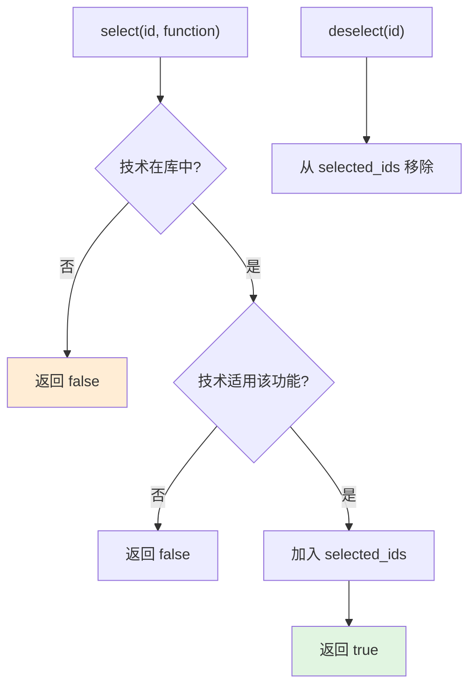
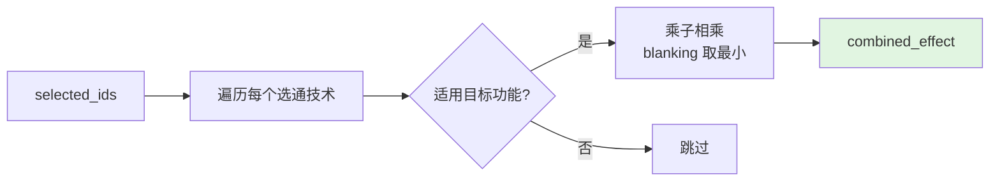
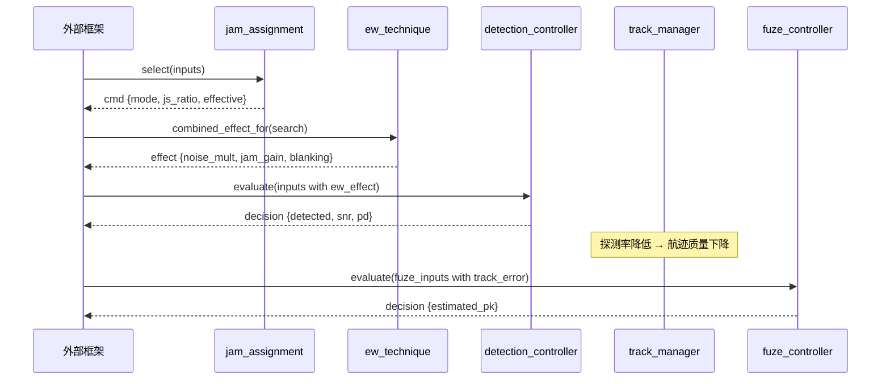

# 干扰分配与技术选通工作流

本文档描述从态势感知到干扰效果合成的完整链路。

## 0. 总体链路



## 1. 干扰分配工作流

### 1.1 SSJ 计算



### 1.2 SOJ 计算



### 1.3 选择逻辑



### 1.4 典型参数

| 参数 | 默认值 | 含义 |
|------|--------|------|
| `jammer.erp_w` | 1000 | 有效辐射功率 |
| `jammer.bandwidth_hz` | 1e9 | 干扰带宽 |
| `radar_tx_power_w` | 100000 | 雷达发射功率 |
| `radar_tx_gain_linear` | 1000 | 发射增益（线性） |
| `target_rcs_m2` | 5.0 | 目标 RCS |
| `js_threshold_linear` | 1.0 | 有效压制门限（J/S = 1 = 0 dB） |

## 2. 技术选通工作流

### 2.1 技术库注册



每条技术包含：
- `technique_id`：唯一标识
- `mitigation_class_id`：对方反制匹配 ID
- `target_function`：针对的系统功能（search/track/guidance/communication）
- `effect`：EW 降级乘子（jamming_power_gain, noise_multiplier, blanking_factor）

### 2.2 选通与去选通



### 2.3 效果合成



合成规则：
```cpp
// 干扰和噪声：乘性叠加
out.jamming_power_gain *= e.jamming_power_gain;
out.noise_multiplier   *= e.noise_multiplier;

// blanking：取最小（最保守）
out.blanking_factor = min(out.blanking_factor, e.blanking_factor);
```

## 3. 与探测/交战链的协同

### 3.1 完整降级链路



### 3.2 多函数选通示例

```cpp
// 对搜索雷达使用技术 A
ew_ctrl.select("tech_A", ew_system_function::search);

// 对跟踪雷达使用技术 B
ew_ctrl.select("tech_B", ew_system_function::track);

// 分别获取效果
auto search_effect = ew_ctrl.combined_effect_for(ew_system_function::search);
auto track_effect  = ew_ctrl.combined_effect_for(ew_system_function::track);
```

## 4. 当前边界

当前电子战工作流尚未覆盖：

- **欺骗式干扰技术**：RGPO、VGPO、角度欺骗（算法层无模型）
- **雷达告警接收机（RWR）**：截获、识别、威胁排序
- **电子防护（EP）**：频率捷变、PRF 抖动、旁瓣对消
- **红外对抗（IRCM）**：调制干扰、DIRCM
- **多干扰机协同**：多部干扰机的时频协调
- **低截获概率（LPI）对抗**：波形设计、截获因子

## 5. 相关源码

- `include/xsf_behavior/ew/jam_assignment.hpp`
- `include/xsf_behavior/ew/ew_technique_controller.hpp`
- `include/xsf_math/ew/electronic_warfare.hpp`
- `include/xsf_behavior/sensor/detection_controller.hpp`
