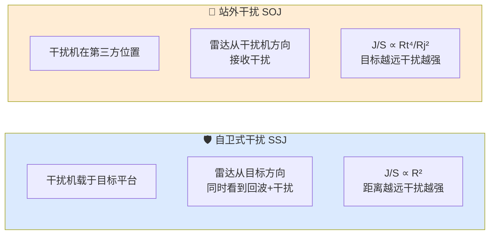
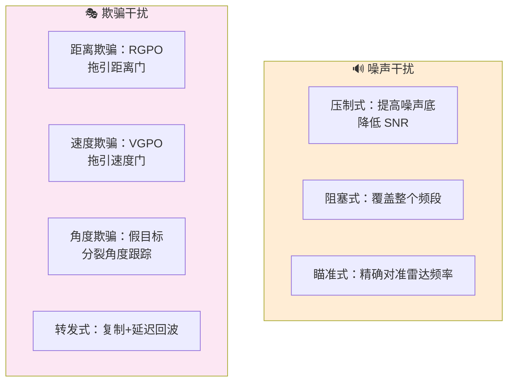
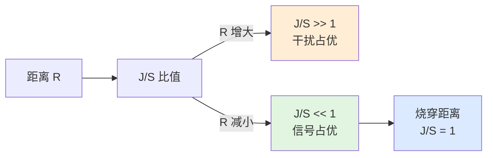
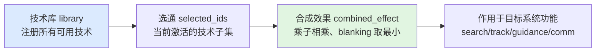
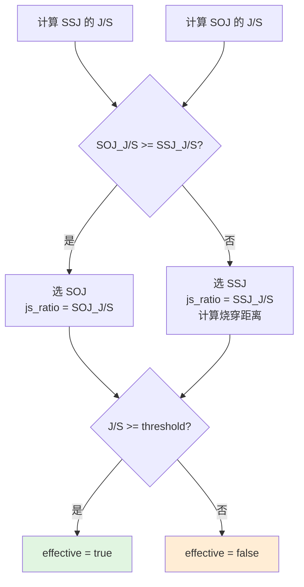

# 电子战心智模型

> 本文为行为层建立思维框架。不解释单个控制器的接口，而是回答"当你要让一个电子战系统在仿真中正确地分配干扰资源、选择对抗技术、评估干扰效果时，到底需要考虑哪些事情"。

## 0. 为什么需要这份心智模型

电子战不是"打开干扰开关就行"，而是一系列资源分配和技术选择的决策链。缺少正确的心智模型，会遇到：

- 不知道自卫干扰和站外干扰何时该切换
- 把所有技术同时打开，发现效果互相抵消
- 干扰了敌方雷达却不知道有没有效
- 没有技术库的概念，每种干扰都写死逻辑

这份文档从"电磁对抗的物理本质"出发，建立完整的思维地图。

## 1. 电子战的两个基本问题

### 1.1 问题一：用什么方式干扰

干扰方式按空间关系分为两类：



关键差异：

| | SSJ | SOJ |
|--|------|------|
| 干扰源位置 | 目标本身 | 第三方平台 |
| 传播路径 | 单程（干扰机→雷达） | 单程（干扰机→雷达） |
| J/S 距离依赖 | R²（目标到雷达距离） | Rt⁴/Rj² |
| 烧穿特性 | 近距离可烧穿 | 与目标距离无关 |
| 雷达增益 | 主瓣增益 | 可能旁瓣/主瓣 |

### 1.2 问题二：用什么技术干扰

干扰技术按效果分为两大类：



当前行为层和算法层主要覆盖**噪声干扰**。欺骗式干扰的算法模型是未来缺口（见 TODO_DEVLOG.md P2-15）。

## 2. 干信比 J/S 的物理本质

### 2.1 J/S 不是"干扰强度"

J/S 是**干扰功率与信号功率的比值**，不是绝对的干扰功率。这意味着：

- 干扰机功率很大，但目标 RCS 也很大时，J/S 可能不高
- 同样的干扰机，对小 RCS 目标（如隐身飞机）效果更好
- 雷达可以通过增大发射功率或天线增益来"对抗"干扰

### 2.2 SSJ 的 J/S 公式

$$
\frac{J}{S} = \frac{P_j G_j}{P_t G_t} \cdot \frac{4\pi R^2}{\sigma} \cdot \frac{B_r}{B_j}
$$

关键洞察：
- $R^2$ 项 → **距离越远，SSJ 优势越大**
- $\sigma$ 在分母 → **目标 RCS 越小，J/S 越大**
- $B_r/B_j$ → **干扰带宽越宽，进入接收机的干扰功率越少**

### 2.3 烧穿距离

烧穿距离是 J/S = 1 时的临界距离：



在烧穿距离以内，雷达能看到目标；以外，目标被干扰淹没。

## 3. 技术库的模块化思想

行为层的 `ew_technique_controller` 引入了"技术库"概念：



### 3.1 为什么需要技术库

- **可扩展**：新增干扰技术不需要改控制器代码，只需注册到库中
- **可组合**：多种技术的效果可以叠加（噪声乘子相乘）
- **可反制**：每种技术声明 `mitigation_class_id`，对方 EP 可以针对性反制
- **可定向**：每种技术针对特定系统功能（搜索/跟踪/制导/通信）

### 3.2 效果合成规则

```cpp
// 噪声乘子：相乘（多种噪声叠加 = 更强噪声）
out.jamming_power_gain *= e.jamming_power_gain;
out.noise_multiplier   *= e.noise_multiplier;

//  blanking：取最小（只要有一种技术能穿透，就不完全失效）
if (e.blanking_factor < out.blanking_factor)
    out.blanking_factor = e.blanking_factor;
```

## 4. 干扰分配的思维链

### 4.1 简单策略

`jam_assignment_controller` 的默认策略：



### 4.2 为什么选 J/S 更大的模式

- J/S 直接决定雷达接收端的信干比
- 更高的 J/S 意味着更强的压制效果
- SOJ 通常 J/S 更高（不依赖目标 RCS），但部署位置受限
- SSJ 始终可用（目标自带），但近距离可能被烧穿

## 5. EW 与探测链的交互

电子战不是独立系统，它与传感器/交战链深度耦合：


一条完整的降级链：
1. 干扰增大 J/S
2. 有效 SNR 下降
3. 探测概率 Pd 下降
4. 跟踪航迹质量下降（更多漏检、更大滤波误差）
5. 制导精度下降（基于噪声更大的航迹状态）
6. 脱靶量增大
7. 杀伤概率 Pk 下降

## 6. 一张图：电子战工作时的完整考虑清单

```text
┌────────────────────────────────────────────────────────┐
│                    外部框架 / 态势感知                      │
│           提供雷达参数、目标位置、干扰机位置/参数            │
└────────────────────┬───────────────────────────────────┘
                     │ 态势输入
                     ▼
┌────────────────────────────────────────────────────────┐
│              行为层 / jam_assignment_controller            │
│                                                        │
│  处理：                                                 │
│    ├─ 分别计算 SSJ 和 SOJ 的 J/S                         │
│    ├─ 选择 J/S 更大的模式                                │
│    └─ 判断是否达到有效压制门限                            │
│                                                        │
│  输出：mode + js_ratio + burnthrough_range + effective   │
└────────────────────┬───────────────────────────────────┘
                     │ 干扰分配结果
                     ▼
┌────────────────────────────────────────────────────────┐
│              行为层 / ew_technique_controller              │
│                                                        │
│  输入：                                                 │
│    ├─ 技术库 library（预注册）                            │
│    └─ 选通指令 select/deselect                            │
│                                                        │
│  处理：                                                 │
│    ├─ 按目标系统功能筛选适用技术                          │
│    ├─ 合成等效降级乘子                                   │
│    └─ 输出 blanking / noise / jamming 乘子               │
│                                                        │
│  输出：combined_effect_for(function)                     │
└────────────────────┬───────────────────────────────────┘
                     │ 降级乘子
                     ▼
┌────────────────────────────────────────────────────────┐
│              行为层 / detection_controller                 │
│           把降级乘子代入 SNR 计算，产出探测判决            │
└────────────────────┬───────────────────────────────────┘
                     │ 探测结果降级
                     ▼
┌────────────────────────────────────────────────────────┐
│              行为层 / track_manager                        │
│           探测率降低 → 航迹质量下降                       │
└────────────────────┬───────────────────────────────────┘
                     │ 航迹误差增大
                     ▼
┌────────────────────────────────────────────────────────┐
│              行为层 / fuze_controller                      │
│           脱靶量增大 → Pk 下降                           │
└────────────────────────────────────────────────────────┘
```

## 7. 常见误解

### "干扰功率越大越好"

不是。干扰效果取决于 J/S，不是绝对功率。对高 RCS 目标或大功率雷达，需要更大的干扰功率才能有效。

### "SSJ 和 SOJ 可以同时用"

可以，但需要协调。如果两者的干扰信号在雷达接收端相干叠加，可能产生不可预测的效果。行为层当前是二选一策略。

### "干扰了雷达就什么都看不到"

不是。干扰降低的是 SNR/Pd，不是完全阻断。在烧穿距离以内、或雷达使用抗干扰措施时，仍然可能探测到目标。

### "技术库里的技术效果可以随便叠加"

不是。行为层的效果合成是简化模型（乘子相乘）。实际中不同技术可能互相增强或互相抵消，需要更精细的模型。

### "blanking_factor 是干扰占空比"

类似但不完全是。它表示雷达未被压制的时间比例。`blanking_factor = 1` 表示完全未压制，`= 0` 表示完全被压制。多个技术的 blanking 取最小值，意味着只要有一种技术能穿透，就不算完全失效。

### "EW 只影响传感器，不影响交战"

不是。EW 通过探测链一路传导到杀伤链（见第 5 节）。干扰的终极效果可能是让导弹打不中。

## 8. 相关源码

- `include/xsf_behavior/ew/jam_assignment.hpp` — 干扰分配控制器
- `include/xsf_behavior/ew/ew_technique_controller.hpp` — EW 技术库
- `include/xsf_math/ew/electronic_warfare.hpp` — 干扰算法模型
- `include/xsf_behavior/sensor/detection_controller.hpp` — 探测判决（EW 降级入口）
- `include/xsf_behavior/engagement/fuze_controller.hpp` — 引信/Pk（EW 降级终点）
