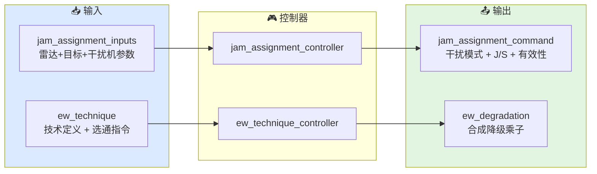

# 电子战控制器总览

本文档描述当前 `xsf-behavior` 电子战子域中各控制器的职责边界、典型输入和输出意图。

## 总体架构



## 控制器列表

### `jam_assignment_controller`

用途：
给定雷达-目标-干扰机的几何和参数关系，选择 SSJ 或 SOJ 中更优的干扰模式，并评估是否达到有效压制。

典型场景：
- 每帧根据当前态势评估最佳干扰方式
- 为 `detection_controller` 提供 `js_ratio_linear`

关键参数：
- `jammer_params`：干扰机 ERP、带宽、天线增益
- 雷达参数：发射功率、增益、频率、带宽
- 目标参数：RCS、到雷达距离
- `js_threshold_linear`：有效压制门限

典型输出：

| 字段 | 含义 |
|------|------|
| `mode` | 干扰模式（off / self_screening / stand_off） |
| `js_ratio_linear` | 选定的干信比（线性值） |
| `burnthrough_range_m` | SSJ 模式下的烧穿距离 |
| `effective` | 是否达到有效压制门限 |

### `ew_technique_controller`

用途：
维护干扰技术库，管理选通状态，按目标系统功能合成等效降级乘子。

典型场景：
- 初始化时注册可用技术
- 运行时根据态势选通/去选通技术
- 查询当前对某系统功能的合成效果

关键状态：
- `library`：技术库（unordered_map<id, ew_technique>）
- `selected_ids`：当前选通的技术 ID 列表

典型输出：

| 字段 | 含义 |
|------|------|
| `jamming_power_gain` | 干扰功率乘子（相乘合成） |
| `noise_multiplier` | 噪声底乘子（相乘合成） |
| `blanking_factor` | 未压制时间比例（取最小合成） |

## 公共数据结构

### `ew_technique`

单条干扰技术的定义：

```cpp
struct ew_technique {
    std::string         technique_id;
    std::string         mitigation_class_id;  // 对方反制匹配 ID
    ew_system_function  target_function;      // search/track/guidance/communication
    ew_degradation      effect;               // 降级乘子
};
```

### `ew_system_function`

技术可针对的系统功能枚举：

| 值 | 含义 |
|-----|------|
| `unknown` | 未指定（对所有功能有效） |
| `search` | 搜索功能 |
| `track` | 跟踪功能 |
| `guidance` | 制导功能 |
| `communication` | 通信功能 |

## 关键实现细节

### J/S 比较策略

```cpp
if (soj_js >= ssj_js && soj_js > 0.0) {
    cmd.mode = jam_assignment_mode::stand_off;
    cmd.js_ratio_linear = soj_js;
} else if (ssj_js > 0.0) {
    cmd.mode = jam_assignment_mode::self_screening;
    cmd.js_ratio_linear = ssj_js;
    cmd.burnthrough_range_m = ...;
}
```

优先选 J/S 更大的模式。SOJ 在 J/S 相等时也优先（因为不消耗目标平台的干扰资源）。

### 效果合成

```cpp
ew_degradation combined_effect_for(ew_system_function fn) const {
    ew_degradation out{};
    out.jamming_power_gain = 1.0;
    out.noise_multiplier   = 1.0;
    out.blanking_factor    = 1.0;

    for (const auto& id : selected_ids) {
        auto it = library.find(id);
        if (it == library.end()) continue;
        if (it->second.target_function != ew_system_function::unknown &&
            it->second.target_function != fn) continue;

        const auto& e = it->second.effect;
        out.jamming_power_gain *= e.jamming_power_gain;
        out.noise_multiplier   *= e.noise_multiplier;
        if (e.blanking_factor < out.blanking_factor)
            out.blanking_factor = e.blanking_factor;
    }
    return out;
}
```

初始化乘子为 1.0（无效果），然后对选通技术逐条叠加。

### 技术与功能的匹配

- `target_function = unknown` 的技术对所有功能都有效
- `target_function = search` 的技术只对搜索功能有效
- 选通时调用 `select(id, fn)` 会检查技术是否适用于指定功能

## 当前适用方式

电子战控制器适合被外部仿真框架按时间步调用：

1. 初始化阶段：
   - 创建 `ew_technique_controller`
   - 用 `add_technique` 注册所有可用技术
2. 每帧：
   - 调用 `jam_assignment_controller.select(inputs)` 获取干扰模式
   - 根据态势决定选通哪些技术（`select` / `deselect`）
   - 按目标系统功能查询 `combined_effect_for(function)`
   - 把降级乘子注入 `detection_controller` 或 `track_manager`
3. 外部框架根据 `effective` 标志决定是否需要切换策略

当前仓库不直接提供电磁频谱仿真或干扰信号生成。

## 相关源码

- `include/xsf_behavior/ew/jam_assignment.hpp`
- `include/xsf_behavior/ew/ew_technique_controller.hpp`
- `include/xsf_math/ew/electronic_warfare.hpp`
- `include/xsf_behavior/sensor/detection_controller.hpp`
