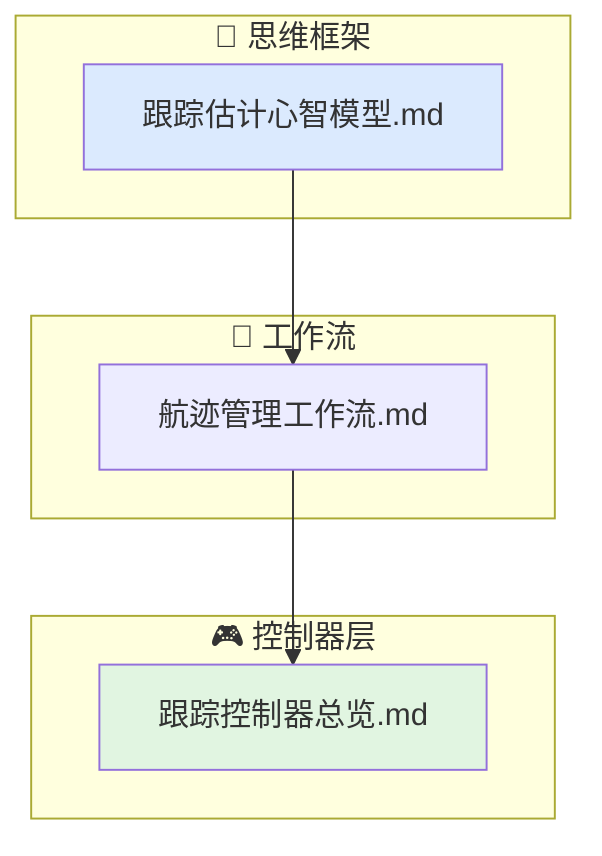

# 跟踪行为文档索引

当前行为层的跟踪子域覆盖"量测到来后，如何把它落到航迹上、如何维持航迹、以及何时丢弃"。

## 文档结构

- `跟踪估计心智模型.md`
  量测-航迹关联的本质、滤波与预测的平衡、航迹确认与丢弃的统计逻辑。
- `航迹管理工作流.md`
  从单点量测起始试探航迹到确认航迹更新再到丢航迹的完整生命周期。
- `跟踪控制器总览.md`
  `track_manager` 的职责、输入、输出与限制条件。

## 代码对应关系

- `include/xsf_behavior/tracking/track_manager.hpp`
