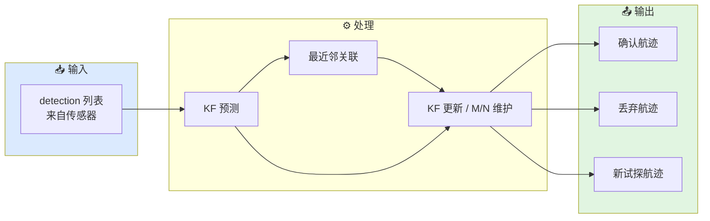
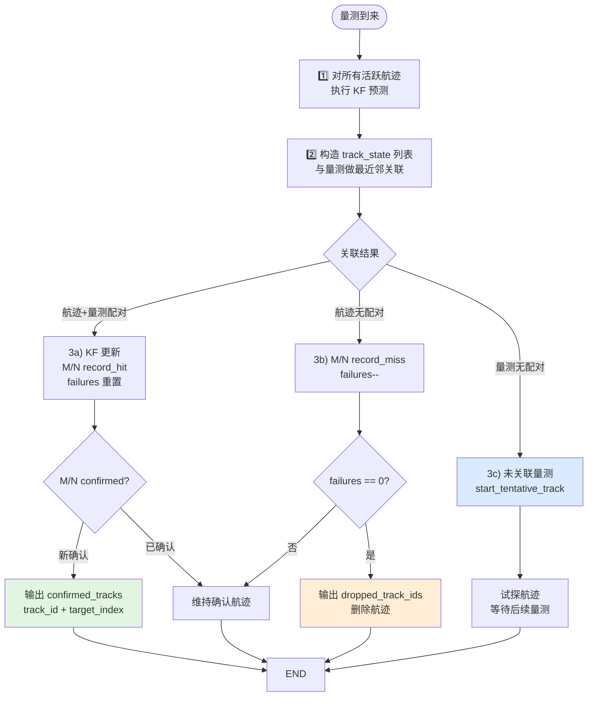
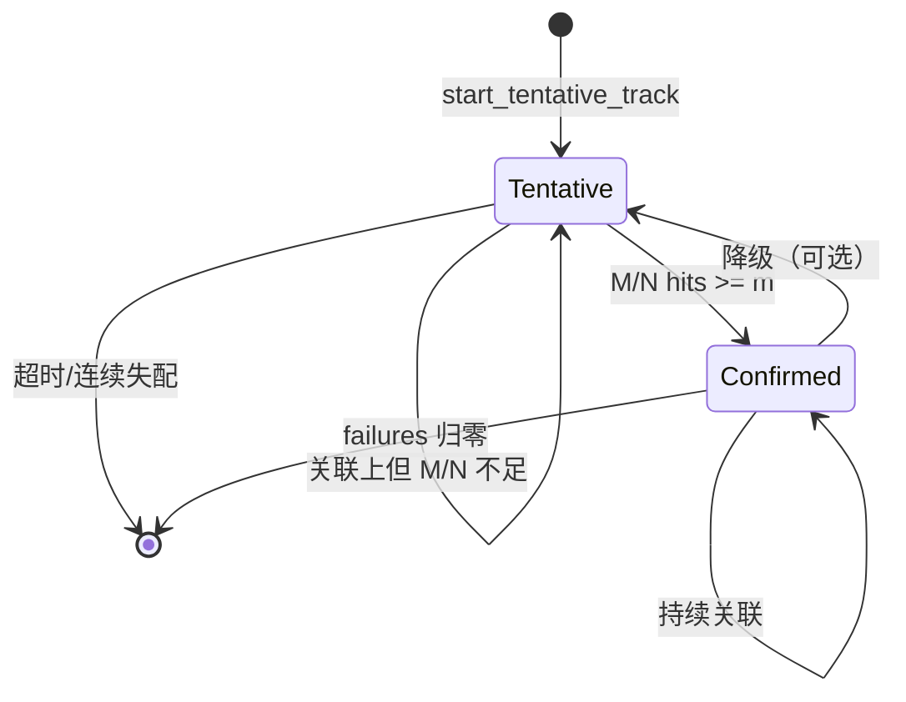
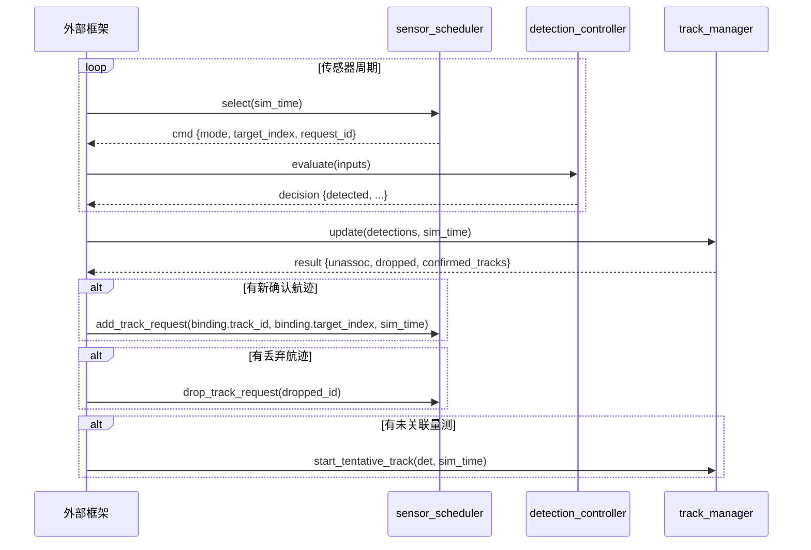

# 航迹管理工作流

本文档描述从量测输入到航迹维护的完整数据流。

## 0. 总体链路



## 1. 航迹生命周期工作流

### 1.1 完整流程



### 1.2 详细步骤

**步骤 1：预测**

对所有活跃航迹执行 KF 预测：
```cpp
for (auto& [id, rec] : tracks) {
    rec.kf.predict(sim_time_s);
}
```

**步骤 2：关联**

构造 track_state（含预测位置、速度、协方差对角线），与量测做最近邻关联：
```cpp
auto assoc = params.associator.associate(track_states, detections);
```

**步骤 3：按关联结果处理**

| 情况 | 处理 |
|------|------|
| 航迹关联上量测 | KF update + record_hit + failures 重置 + 检查是否新确认 |
| 航迹未关联上量测 | record_miss + failures-- |
| 量测未关联上任何航迹 | 输出到 unassociated_detection_indices，外部可决定起始新航迹 |

**步骤 4：淘汰**

删除 failures 归零的航迹。

## 2. 状态转换



## 3. 参数配置

| 参数 | 默认值 | 含义 |
|------|--------|------|
| `mofn.m` | 3 | M/N 确认所需命中次数 |
| `mofn.n` | 5 | M/N 确认窗口大小 |
| `associator.gate_threshold` | 16.0 | 马氏距离门限（3自由度，~99.7%） |
| `drop_after_misses` | 5 | 连续未命中即丢弃 |
| `initial_position_cov` | 100.0 | 起始位置协方差（m²） |
| `initial_velocity_cov` | 25.0 | 起始速度协方差（m²/s²） |

## 4. 与 sensor_scheduler 的协同



## 5. 当前边界

当前航迹管理尚未覆盖：

- **EKF/UKF**：非线性量测模型（雷达极坐标→直角坐标）
- **IMM**：机动目标的多模型跟踪
- **航迹合并**：两条航迹实为同一目标时的合并
- **航迹分裂**：一个目标产生多个量测（如扩展目标）
- **多假设跟踪（MHT）**：保留多个关联假设，延迟决策
- **分布式融合**：多传感器航迹融合

## 6. 相关源码

- `include/xsf_behavior/tracking/track_manager.hpp`
- `include/xsf_math/tracking/kalman_filter.hpp`
- `include/xsf_math/tracking/track_association.hpp`
- `include/xsf_behavior/sensor/sensor_schedule.hpp`
