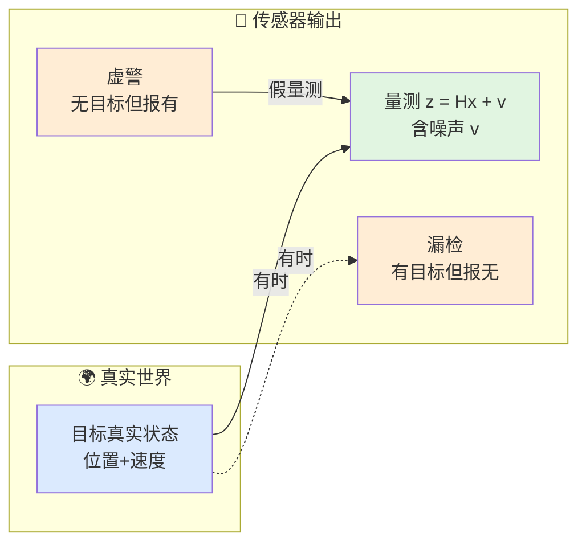
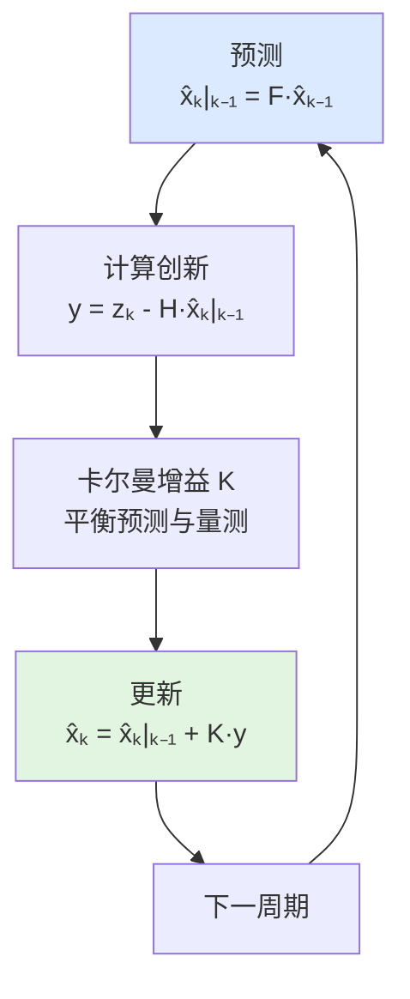
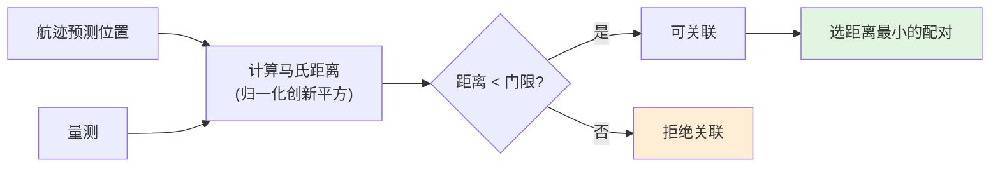
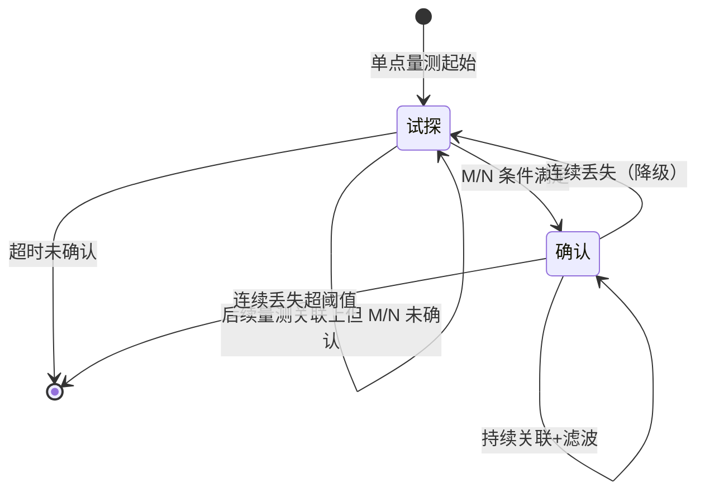
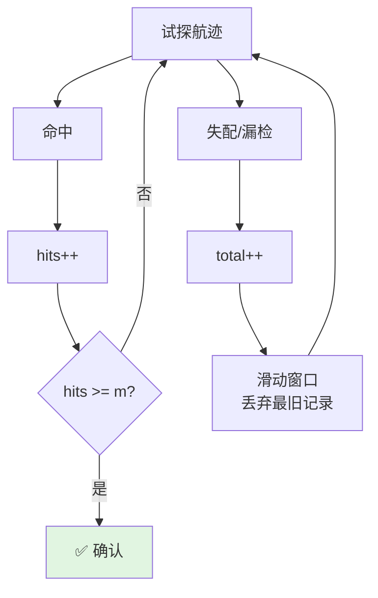
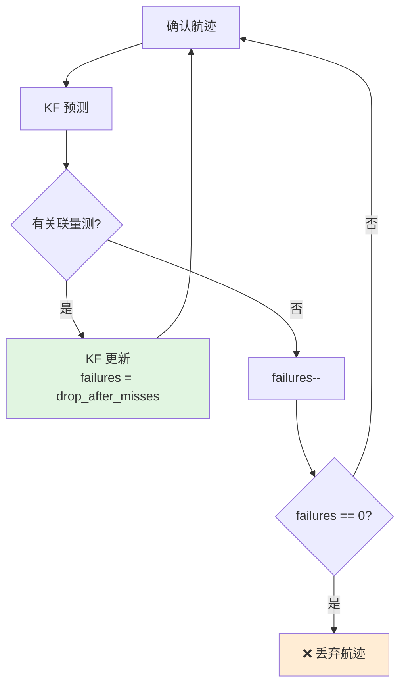
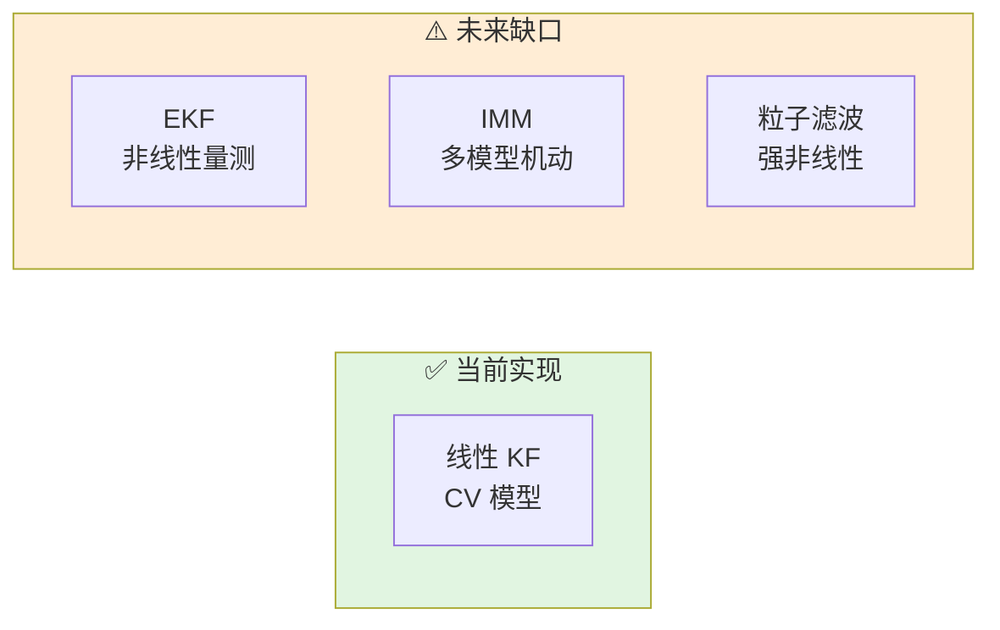

# 跟踪估计心智模型

> 本文为行为层建立思维框架。不解释单个控制器的接口，而是回答"当你要让一个跟踪系统在仿真中正确地消化量测、维持航迹、丢弃假目标时，到底需要考虑哪些事情"。

## 0. 为什么需要这份心智模型

跟踪是探测和交战之间的桥梁。探测给出的是"这一帧在这个位置似乎有东西"，而交战需要的是"目标正以这个速度往这个方向运动"。

没有正确的跟踪心智模型，会遇到以下困境：

- 量测噪声大时，航迹抖动剧烈，制导律输出不稳定
- 多个目标靠近时，航迹"跳来跳去"，关联混乱
- 虚警量测被当成真实目标，产生虚假航迹
- 真实目标机动时，滤波器 lag 严重，预测位置偏差大

这份文档从"量测如何变成稳定状态估计"出发，建立完整思维地图。

## 1. 跟踪的三个核心问题

### 1.1 量测从哪里来——不是完美数据

量测来自传感器，而传感器的输出有以下几个不完美之处：

- **位置噪声**：雷达测距有误差，测角有误差，合成到直角坐标后误差被放大
- **虚警**：噪声超过门限产生假点
- **漏检**：真实目标因 SNR 不足或遮挡未被探测到
- **多径/杂波**：地面/海面反射产生假回波

这意味着跟踪器输入的不是"目标的真实位置"，而是"带有噪声和虚假成分的采样"。



### 1.2 状态估计——从离散点推测连续运动

跟踪器不能简单地"把每个量测连起来"，因为：

- 量测有噪声，直接连线会得到锯齿状轨迹
- 目标在量测间隔内运动了，需要预测
- 目标可能机动，匀速假设会失效

滤波器的核心思想是：

$$
\hat{x}_k = \underbrace{F \hat{x}_{k-1}}_{\text{预测}} + \underbrace{K(z_k - H F \hat{x}_{k-1})}_{\text{用新量测修正}}
$$

- **预测**：基于动力学模型（如匀速）推测下一时刻状态
- **修正**：用实际量测与预测的差距（创新）来校正状态
- **增益 K**：决定更相信预测还是更相信量测



### 1.3 数据关联——这个量测属于谁

当有多个目标和多个量测时，核心问题是："第 3 个量测到底属于第 1 条航迹还是第 2 条航迹？"

关联错误会导致：
- 航迹被错误的量测"拉偏"
- 两条航迹合并成一条
- 一条航迹分裂成两条

行为层目前使用**带门限的最近邻关联**：



马氏距离（Mahalanobis distance）比欧氏距离更合理，因为它考虑了航迹自身的不确定度：
- 不确定度大的航迹，对量测的"容忍范围"更大
- 不确定度小的航迹，对量测位置要求更严格

## 2. 航迹生命周期的思维链

### 2.1 完整生命周期



### 2.2 试探航迹（Tentative Track）

当有一个量测无法与任何现有航迹关联时，启动一条试探航迹。

- 位置用首个量测初始化
- 速度初始化为零（或默认值）
- 不立即被交战系统使用
- 需要积累足够"命中"才能转正

### 2.3 M/N 确认逻辑

行为层使用 M-of-N 逻辑判断试探航迹是否足够可信：

- **M**：在 N 次机会中需要至少 M 次命中
- 默认 `m=3, n=5`：5 次中有 3 次探测到，航迹确认
- 这是一个统计滤波器，防止虚警产生_persistent_假航迹



### 2.4 确认航迹的维持与丢弃

确认航迹后，每次更新周期：

1. **有量测关联**：KF 更新，失败计数器重置
2. **无量测关联**：KF 纯预测，失败计数器递减
3. **失败计数器归零**：航迹丢弃



## 3. 滤波器选择的思维链

行为层当前使用 **6 状态线性卡尔曼滤波器（CV 模型）**：

- 状态：`[x, y, z, vx, vy, vz]`
- 量测：`[x, y, z]`（仅位置）
- 动力学模型：匀速（Constant Velocity）

### 3.1 CV 模型的适用场景

- 目标运动平稳、机动性低
- 时间步长较小
- 量测精度足够高

### 3.2 CV 模型的局限

- 目标机动时，预测位置 lag 严重
- 量测是极坐标转直角坐标时，存在非线性
- 过程噪声参数需要手动调参



## 4. 一张图：跟踪工作时的完整考虑清单

```text
┌────────────────────────────────────────────────────────┐
│                    外部框架 / 传感器层                      │
│           产出探测结果（位置 + 检测标志 + 噪声估计）          │
└────────────────────┬───────────────────────────────────┘
                     │ 量测列表
                     ▼
┌────────────────────────────────────────────────────────┐
│                  行为层 / track_manager                    │
│                                                        │
│  输入：                                                 │
│    ├─ 量测列表（含位置、噪声）                            │
│    └─ 当前仿真时间                                       │
│                                                        │
│  处理：                                                 │
│    ├─ 对所有航迹做 KF 预测                               │
│    ├─ 构造 track_state 列表                              │
│    ├─ 最近邻关联（马氏距离 + 门限）                       │
│    ├─ 对关联上的航迹：KF 更新 + M/N 命中                  │
│    ├─ 对未关联航迹：M/N 失配 + 失败计数递减               │
│    ├─ 淘汰失败计数归零的航迹                              │
│    └─ 未关联量测 → 起始新试探航迹                         │
│                                                        │
│  输出：                                                 │
│    ├─ 未关联量测索引（可能起始新航迹）                     │
│    ├─ 丢弃航迹 ID 列表                                   │
│    ├─ 新确认航迹 ID 列表                                 │
│    └─ 所有活跃航迹的内部状态（位置、速度、协方差）          │
└────────────────────┬───────────────────────────────────┘
                     │ 航迹状态
                     ▼
┌────────────────────────────────────────────────────────┐
│                  外部框架 / 交战/显示层                     │
│           消费航迹状态进行制导、显示、决策                  │
└────────────────────────────────────────────────────────┘
```

## 5. 常见误解

### "有量测就一定要更新航迹"

不是。量测可能来自虚警、杂波或其他目标。必须先做关联，确认这个量测"属于"这条航迹，才能用于更新。

### "滤波器能消除所有噪声"

不能。滤波器只能"减小"噪声影响，不能完全消除。过程噪声和量测噪声的权衡决定了滤波器的响应速度。

### "航迹确认后就永久存在"

不是。确认航迹如果连续多次未收到关联量测，会被丢弃。跟踪是"持续验证"的过程，不是一次性确认。

### "M/N 的 N 是固定窗口"

行为层的实现是简化版。严格的 M/N 需要维护最近 N 次的命中/失配记录。当前实现用近似滑动窗口处理。

### "最近邻关联在多目标场景下足够"

不够。目标密集时，贪心最近邻可能产生次优甚至错误的关联。GNN（全局最近邻）、JPDA（联合概率数据关联）、MHT（多假设跟踪）是更优但计算量更大的方案。

### "KF 的协方差只是装饰"

不是。协方差直接用于：
- 关联门限的大小（不确定度大则门限大）
- 马氏距离的计算
- 航迹质量的评估
- 制导精度预测（脱靶量估计）

## 6. 相关源码

- `include/xsf_behavior/tracking/track_manager.hpp` — 航迹管理控制器
- `include/xsf_math/tracking/kalman_filter.hpp` — 6 状态线性 KF
- `include/xsf_math/tracking/track_association.hpp` — 最近邻关联
- `tests/test_core.cpp` — KF 验证
- `tests/test_guidance.cpp` — 跟踪相关验证
