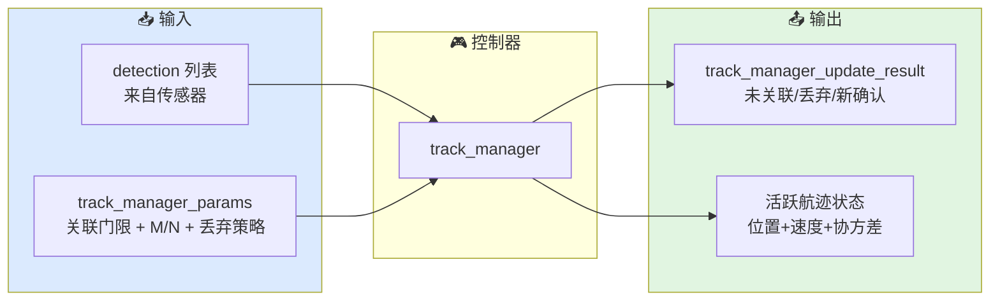

# 跟踪控制器总览

本文档描述当前 `xsf-behavior` 跟踪子域中 `track_manager` 的职责边界、典型输入和输出意图。

## 总体架构



## 控制器列表

### `track_manager`

用途：
维护一组活跃航迹，按新量测执行预测-关联-更新-淘汰循环，并管理航迹的试探→确认→丢弃生命周期。

典型场景：
- 收到传感器量测后调用 `update`
- 对未关联量测调用 `start_tentative_track`
- 查询航迹状态用于制导或显示

关键状态：
- `tracks`：活跃航迹表（unordered_map<id, track_record>）
- `next_track_id`：自增航迹 ID 分配器

内部每条航迹维护：
- `kf`：6 状态线性卡尔曼滤波器
- `mofn`：M/N 确认状态
- `failures_until_drop`：剩余允许失配次数
- `detection_history_bits`：探测历史位流
- `confirmed`：是否已确认

典型输出：

| 字段 | 含义 |
|------|------|
| `unassociated_detection_indices` | 未与任何航迹关联的量测索引 |
| `dropped_track_ids` | 本次被淘汰的航迹 ID |
| `confirmed_track_ids` | 本次新确认的航迹 ID |

## 公共数据结构

### `track_record`

单条航迹的完整内部状态：

```cpp
struct track_record {
    int                   id = -1;
    kalman_filter_6state  kf{};           // 滤波器状态
    m_of_n_logic::state   mofn{};         // M/N 确认状态
    int                   failures_until_drop = -1;
    unsigned int          detection_history_bits = 0;
    double                last_update_time_s = 0.0;
    bool                  confirmed = false;
};
```

### `track_manager_params`

控制航迹管理的行为参数：

```cpp
struct track_manager_params {
    m_of_n_logic             mofn{};              // M/N 逻辑（默认 3/5）
    nearest_neighbor_associator associator{};      // 关联器（含门限）
    int                       drop_after_misses = 5;
    double                    initial_position_cov = 100.0;
    double                    initial_velocity_cov = 25.0;
};
```

## 关键实现细节

### KF 预测-更新顺序

```cpp
// 1) 预测：所有航迹先预测到当前时间
rec.kf.predict(sim_time_s);

// 2) 关联：用预测位置做关联
auto assoc = params.associator.associate(track_states, detections);

// 3) 更新：关联上的做 KF update，未关联的纯预测
rec.kf.update(sim_time_s, detections[idx].position);
```

注意：预测必须在关联之前，因为关联需要用到预测位置。

### 航迹起始的速度初始化

试探航迹用首个量测初始化位置，速度初始化为零。协方差设置：
- 位置协方差 = `initial_position_cov`
- 速度协方差 = `initial_velocity_cov`（默认 25.0，比位置小很多）

这意味着起始阶段速度不确定度较小，如果目标实际速度很大，前几步滤波会有较大 lag。

### 马氏距离的计算

```cpp
static double mahalanobis_distance(const track_state& trk, const detection& det) {
    double dx = det.position.x - trk.position.x;
    // ...
    double sx = trk.position_covariance[0] + det.meas_noise[0];
    return (dx*dx/sx) + (dy*dy/sy) + (dz*dz/sz);
}
```

合成协方差 = 航迹位置协方差 + 量测噪声（对角近似）。

## 当前适用方式

`track_manager` 适合被外部仿真框架按传感器周期调用：

1. 传感器产出一组 `detection`
2. 调用 `track_manager.update(detections, sim_time_s)`
3. 处理结果：
   - `confirmed_track_ids` → 通知 `sensor_scheduler` 添加跟踪请求
   - `dropped_track_ids` → 通知 `sensor_scheduler` 丢弃跟踪请求
   - `unassociated_detection_indices` → 决定哪些量测用于起始新试探航迹
4. 查询活跃航迹状态用于制导/显示

当前仓库不直接提供传感器仿真或显示输出。

## 相关源码

- `include/xsf_behavior/tracking/track_manager.hpp`
- `include/xsf_math/tracking/kalman_filter.hpp`
- `include/xsf_math/tracking/track_association.hpp`
- `include/xsf_behavior/sensor/sensor_schedule.hpp`
