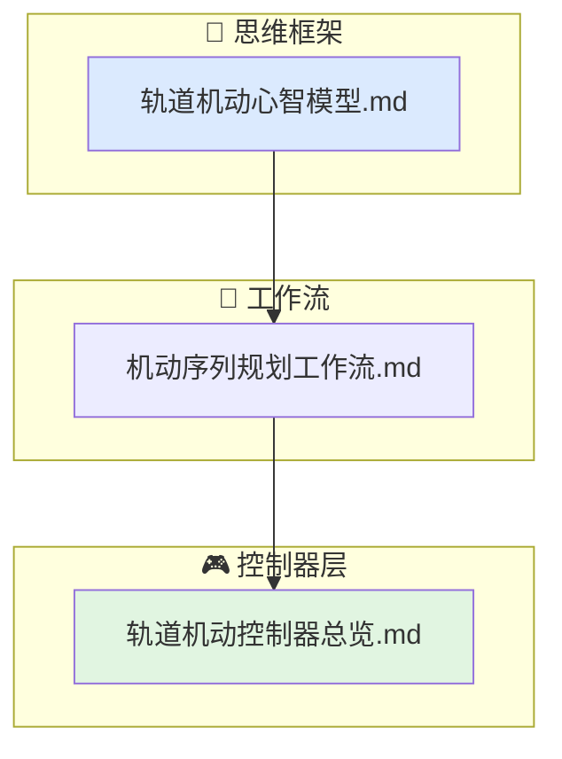

# 轨道行为文档索引

当前行为层的轨道子域覆盖"给定初始轨道状态，如何规划一系列机动以达到目标轨道"。

## 文档结构

- `轨道机动心智模型.md`
  轨道能量与半长轴的关系、霍曼转移的最优性、平面机动的代价、脉冲近似与有限推力的差异。
- `机动序列规划工作流.md`
  从初始轨道到目标轨道的多步机动序列生成与串联逻辑。
- `轨道机动控制器总览.md`
  `orbital_maneuver_planner` 的职责、输入、输出与限制条件。

## 代码对应关系

- `include/xsf_behavior/orbital/maneuver_planner.hpp`
