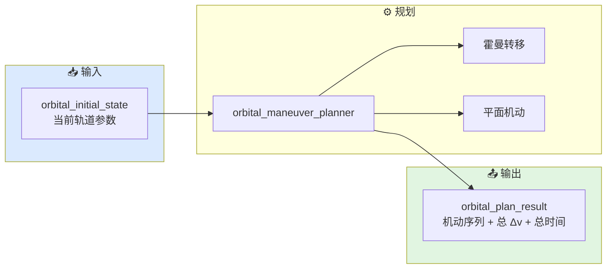
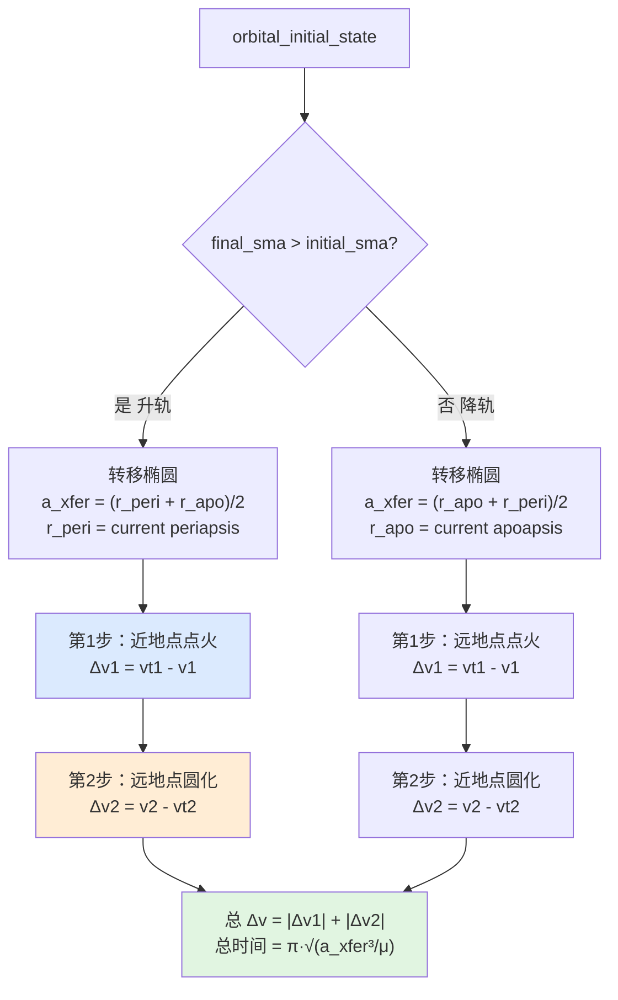
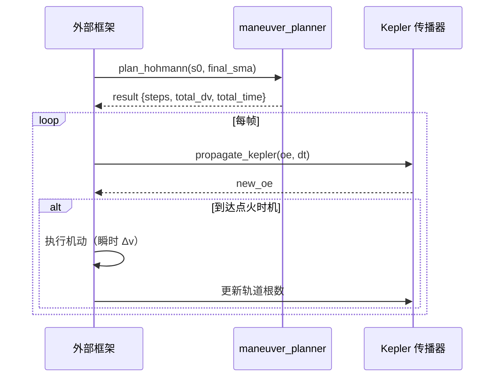

# 机动序列规划工作流

本文档描述从初始轨道到目标轨道的机动序列生成过程。

## 0. 总体链路



## 1. 霍曼转移序列

### 1.1 标准霍曼转移



### 1.2 代码中的关键逻辑

```cpp
if (final_sma_m > s0.semi_major_axis_m) {
    // 升轨：在当前近地点建立转移椭圆
    transfer_sma = 0.5 * (final_sma_m + s0.semi_major_axis_m * (1.0 - s0.eccentricity));
    first.condition  = orbital_burn_condition::at_periapsis;
    second.condition = orbital_burn_condition::at_apoapsis;
} else {
    // 降轨：在当前远地点建立转移椭圆
    transfer_sma = 0.5 * (final_sma_m + s0.semi_major_axis_m * (1.0 + s0.eccentricity));
    first.condition  = orbital_burn_condition::at_apoapsis;
    second.condition = orbital_burn_condition::at_periapsis;
}
```

## 2. 带平面改变的复合机动

### 2.1 序列结构


### 2.2 平面机动 Δv

```cpp
double dv_plane = raan_inclination_change_delta_v(
    s0.speed_mps, s0.inclination_rad, s0.raan_rad,
    final_inclination_rad, final_raan_rad);
```

使用当前轨道速度作为平面机动的基准速度。注意：
- 平面机动在速度大的位置做代价更大
- 行为层目前使用 `immediate` 条件，不精确计算节点位置
- 更精确的方案应在升交点或降交点执行

## 3. 机动步骤的数据结构

```cpp
struct orbital_burn_step {
    orbital_burn_kind       kind;               // 机动类型
    orbital_burn_condition  condition;          // 点火时机
    double                  delta_v_mps;        // 速度增量
    double                  transfer_sma_m;     // 转移轨道半长轴
    double                  target_inclination_rad; // 目标倾角
    double                  target_raan_rad;    // 目标 RAAN
};
```

### 3.1 机动类型（orbital_burn_kind）

| 值 | 含义 |
|-----|------|
| `inplane_sma_change` | 面内半长轴改变（霍曼转移第一次点火） |
| `plane_change` | 纯平面改变 |
| `raan_inclination_change` | RAAN + 倾角联合改变 |
| `circularize` | 圆化（霍曼转移第二次点火） |

### 3.2 点火时机（orbital_burn_condition）

| 值 | 含义 |
|-----|------|
| `immediate` | 立即执行（平面机动） |
| `at_periapsis` | 在近地点执行 |
| `at_apoapsis` | 在远地点执行 |

## 4. 与轨道传播的协同



外部框架的职责：
1. 接收机动序列
2. 用开普勒/J2 传播器推进轨道
3. 监测是否到达点火时机（近地点/远地点/指定时间）
4. 到达时执行机动（速度矢量瞬时改变）
5. 继续传播直到下一机动或任务完成

## 5. 当前边界

当前轨道机动规划尚未覆盖：

- **Lambert 问题求解**：两点边界值轨道转移
- **有限推力优化**：低推重比发动机的长期最优控制
- **多脉冲转移**：三脉冲以上的复杂转移
- **交会与拦截**：考虑目标运动的拦截轨道
- **再入机动**：大气层内外的过渡
- **J2 修正后的精确时机**：当前只输出拱点条件，未考虑 J2 导致的拱点漂移
- **轨道保持**：长期站位维持的周期性机动

## 6. 相关源码

- `include/xsf_behavior/orbital/maneuver_planner.hpp`
- `include/xsf_math/orbital/kepler.hpp`
- `include/xsf_math/orbital/maneuvers.hpp`
- `include/xsf_math/orbital/j2.hpp`
