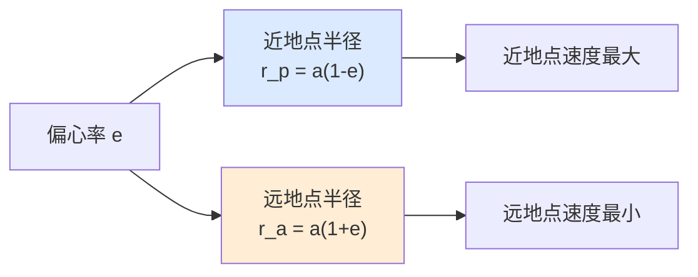
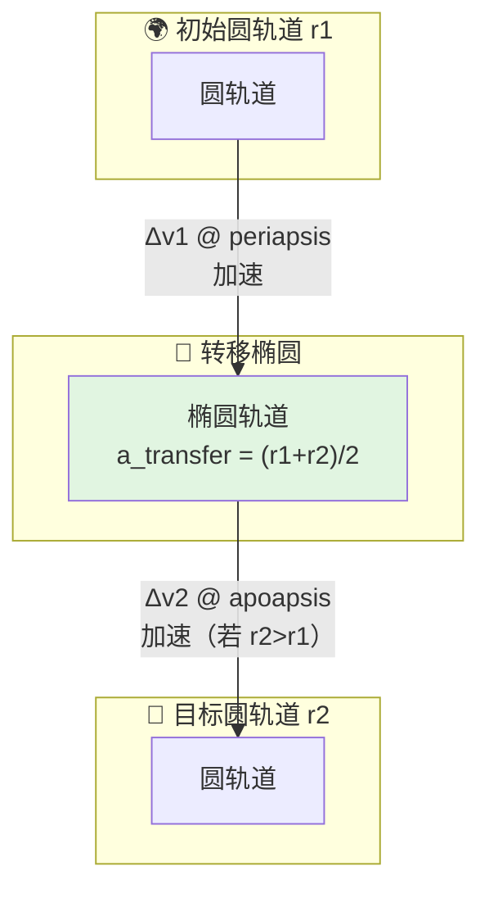
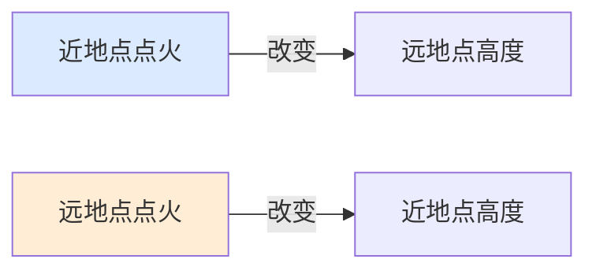
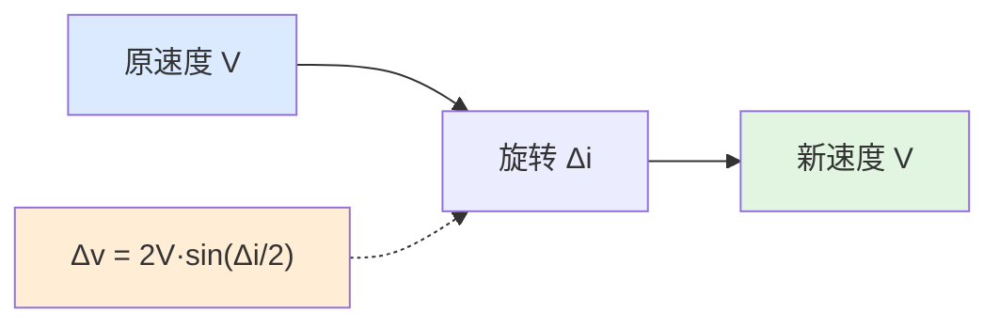
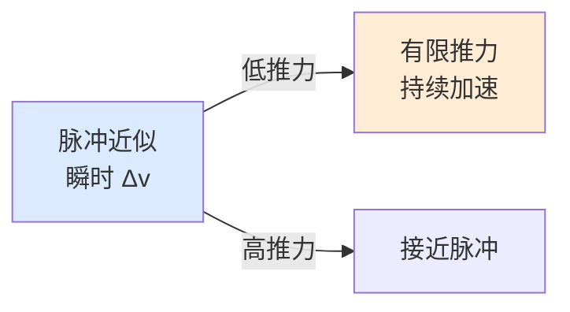

# 轨道机动心智模型

> 本文为行为层建立思维框架。不解释单个控制器的接口，而是回答"当你要让一个轨道系统在仿真中正确地规划机动、估算燃料消耗、评估转移时间时，到底需要考虑哪些事情"。

## 0. 为什么需要这份心智模型

轨道力学与大气飞行有根本差异。如果用心智模型去套，会遇到：

- 用"推力方向 = 速度方向"来规划轨道机动，发现轨道形状没变只是能量变了
- 在近地点加速，结果远地点升高了，不明白为什么
- 想改变轨道倾角，发现需要的 Δv 大得惊人
- 把霍曼转移当成唯一手段，不知道何时该用其他策略

这份文档从"轨道能量的几何本质"出发，建立完整的思维地图。

## 1. 轨道的核心量：能量与半长轴

### 1.1  vis-viva 方程

轨道上任意一点的速度：

$$
v^2 = \mu \left( \frac{2}{r} - \frac{1}{a} \right)
$$

其中：
- $v$：轨道速度
- $r$：到地心距离
- $a$：半长轴
- $\mu$：地球引力参数

关键洞察：**半长轴 $a$ 直接对应轨道能量**。改变 $a$ 就是改变轨道总能量。


- $a$ 增大 → 能量增大（负得少）→ 轨道变大
- $a$ 减小 → 能量减小（负得多）→ 轨道变小
- 圆轨道：$a = r$，速度 $v = \sqrt{\mu/r}$

### 1.2 近地点与远地点



关键洞察：**在近地点加速，远地点升高；在远地点加速，近地点升高**。这是因为能量注入的位置决定了轨道哪一端被"拉长"。

## 2. 霍曼转移：最省能量的二脉冲转移

### 2.1 基本思想

在两个共面圆轨道之间转移，霍曼转移是最省能量的双脉冲方案：



### 2.2 为什么两次点火都在拱点

- **拱点速度方向垂直于位矢**（与当地水平面平行）
- **加速/减速不改变拱点位置**，只改变对侧拱点的高度
- 在非拱点点火会同时改变拱点位置和轨道形状，效率低



### 2.3 升轨 vs 降轨

| | 升轨（r2 > r1） | 降轨（r2 < r1） |
|--|----------------|----------------|
| 第一次点火位置 | 近地点（当前圆轨道任意点） | 远地点 |
| 第二次点火位置 | 远地点 | 近地点 |
| Δv1 方向 | 顺速度方向（加速） | 逆速度方向（减速） |
| Δv2 方向 | 顺速度方向（加速） | 逆速度方向（减速） |

行为层的 `orbital_maneuver_planner` 自动根据 `final_sma_m > initial_sma_m` 判断升轨/降轨。

## 3. 平面机动的代价

### 3.1 为什么平面机动很贵

改变轨道倾角或升交点赤经（RAAN）需要改变速度方向，而不是速度大小：

$$
\Delta v = 2v \sin\frac{\Delta i}{2}
$$

关键洞察：**平面机动需要"侧向"推力，而当前速度方向的推力对平面改变没有贡献**。这就是为什么：

- 小倾角改变（几度）代价小
- 大倾角改变（几十度）代价极大
- 最佳平面机动点在轨道交点（节点），此时速度矢量垂直于交线



### 3.2 何时应该合并平面机动

如果任务同时需要改变轨道高度和轨道倾角，应该：

1. **先平面机动，再霍曼转移**：在原始轨道做平面机动（速度高，Δv 大但省总能量）
2. **先霍曼转移，再平面机动**：在目标轨道做平面机动（速度低，Δv 小）
3. **在转移轨道拱点合并**：一次点火同时改变高度和平面的分量

行为层目前使用策略 1（先平面机动，再霍曼转移），这是工程上常见的保守方案。

## 4. 脉冲近似 vs 有限推力

### 4.1 脉冲近似

行为层的所有机动计算都基于**脉冲近似**：

- 假设推力在瞬间完成
- 速度瞬时改变 Δv，位置不变
- 计算简单，解析可解

### 4.2 有限推力的现实

实际发动机有：

- 有限推力大小 → 加速需要有限时间
- 推力方向控制 → 推力矢量可能不完全沿理想方向
- 燃料消耗 → 质量变化



关键洞察：
- 高推重比发动机（如化学火箭）接近脉冲近似
- 低推重比发动机（如电推进）必须用有限推力模型
- 脉冲近似给出的 Δv 是下限；有限推力实际消耗更多燃料

## 5. J2 摄动与长期规划

### 5.1 J2 效应

地球不是完美球体，赤道隆起产生 J2 摄动：

- **升交点赤经漂移（RAAN）**：轨道面绕地球自转轴缓慢旋转
- **近地点幅角漂移**：椭圆轨道拱线缓慢旋转


关键洞察：**J2 摄动可用于"免费"调整轨道面**。通过选择特定倾角和半长轴，可以让 RAAN 以期望的速率漂移，从而在不消耗燃料的情况下实现对特定区域的覆盖。

### 5.2 长期规划必须考虑 J2

如果机动规划只考虑二体问题：
- 实际轨道面会漂移
- 点火时机会错过
- 交会精度会损失

行为层的 `orbital_maneuver_planner` 目前只输出脉冲计划和 Δv，不包含 J2 修正。外部框架需要用 `orbital/j2.hpp` 的传播器来修正长期漂移。

## 6. 一张图：轨道机动规划时的完整考虑清单

```text
┌────────────────────────────────────────────────────────┐
│                    外部框架 / 任务需求                      │
│           目标轨道（a, e, i, Ω, ω）+ 时间约束              │
└────────────────────┬───────────────────────────────────┘
                     │ 目标轨道参数
                     ▼
┌────────────────────────────────────────────────────────┐
│              行为层 / orbital_maneuver_planner             │
│                                                        │
│  输入：                                                 │
│    ├─ 初始轨道状态（a, e, i, Ω, 速度）                    │
│    └─ 目标轨道参数（final_sma, final_i, final_RAAN）      │
│                                                        │
│  处理：                                                 │
│    ├─ 判断升轨/降轨                                     │
│    ├─ 计算霍曼转移两次 Δv 和转移时间                      │
│    ├─ 若需平面改变 → 增加平面机动 Δv                     │
│    └─ 组装机动序列（点火时机 + Δv + 目标参数）             │
│                                                        │
│  输出：                                                 │
│    ├─ steps[]：每步的 kind/condition/Δv/target          │
│    ├─ total_delta_v_mps：总速度增量                      │
│    └─ total_duration_s：总转移时间                       │
└────────────────────┬───────────────────────────────────┘
                     │ 机动序列
                     ▼
┌────────────────────────────────────────────────────────┐
│                  外部框架 / 轨道传播器                      │
│           按机动序列执行点火，用 Kepler/J2 推进状态        │
└────────────────────────────────────────────────────────┘
```

## 7. 常见误解

### "轨道机动就是加速"

不是。轨道机动可以加速、减速、侧向推。不同的方向产生不同的效果：
- 顺速度方向：改变轨道能量（高度）
- 逆速度方向：降低轨道能量
- 垂直于速度方向：改变轨道平面（倾角/RAAN）
- 径向（指向地心）：改变偏心率

### "霍曼转移总是最优"

不是。霍曼转移只在共面圆轨道之间、且半径比不太大时最优。双椭圆转移在某些情况下更省能量（但时间更长）。

### "平面机动可以在任意位置做"

不是。平面机动的最佳位置是轨道节点（轨道面与目标面的交线处）。在非节点位置做平面机动会同时改变轨道形状，效率低。

### "Δv 小就意味着燃料少"

不是。Δv 与燃料的关系：
$$
\Delta v = I_{sp} \cdot g_0 \cdot \ln\frac{m_0}{m_f}
$$
相同的 Δv，低比冲发动机需要更多燃料。行为层目前只输出 Δv，不计算燃料。

### "脉冲近似对所有发动机都适用"

不是。低推重比发动机（如离子推进）需要持续加速数小时甚至数天，必须用有限推力模型。脉冲近似只适用于化学火箭等高推重比场景。

### "轨道高度不变就是圆轨道"

不是。高度不变可能是圆轨道，也可能是轨道面与地球自转同步（如地球静止轨道）。行为层目前只处理开普勒轨道，不处理同步轨道的特殊约束。

## 8. 相关源码

- `include/xsf_behavior/orbital/maneuver_planner.hpp` — 机动序列规划器
- `include/xsf_math/orbital/kepler.hpp` — 开普勒轨道力学
- `include/xsf_math/orbital/maneuvers.hpp` — 基础机动 Δv 计算
- `include/xsf_math/orbital/j2.hpp` — J2 摄动
- `tests/test_guidance.cpp` — 轨道相关验证
