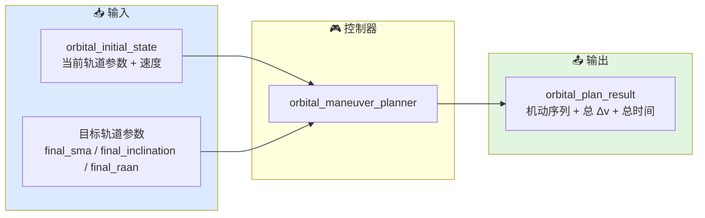

# 轨道机动控制器总览

本文档描述当前 `xsf-behavior` 轨道子域中 `orbital_maneuver_planner` 的职责边界、典型输入和输出意图。

## 总体架构



## 控制器列表

### `orbital_maneuver_planner`

用途：
给定初始轨道状态和目标轨道参数，规划一系列脉冲机动步骤，输出每步的点火时机、Δv 和目标参数。

典型场景：
- 卫星从初始轨道升轨到目标轨道
- 需要同时改变轨道高度和倾角
- 估算任务所需的总 Δv 和总时间

关键方法：

| 方法 | 用途 |
|------|------|
| `plan_hohmann` | 标准霍曼转移（两次点火） |
| `plan_hohmann_with_plane_change` | 霍曼转移 + 前置平面机动 |
| `plan_circularize` | 单次圆化机动 |

典型输出：

| 字段 | 含义 |
|------|------|
| `steps` | 机动步骤数组 |
| `total_delta_v_mps` | 总速度增量 |
| `total_duration_s` | 总转移时间 |

## 公共数据结构

### `orbital_burn_step`

单次机动的定义：

```cpp
struct orbital_burn_step {
    orbital_burn_kind       kind;               // 机动类型
    orbital_burn_condition  condition;          // 点火时机
    double                  delta_v_mps;        // 速度增量大小
    double                  transfer_sma_m;     // 转移轨道半长轴（SMA 改变用）
    double                  target_inclination_rad; // 目标倾角（平面机动用）
    double                  target_raan_rad;    // 目标 RAAN（平面机动用）
};
```

### `orbital_initial_state`

规划所需的初始状态：

```cpp
struct orbital_initial_state {
    double semi_major_axis_m = 0.0;
    double eccentricity      = 0.0;
    double speed_mps         = 0.0;
    double inclination_rad   = 0.0;
    double raan_rad          = 0.0;
    double mu                = mu_earth;  // 可自定义（其他行星）
};
```

## 关键实现细节

### 升轨/降轨判断

```cpp
if (final_sma_m > s0.semi_major_axis_m) {
    // 升轨：近地点建立转移椭圆，远地点圆化
} else {
    // 降轨：远地点建立转移椭圆，近地点圆化
}
```

### 转移半长轴计算

升轨时，转移椭圆的近地点等于当前轨道的近地点：
```cpp
transfer_sma = 0.5 * (final_sma_m + s0.semi_major_axis_m * (1.0 - s0.eccentricity));
```

降轨时，转移椭圆的远地点等于当前轨道的远地点：
```cpp
transfer_sma = 0.5 * (final_sma_m + s0.semi_major_axis_m * (1.0 + s0.eccentricity));
```

### 平面机动前置

```cpp
orbital_plan_result plan_hohmann_with_plane_change(...) {
    // 1) 先计算霍曼转移
    orbital_plan_result out = plan_hohmann(s0, final_sma_m);

    // 2) 在前面插入平面机动
    orbital_burn_step plane;
    plane.kind = orbital_burn_kind::raan_inclination_change;
    plane.condition = orbital_burn_condition::immediate;
    plane.delta_v_mps = raan_inclination_change_delta_v(...);
    out.steps.insert(out.steps.begin(), plane);
    out.total_delta_v_mps += plane.delta_v_mps;
    return out;
}
```

注意：平面机动插入在霍曼转移**之前**，且标记为 `immediate`（立即执行）。更精确的方案应计算轨道节点位置，在节点处执行。

## 当前适用方式

轨道机动规划器适合在任务规划阶段调用：

1. 外部框架确定初始轨道和目标轨道
2. 调用规划器获取机动序列：
   ```cpp
   auto plan = planner.plan_hohmann_with_plane_change(s0, final_sma, final_i, final_raan);
   ```
3. 检查 `total_delta_v_mps` 是否在燃料预算内
4. 检查 `total_duration_s` 是否满足时间约束
5. 按 `steps` 顺序执行机动：
   - 用开普勒/J2 传播器推进轨道
   - 监测点火时机（近地点/远地点/指定时间）
   - 到达时瞬时改变速度矢量
6. 验证最终轨道是否收敛到目标

当前仓库不直接提供轨道传播或动力学积分。

## 相关源码

- `include/xsf_behavior/orbital/maneuver_planner.hpp`
- `include/xsf_math/orbital/kepler.hpp`
- `include/xsf_math/orbital/maneuvers.hpp`
- `include/xsf_math/orbital/j2.hpp`
