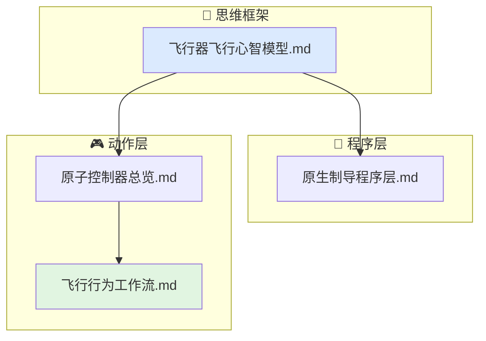

# 飞行行为文档索引

当前行为层只覆盖飞行相关行为，文档集中放在本目录。

## 文档结构

- `飞行器飞行心智模型.md`
  飞行约束、纵横向控制思维链、阶段切换与能量边界。
- `原生制导程序层.md`
  飞行相关原生程序层的结构、程序链路和已迁入内容。
- `原子控制器总览.md`
  飞行原子控制器的职责、输入、输出与限制条件。
- `飞行行为工作流.md`
  航路、定高、进近、拉平等飞行动作链的组织方式。

## 代码对应关系

- `include/xsf_behavior/flight/flight_state.hpp`
- `include/xsf_behavior/flight/basic_controllers.hpp`
- `include/xsf_behavior/flight/guidance_programs.hpp`
