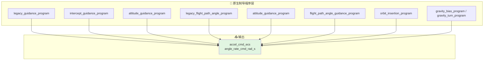
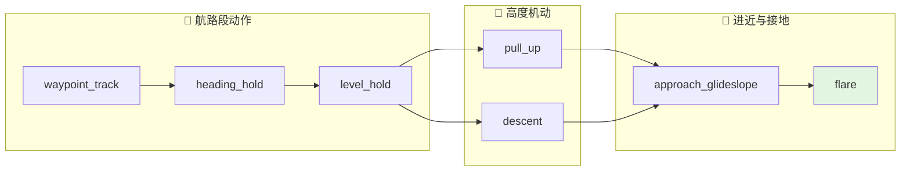
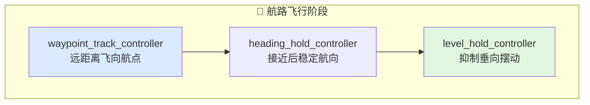
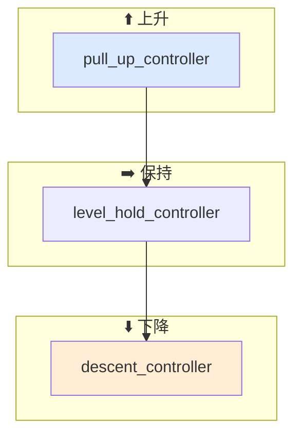
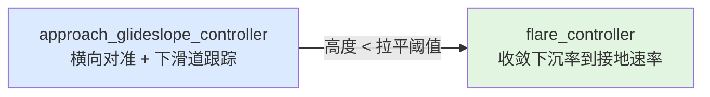
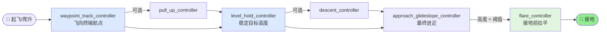

# 飞行行为工作流

本文档描述当前 `xsf-behavior` 的工作流。

现在行为层分成两类：

- 原生制导程序层：按程序链组织
- 原子控制器层：更接近外部框架托管动作

工作流分成两条。

## 0. 原生程序优先链

程序链驱动场景可使用：

1. `legacy_guidance_program`
2. `intercept_guidance_program`
3. `altitude_guidance_program`
4. `legacy_flight_path_angle_program`
5. `attitude_guidance_program`
6. `flight_path_angle_guidance_program`
7. `orbit_insertion_program`
8. `gravity_bias_program / gravity_turn_program`

适用场景：

- 导弹/拦截器程序级控制
- 需要保留相位参数语义
- 需要保留偏置、切换、覆盖顺序
## 1. 原子控制器链的总体思路

飞行动作可拆成三类：

- 航路段动作
- 进近段动作
- 接地前动作

外部框架负责“何时切换”，行为层负责“当前动作该输出什么控制命令”。

## 2. 动作链

### 航路飞行

顺序：

1. `waypoint_track_controller`
2. `heading_hold_controller`
3. `level_hold_controller`

工作方式：

- 远距离飞向航点时，优先用 `waypoint_track_controller`
- 接近目标航段后，可切换到 `heading_hold_controller`
- 高度基本稳定时，用 `level_hold_controller` 抑制多余的垂向摆动

### 高度机动

顺序：

1. `pull_up_controller`
2. `level_hold_controller`
3. `descent_controller`

工作方式：

- 需要快速上升时使用 `pull_up_controller`
- 到达目标高度附近切到 `level_hold_controller`
- 需要下降到较低高度或切入进近时使用 `descent_controller`

### 进近与接地前

顺序：

1. `approach_glideslope_controller`
2. `flare_controller`

工作方式：

- 远距进近时，用 `approach_glideslope_controller` 同时解决横向对准和纵向下滑道
- 低高度进入拉平窗口后，切换到 `flare_controller`

## 3. 一个典型工作流

下面是一条轻量但完整的飞行控制链：

1. 用 `waypoint_track_controller` 飞向终端航点
2. 在目标高度附近用 `level_hold_controller` 稳定高度
3. 进入最终进近时切到 `approach_glideslope_controller`
4. 当高度低于拉平阈值时切到 `flare_controller`

如果场景里需要大幅升降变化，可在步骤 1 和步骤 2 之间插入：

1. `pull_up_controller`
2. `descent_controller`

## 4. 外部框架职责

外部仿真框架负责：

- 状态推进
- 阶段判定
- 目标切换
- 控制指令到动力学/舵面的映射

行为层只负责：

- 计算当前动作指令
- 处理动作内部限幅
- 返回当前命令是否有效

## 5. 当前边界

当前工作流仍然是“薄编排”方案，还没有内建：

- 完整飞行阶段状态机
- 着陆滑跑逻辑
- 自动复飞逻辑
- 复杂多动作优先级裁决器

后续可在保持轻量的前提下增加薄层动作切换辅助结构，但不扩展为完整仿真内核。
